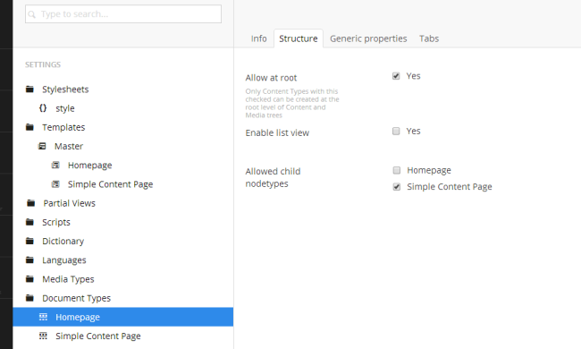
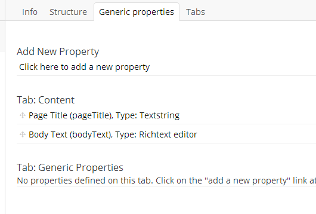

# Creating More Pages Using the Master - Part 2

## Creating a Contact Us Page 

We're now going to make a simple page where we'll just put our contact details. For added functionality you might want to look at replacing this with a fully fledged contact us form.

Some potential solutions:

* Build your own contact form using Surface Controllers - [https://our.umbraco.com/documentation/Reference/Templating/Mvc/forms](https://our.umbraco.com/documentation/Reference/Templating/Mvc/forms) or [http://umbraco.tv/videos/developer/fundamentals/surface-controllers/](https://our.umbraco.com/documentation/Reference/Templating/Mvc/forms)
* If you're not a programmer you can use the Umbraco built in package - Umbraco Forms. This has the added benefit editors can also create their own forms [http://umbraco.com/products-and-support/forms](http://umbraco.com/products-and-support/forms)

### Creating a Simple Content Only Contact Us Page 

For now let's create a simple content-only contact us page - a page where the user can provide a title and some rich text. This is very similar to our homepage document type at the moment but we're assuming that you'll go and develop this into something very specific (e.g. adding the featured article and other article content blocks). 

Go to **_Settings > Document Types_** (hover) **_> ... > + Create_ > Document Type** .  Let's create one called "_Simple Content Page_". 

Firstly let's select an **_Icon_** - type the word "_Content_" into the filter and select the document icon. In description type "A simple content page".  Click **_Save_**.

Now click on the **_Settings > Templates (hover) > ..._** and then **_Reload Nodes_** to show your new Simple Content Page template that was created automatically with the Document Type.  Click on your **_Simple Content Page node_** and then the **_Properties tab_**. Change the **_Master template_** drop down to select value "_Master_" - this will mean that we'll get the header and footer from the master just as we do in the Homepage template.  

Click **_Save_** then load the **_Template tab_** you should see the portion of Razor code has updated to say `Layout ="Master.cshtml"` if it hasn't updated itself click on a different node and then back again to reload it. Now add the following HTML to the template and click **_Save_**. 

	

		

			<section>
				<h2>Header goes here</h2>
				
Content goes here

			</section>	
		
 <!-- #main -->
	
 <!-- #main-container -->

*Figure 30 - Simple Content Page Template HTML*

Now let's create a page using our new **_Document Type_** and **_Template_** - go to **_Content > Homepage (hover) > ... > Create_**.  Oh but we can't!  We'll see an error like that below:

*Figure 31 - Umbraco Content Error - No Document Types Available**

This is by design - Umbraco limits the editors to only being able to create content in the places that you, the developer, allow. This will stop a user from breaking a site design (or an entire site) when they create a new homepage under the news container node later! Unfortunately this functionality also confuses a lot of new Umbracians - hence why we show you this error here.  

Go to **_Settings > Document Types > Homepage_** on the **_Permissions_**  screen you'll see a list of **_Allowed child node types_** (be careful not to confuse this with the **_Permissions screen_**'s **_Allowed templates_** - we'll cover that later).  We need to allow users to be able to create child nodes below our Homepage of type "_Simple Content Page_". Click **_Add child_** and select the **_Simple Content Page_** and hit **_Save_**. 

*Figure 32 - Homepage - Allowed Child Nodetypes*

So there is the confusing bit - first we create the **_Simple Content Page_** Document Type but after we then have to allow it to be created under the homepage document type - e.g. we create our new **_Document Type_** but then have to update the **_Homepage_** settings to be able to use it. We'll do this again later when we create an Articles container and Article item - we'll need to allow the Article items under the container. Simple - perhaps not but you'll get used to it!

Now go back **Content > Homepage (hover) > ... > Create** now we have the **Simple Content Page**! Select this and enter a name (text field at the top) - enter the name "Contact Us". You can see that we only have a **_Properties tab_** here - no data properties yet. This is different to the document type for the homepage as we've not yet added any tabs nor data properties (e.g. no bodyText or pageTitle fields to enter content!).  Click **_Save and Publish_**. 

*Figure 33 - Creating Our Contact Us Page*

Our **_Content tree_** will now reload and there will be a **_Contact Us_** page under the homepage.  This is the recommended structure for most sites - your primary level 1 pages will sit under the Homepage. Go look at this page - if you look at the **_Properties tab_** you can see a **_Link To document row_** - click this. You might find an unstyled page again. This is because the template designers have assumed that your site will be a flat structure - e.g. all pages sitting at the same level so the browser can't find the CSS or JS at the page level below the homepage. You need to update the **_Master_** template to add a leading slash on the JS and CSS source lines. 

e.g.  change the lines in the Master Template:

#### CSS
From: `<link rel="stylesheet" href="css/style.css">`

To: `<link rel="stylesheet" href="/css/style.css">`

### JS
From: ``

To: ``

**_Save_** the template changes and reload your **_Contact Us page_**. We'll now have a pretty empty looking page. 

Let's add two simple fields - **_pageTitle_** (type = Textstring) and **_bodyText_** (type Rich Text Editor).  Follow the instructions in creating the Homepage document type if you're not sure how to do this. Then wire these fields up - by editing the Template, again follow the Homepage section if this isn't yet second nature to you yet! You'll see in the screenshot we've removed the `
` tags - the rich text editor will add these for us (the textbox field needs the `<h2>` tags though).

*Figure 34 - Simple Contact Page Generic Properties*

*Figure 35 - Simple Content Page Template with Data Fields*

Now add some content under the **_Content > Homepage node > Contact Us node_**. Click **_Save and Publish_** and you should have a slightly more interesting page when you reload it! 

*Figure 36 - Contact Us with Some Data*

## Using Document Type Properties from the Homepage

What you may notice is that the footer is now empty - we don't have our content from our Homepage node. We need to tell Umbraco to get the content from the parent **_Homepage_** tab. To do this we edit the template (the Master). 

Highlight the Umbraco field in the footer `<h3>` tags and then click the **_Insert Umbraco page field_** button again   here is where all of the options we ignored earlier come into play - choose footerText again from the **_Choose field dropdown_** but this time we'll check the **_Recursive_** checkbox. This tells Umbraco that if the field doesn't exist at the node level for the page we're requesting (e.g. Contact Us) it will look up the content tree (so in our example go to the **_Homepage_** for this content) - this means you could also create a **_footerText_** element at the Contact Us page if you wanted the editor to override the site wide default but for fields like this it's not normally used.  Click **_Insert_** and you'll see a different bit of Razor is added : `@Umbraco.Field("footerText", recursive: true)` 

Click **_Save_** and reload our Contact Us page. 

---
## Next - [Master Template The Navigation Menu](Master-Template-The-Navigation-Menu.md)
A simple solution for the template in the menu. 
