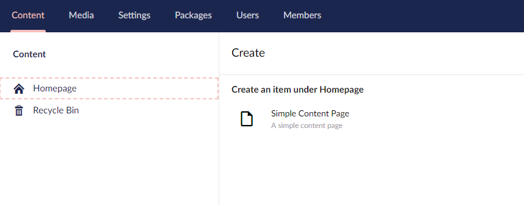
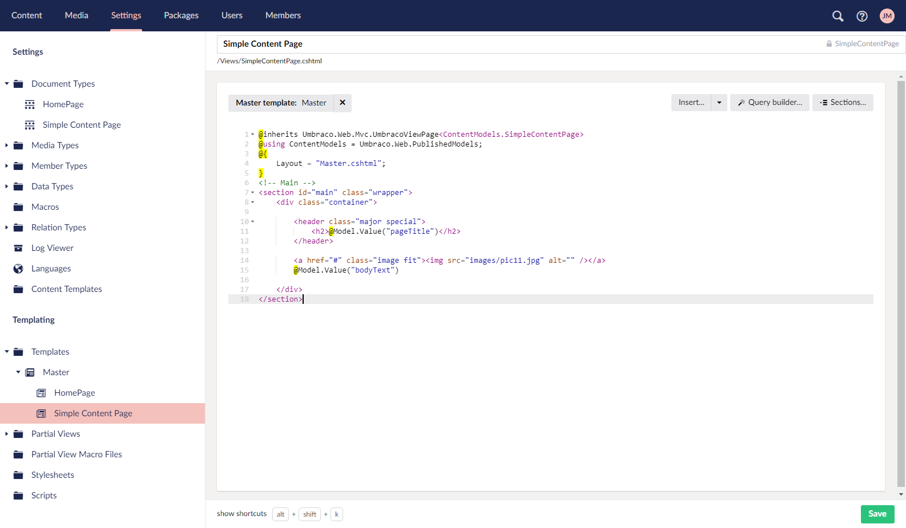
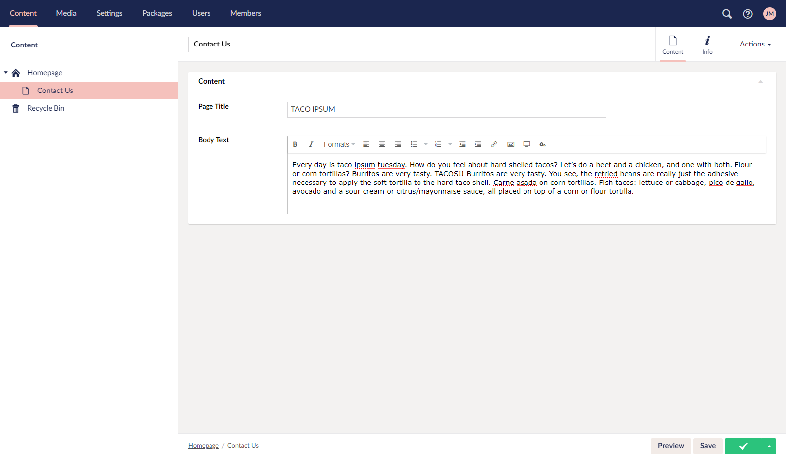

# Creating More Pages Using the Master - Part 2

## Creating a Contact Us Page


We're now going to make a page where we'll put our contact details. For added functionality, you might want to look at replacing this with a fully fledged contact us form.


Some potential solutions:

* If you're not a programmer you can use the Umbraco built-in package - Umbraco Forms. This has the added benefit that editors can also create their own forms. Find more info and purchase the product through [Umbraco Apps](https://umbraco.com/apps/umbraco-forms/)
* Build your own contact form using [Surface Controllers](../../../Reference/Templating/Mvc/forms) or the [Surface Controller chapter on UmbracoTV](https://umbraco.tv/videos/umbraco-v7/developer/fundamentals/surface-controllers/the-surface-controller/)

### Creating a Content-only Contact Page

For now, let's create a content-only contact page - a page where the user can provide a title and some rich text. This is very similar to our homepage document type at the moment but we're assuming that you'll go and develop this into something very specific (e.g. adding the featured article and other article content blocks).

<!-- vale valeStyle.Hyperbolic = NO -->
Go to **_Settings > Document Types_** (hover) **_> ... > + Create_ > Document Type** .  Let's create one called "_Simple Content Page_".

Firstly let's select an **_Icon_** - type the word "_Content_" into the filter and select the document icon. In description type "A simple content page".  Click **_Save_**.


Now click on the **_Settings > Templates (hover) > ..._** and then **_Reload_** to show your new Simple Content Page template that was created automatically with the Document Type.  Click on your **_Simple Content Page_** template and then change the **_Master template_** and select the value "_Master_" - this will mean that we'll get the header and footer from the master as we do in the Homepage template.


Click **_Save_** then load the **_Template tab_** you should see the portion of Razor code has updated to say `Layout ="Master.cshtml"` if it hasn't updated itself click on a different node and then back again to reload it. Now add the following HTML to the template and click **_Save_**.

```html
<!-- Main -->
<section id="main" class="wrapper">
    <div class="container">

        <header class="major special">
            <h2>Generic</h2>
            <p>Lorem ipsum dolor sit amet nullam id egestas urna aliquam</p>
        </header>

        <a href="#" class="image fit"></a>
        <p>Vis accumsan feugiat adipiscing nisl amet adipiscing accumsan blandit accumsan sapien blandit ac amet faucibus aliquet placerat commodo. Interdum ante aliquet commodo accumsan vis phasellus adipiscing. Ornare a in lacinia. Vestibulum accumsan ac metus massa tempor. Accumsan in lacinia ornare massa amet. Ac interdum ac non praesent. Cubilia lacinia interdum massa faucibus blandit nullam. Accumsan phasellus nunc integer. Accumsan euismod nunc adipiscing lacinia erat ut sit. Arcu amet. Id massa aliquet arcu accumsan lorem amet accumsan.</p>
        <p>Amet nibh adipiscing adipiscing. Commodo ante vis placerat interdum massa massa primis. Tempus condimentum tempus non ac varius cubilia adipiscing placerat lorem turpis at. Aliquet lorem porttitor interdum. Amet lacus. Aliquam lobortis faucibus blandit ac phasellus. In amet magna non interdum volutpat porttitor metus a ante ac neque. Nisi turpis. Commodo col. Interdum adipiscing mollis ut aliquam id ante adipiscing commodo integer arcu amet Ac interdum ac non praesent. Cubilia lacinia interdum massa faucibus blandit nullam. Accumsan phasellus nunc integer. Accumsan euismod nunc adipiscing lacinia erat ut sit. Arcu amet. Id massa aliquet arcu accumsan lorem amet accumsan commodo odio cubilia ac eu interdum placerat placerat arcu commodo lobortis adipiscing semper ornare pellentesque.</p>
        <p>Amet nibh adipiscing adipiscing. Commodo ante vis placerat interdum massa massa primis. Tempus condimentum tempus non ac varius cubilia adipiscing placerat lorem turpis at. Aliquet lorem porttitor interdum. Amet lacus. Aliquam lobortis faucibus blandit ac phasellus. In amet magna non interdum volutpat porttitor metus a ante ac neque. Nisi turpis. Commodo col. Interdum adipiscing mollis ut aliquam id ante adipiscing commodo integer arcu amet blandit adipiscing arcu ante.</p>

    </div>
</section>
```

Now let's create a page using our new **_Document Type_** and **_Template_** - go to **_Content > Homepage (hover) > ... > Create_**.  Oh but we can't!  We'll see an error like that below:


This is by design - Umbraco limits the editors to only being able to create content in the places that you, the developer, allow. This will stop a user from breaking a site design (or an entire site) when they create a new homepage under the news container node later! Unfortunately, this functionality also confuses a lot of new Umbracians - hence why we show you this error here.

Go to **_Settings > Document Types > Homepage_** on the **_Permissions_**  screen you'll see a list of **_Allowed child node types_** (be careful not to confuse this with the **_Permissions screen_**'s **_Allowed templates_** - we'll cover that later).  We need to allow users to be able to create child nodes below our Homepage of type "_Simple Content Page_". Click **_Add child_** and select the **_Simple Content Page_** and hit **_Save_**.


First we create the **_Simple Content Page_** Document Type but after we then have to allow it to be created under the Homepage document type. Eg. we create our new **_Document Type_** but then have to update the **_Homepage_** settings to be able to use it.

Now go back **Content > Homepage (hover) > ... > Create** now we have the **Simple Content Page**! Select this and enter a name (text field at the top) - enter the name "Contact Us". You can see that we only have a **_Properties tab_** here - no data properties yet. This is different to the document type for the homepage as we've not yet added any tabs nor data properties (e.g. no bodyText or pageTitle fields to enter content!).  Click **_Save and Publish_**.



Our **_Content tree_** will now reload and there will be a **_Contact Us_** page under the homepage. This is the recommended structure for most sites - your primary level 1 pages will sit under the Homepage. Go look at this page - if you look at the **_Info tab_** you can see a **_Links_** section, click the `/contact-us/` link there.


You might find an unstyled page again. This is because the template designers have assumed that your site will be a flat structure. This means that the browser can't find the CSS or JavaScript at the page level below the Homepage. You need to update the **_Master_** template to add a leading slash on the JavaScript and CSS source lines.

e.g.  change the lines in the Master Template:

#### CSS
From: `<link rel="stylesheet" href="assets/css/main.css" />`

To: `<link rel="stylesheet" href="/assets/css/main.css" />`

### JavaScript
From:
```javascript
<script src="assets/js/jquery.min.js"></script>
<script src="assets/js/skel.min.js"></script>
<script src="assets/js/util.js"></script>
<script src="assets/js/main.js"></script>
```

To:
```javascript
<script src="/assets/js/jquery.min.js"></script>
<script src="/assets/js/skel.min.js"></script>
<script src="/assets/js/util.js"></script>
<script src="/assets/js/main.js"></script>
```

**_Save_** the template changes and reload your **_Contact Us page_**. We now have a generic text page.


Let's add two simple fields - **_pageTitle_** (type = TextBox) and **_bodyText_** (type Rich Text Editor).  Follow the instructions in creating the Homepage document type if you're not sure how to do this.


Then wire these fields up - by editing the Template, again follow the Homepage section if this isn't yet second nature to you yet! You'll see in the screenshot we've removed the `<p>` tags - the rich text editor will add these for us (the textbox field needs the `<h2>` tags though).



Now add some content under the **_Content > Homepage node > Contact Us node_**. Click **_Save and Publish_** and you should have a slightly more interesting page when you reload it! - We will be using content from [Taco Ipsum](https://www.tacoipsum.com/1.html#ipsum)



## Using Document Type Properties from the Homepage

What you may notice is that the footer is now empty - we don't have our content from our Homepage node. We need to tell Umbraco to get the content from the parent **_Homepage_** tab. To do this we edit the template (the Master).

Highlight `@Model.Value("footerText")` in the footer and then click the **_Insert > Value.. _** button again.
This is where all of the options we ignored earlier come into play - choose footerText again from the **_Choose field_** dropdown, but this time we'll check the **_Recursive_** checkbox.

This tells Umbraco that if the field doesn't exist at the node level for the page we're requesting, it will look up the content tree. So in our example go to the **_Homepage_** for this content. This means you could also create a **_footerText_** element at the Contact Us page if you wanted the editor to override the site-wide default but for fields like this it's not normally used.  Click **_Insert_** and you'll see a different bit of Razor is added: `@Model.Value("footerText", fallback: Fallback.ToAncestors)`

Click **_Save_** and reload our Contact Us page.

---
## Next - [Master Template The Navigation Menu](../Master-Template-The-Navigation-Menu)
A solution for the template in the menu.
