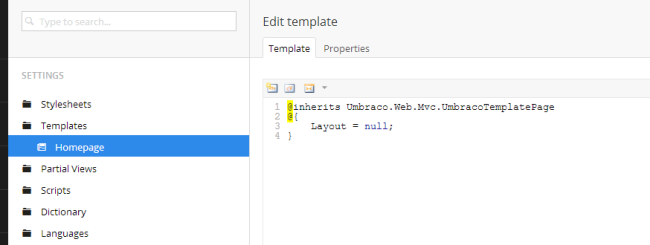
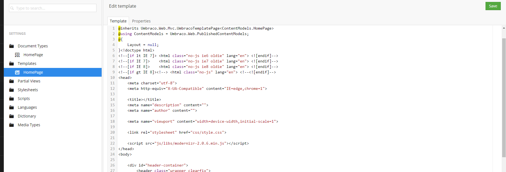

# Creating (Editing) Your First Template

Next click the expand node icon (it's the small triangle) behind the **_Settings >_** **_Templates folder_** - you should then see a child node titled "_Homepage_" - Umbraco created this automatically when we created the **_Document Type_** (remember that option that said "..without template", we chose the one with and this is what it did).  

Clicking on the **_Homepage node_** will load the template - which, except for a little bit of Razor code, is empty!

*Figure 13 - Homepage template*

Leaving the code that's there (if you don't understand it, don't worry!) let's copy our template code in. Open up **_index.html_** from the **_Initializr_**  template in your favourite text editor (Notepad++ is good).  Copy and paste the whole thing into this template **after** the closing curly brace "}".  Your template should now look like below:

*Figure 14 – Homepage Template with Initializr HTML*

Click the **_Save_** button.  

We now have a template. That's two out of the three stages complete for our first page. 

# **Creating Your First Content Node**

Our third and final stage to creating our first page in Umbraco is to create a content node where an editor can add the content which Umbraco will use, along with the Document Type and Template, to serve up an HTML page to web visitors. 

We're now ready to create our first page in Umbraco!   Click the **_Content_** button (first option in the left hand menu).  

Hover over the grey text **_CONTENT_**  and you'll see the three dots **_..._** - click this.  If you've done everything correctly so far you should see the option to create our Homepage! 

*Figure 15 - Create a Homepage*

>If you can't see this then don't panic - check that **_Settings> Document Types > Homepage node_**  > **_Structure tab_** > **_Allow at root_** is checked.

Let's create our homepage. Click the icon and you'll see what we've just been setting up - our document type is now going to drive our homepage content – it gives us and the editors the fields they need. 

In the field at the top of the page you'll see "_Enter a name..._" click this and enter the name for your new content node.  We're going to call this "_Homepage_". 

*Figure 15a - Create a Homepage - Enter a name...*

Fill in the following on the **_Contents_** tab:

>**_Page Title_** 	Welcome to Widgets Ltd
>
>**_Body Text_** 	Hello world! We can write what we like here!
>
>
>"Widgets Ltd 2014"

Click the Footer tab and enter:

>**Footer Text**	 "Copyright Widgets Ltd 2014" 

Now click the green **_Save and publish_** button.  The menu will reload with our homepage node under the **_CONTENT_** label. And here's the good bit... go and refresh your webpage in your browser http://localhost – the default Umbraco page will be gone and we'll see a very bare, unstyled page! We’re getting there!

>If you see a blank page then check you entered your template markup and remembered to save it.

*Figure 16 – An Unstyled Homepage*

---
## Next - [CSS & Javascript](CSS-And-Javascript.md)
Adding the CSS and Javascript for your site into Umbraco.
