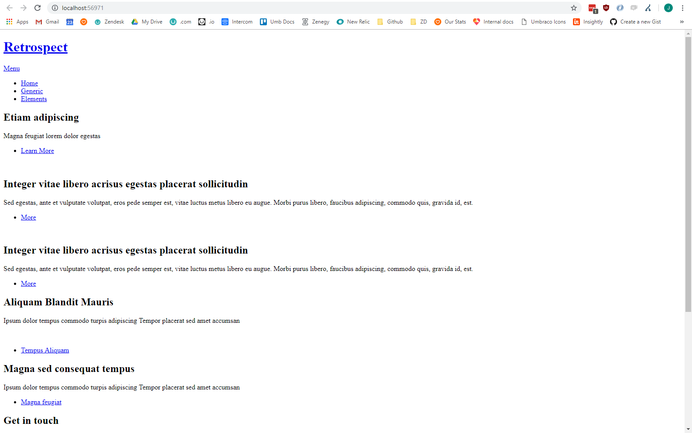

# Creating (Editing) Your First Template

Next click the expand node icon (it's the small triangle) in front of the [Settings] > [Templates folder] - you should then see a child **_node_** titled "Homepage"

Umbraco created this automatically when we created the **_Document Type_** (remember that option that said "..without template", we chose the one with and this is what it did).

Clicking on the "Homepage" **_node_** will load the **_Template_** - which, except for a little bit of **_Razor code_**, is empty!


Leaving the code that's there (if you don't understand it, don't worry!) let's copy our template code in. Open up "index.html" from the "Retrospect" template in your favourite text editor.  Copy and paste the whole thing into this **_Template_** after the closing curly brace "}".  Your **_Template_** should now look like below:

:::warn
Umbraco **_Templates_** use **_Razor_** which allows you to add code in your **_Template_** files. **_Razor_** reacts to `@` signs, so the `@` on line 10 should be deleted as below
:::


Click the [Save] button.

We now have a **_Template_**. That's two out of the three stages complete for our first page.

# **Creating Your First content node**

Our third and final stage to creating our first page in Umbraco, is to create a **_content node_** that uses our **_Document Type_** and **_Template_**, to serve up an HTML page to web visitors.

We're now ready to create our first page in Umbraco!   Click the [Content] button (first option in the top menu).

Hover over the grey text [CONTENT]  and you'll see the three dots [...] - click this.  If you've done everything correctly so far you should see the option to create our Homepage!


:::tip
If you can't see this then don't panic - check that [Settings] > [Document Types] > [Homepage]  > [Structure tab] > [Allow at root] is checked.
:::

Click the "HomePage" **_node_** and you'll see what we've been setting up - our **_Document Type_** is now going to drive our homepage content – it gives us and the editors the fields they need.

In the field at the top of the page you'll see "_Enter a name..._" click this and enter the name for your new content node.  We're going to call this "Homepage".
:::tip
This Name will show up in the node list and will be used to create a url for the page. Try to keep it short but descriptive.
:::


Fill in the following **_properties_** underneath "Contents":

```Page Title```

"Welcome to Widgets Ltd"

```Body Text```

"Hello world! We can write what we like here!

Widgets Ltd 2019"

In the "Footer" section a bit lower, fill in the following **_property_**:

```Footer Text```

"Copyright Widgets Ltd 2019"

Now click the green [Publish] button.  The menu will reload with our "homepage" **_node_** under the [Content] label. And here's the good bit... go and refresh your webpage in your browser http://localhost – the default Umbraco page will be gone and we'll see a very bare, unstyled page! We’re getting there!

:::tip
If you see a blank page then check you entered your template markup and remembered to save it.
:::



---
## Next - [CSS & JavaScript](../CSS-And-JavaScript)

Adding the CSS and JavaScript for your site into Umbraco.
