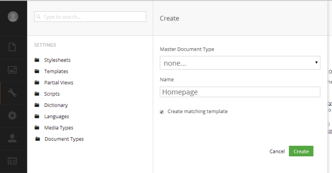
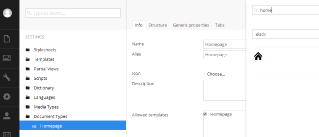
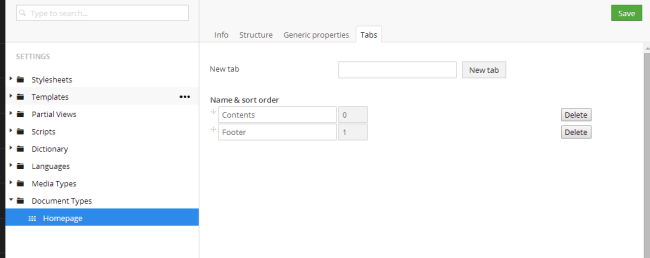

#Document Types

## Data first 
### nothing in = nothing out!

Step 1 of any site is to create a "**_Document Type_**" – after a few installations you’ll become familiar with this terminology but at the start it might be a little bit bewildering.  A **_Document Type_** is a data container in Umbraco where you can add data fields / attributes where the editor user can input data and Umbraco can use it to output it in the relevant part of a "**_template_**" (more on these later).  

**_Document Types_** are infinitely extendable but usually you’ll add data fields something like the following:

*    Page title
*    Sub Heading
*    Body Text
*    Meta Title
*    Meta Description
*    ...

Each **_Data Field_** has a type - e.g. a text string or a number or rich text body... we’ll come to this later.

## Creating your first Document Type

Right, let’s get busy. Go to the **_Settings_** menu in Umbraco. This is the third button on the left hand black menu with the spanner. Then you’ll see a long list of settings – don’t worry about these yet, we’ll introduce them as we need them. 

**_Document Types_** is now (as of v7.4) positioned as the first option in the list and is always the starting point for any Umbraco build.  Hover over the **_Document Types_** **_node_** and you’ll see three dots **_..._** , click this to see the menu. Then you'll get three options, click **_Document Type_** option - we want a template automatically created for us. Using folders can help you organise your Document Types but we'll keep things simple for now.

*Figure 7 - Creating a Document Type*

Give our new **_Document Type_** the **_Name_** = "_HomePage"_ you'll see that an alias is created for us. 

Enter in the **_Description_** field "_This is our homepage template_".  This text is used to help the user select the correct document type later. 

Click **_Save_** to store our new DocumentType. 

*Figure 8 – Name your Document Type*

Umbraco now adds a **_Document Type_** to the tree under the node. Now we're going to give this Document Type an icon to help our editors in the **_Content_** tree later. Click the white document icon next to the name field, enter "_home_" into the search field that appears and select the house icon.

*Figure 9 - Adding an Icon to Document Type*

Next click the  **_Permissions_** icon and check **_Allow as root_**.  This will allow us to create a homepage at the root of the content tree (simple huh?). 

*Figure 9a - Allow Homepage Document Type As Root*

Next we go back to the **_Design_** screen. Create a new tab called "_Contents_" remembering to click **_Save_** after).

*Figure 10 - Document Types - Adding Our First Content Tab*

Now click on the **_Add property_** link – this is where we can create each of the necessary data containers in which the editors can enter the necessary content for the homepage.  Enter the **_Name_** "_Page Title_". When you move to the next field you’ll see Umbraco helpfully gives you the alias "pageTitle".  Click the **_Add editor_** link and you'll see a long list of editors, select the "Textbox" (come back and explore this list of data types later - it's a hint to the power of Umbraco, we're just going to use the most simple data type for now).  

*Figure 11 - Selecting the Textbox Data Type*

Umbraco will generate a long name for the Data type - ignore this for now and select **_Submit_**.

Now you can enter a **_Description_**, again helps the editor provide relevant content so we'll fill this in "_The main title of the page (e.g. Welcome to Widgets Ltd)._ " 

*Figure 11 - Creating our pageTitle Data Type*

Ignore the rest of the fields for now and click the green **_Submit_** button at the bottom right. 

Repeat this step, clicking the **_Add property_** at the bottom of the **_Content_** tab and create the following properties (use the **_Add another tab_** link to create a new tab called Footer for the Footer Text):

<table border="0">
<col width="130">
<col width="400">
<tr><th>Name</th><th>Body Text</th></tr>
<tr><td>Alias:</td><td>bodyText</td></tr>
<tr><td>Type:</td><td>Richtext editor (use the search to help you find this, leave all the options as default and just click Submit)</td></tr>
<tr><td>Tab:</td><td>Contents</td></tr>
<tr><td>Description:</td><td>The main content of the page.</td></tr>
</table>

<table border="0">
<col width="130">
<col width="400">
<tr><th>Name</th><th>Footer Text</th></tr>
<tr><td>Alias:</td><td>footerText</td></tr>
<tr><td>Type:</td><td>Textbox</td></tr>
<tr><td>Tab:</td><td>Footer (remember to add this!)</td></tr>
<tr><td>Description:</td><td>Copyright notice for the footer.</td></tr>
</table>

You should now have a Document Type that looks like this:

*Figure 12 - Homepage Document Type with Properties*

We’ve now created our first Document Type – Umbraco needs three things to create a webpage and this is the first and most important. It takes the data inside an instance of the Document Type and merges it with a template – we’ll create our template next.

---
##Next - [Creating Your First Template and Content Node](Creating-Your-First-Template-and-Content-Node.md)
How to create your first template and create a content node. 
