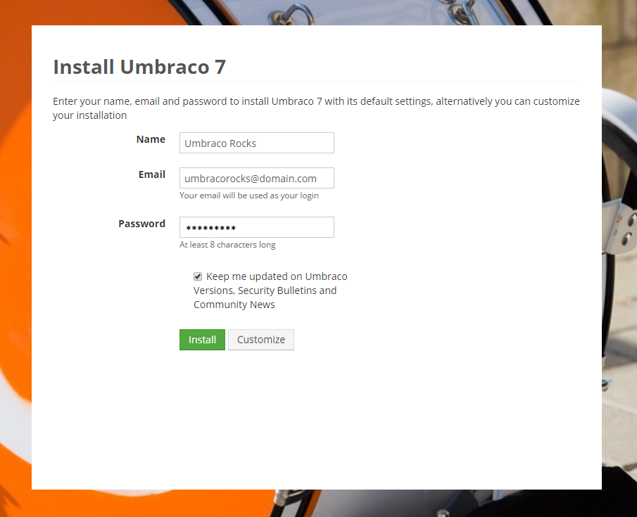
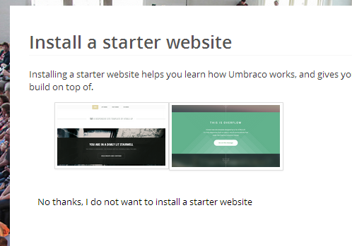
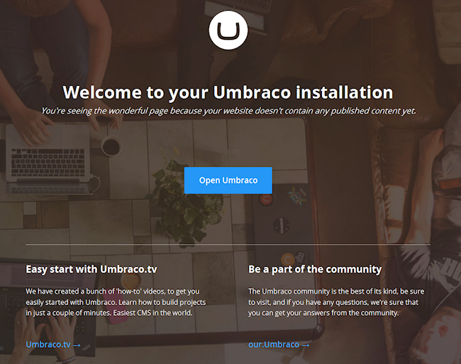

# Introduction 

The following sections of the "Creating a Basic Site" tutorial provide step by step instructions through an Umbraco website build starting from a set of flat HTML, CSS and JavaScript files. It will allow you to take any website "template" and install it into a fresh Umbraco and wire up the sections that need content managing in Umbraco.  

# **What You’ll Need**

To take you through a demo of installing a basic site in Umbraco you need the following:

*    A clean, empty installation of Umbraco – e.g. no starter site installed, see the notes below what to do when running through the installation wizard. Use the latest main 7.X download. Follow the installation steps in the documentation [https://our.umbraco.com/documentation/Installation](https://our.umbraco.com/documentation/Installation)  
*    The tutorial instructions uses a copy of Initializr – a HTML5, responsive website template. [https://github.com/verekia/initializr-template/archive/master.zip](https://github.com/verekia/initializr-template/archive/master.zip) or, if you prefer, you can use your own flat HTML files.

# **Getting Started**

## Installing an Empty Umbraco

This guide doesn’t cover the installation of Umbraco – follow the instructions in https://our.umbraco.com/documentation/Installation. When you see the first splash screen click **_customize_** – either fill in your MS SQL blank DB credentials or use the CE option – then on the final screen use the “**_No thanks I do not want to use a starter website_**”. 

 

*Figure 1 - Installation Splash Screen - note the Customize link*

*Figure 2 - Install a starter website - No Thanks!*

## Checking you have an Empty Umbraco Install

When you hit your local host address (http://localhost or whatever you’ve set up) you should see the Umbraco empty page screen. 

 

*Figure 3 - This is correct – we have a blank, empty Umbraco website!*

If you can see the Umbraco Starter kit site you’ve missed the option to install Umbraco with no starter site.  

 

*Figure 4- You should NOT see this!*

You need to reinstall Umbraco if you can see the starter kit – if you did a manual install you can delete all files in the directory where your local host is being served from, copy the Umbraco zip contents back in and then hit localhost in your browser.  

## Preparing the Initializr Template Site 

Now unzip the Initializr contents to a folder onto your desktop (or a place of your choosing).  Now open the **_index.html_** from this directory in your preferred browser to see the template – you can see it’s full of lovely filler text with dummy links. We’re going to turn this into a fully fledged, Umbraco-powered site! 

 

*Figure 5 - The Initializr Template*

Log into your Umbraco installation (e.g. go to http://localhost/umbraco in your browser).  You should be faced with an empty Umbraco installation – but where to start!?

 

*Figure 6 - A barren, empty Umbraco installation*

---

## Next - [Creating Your First Document Type](Document-Types.md)
How to create Document Types and what they do.

