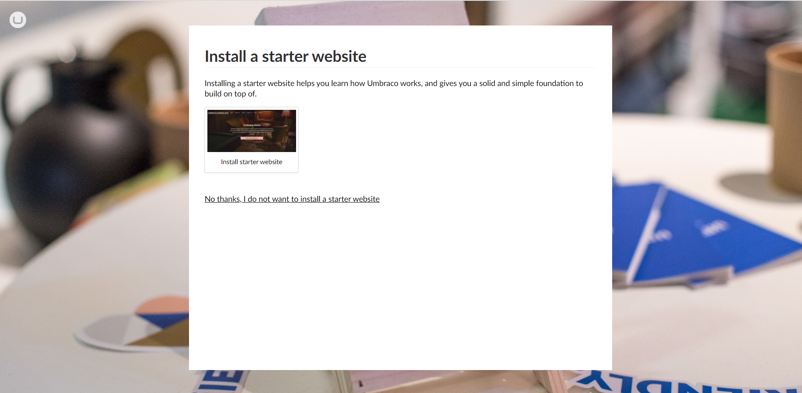

# Introduction

This tutorial provides step by step instructions to build an Umbraco website using a set of flat HTML, CSS, and JavaScript files. It  allows you to use a website template, customize it, and wire up the sections that need content managing in the Umbraco CMS.

## **What You Need**

To install a basic website in the Umbraco CMS, you need the following:

* A clean and empty installation of the Umbraco CMS without the starter site installed. See the [Verifying your Umbraco Installation](#verifying-your-umbraco-installation)
* This tutorial uses a custom made template, called Custom Umbraco Template. You can download the [Custom Umbraco Template](http://umbra.co/Umbracotemplate) or, if you prefer, you can use your own flat HTML files.

## **Getting Started**

### Installing Umbraco

To download the latest version of Umbraco, refer to the [Installation article](../../../Getting-Started/Setup/Install). On the installation wizard, follow the steps:

1. Enter your **Name**, **Email**, and **Password**.
    
2. Click **Customize**.
3. In the **Configure an ASP.Net Machine Key** window, click **Continue**.
4. In the **Configure your database** window, click **Continue**.
5. In the **Install a starter website**, click **No thanks, I do not want to install a starter website**.
    
6. The installation will take a couple of minutes to complete.

### Verifying your Umbraco Installation

When you run your local host address (http://localhost:xxxx), you will see the **Welcome to your Umbraco installation** screen.

If you see the starter kit, you need to re-install Umbraco. To re-install Umbraco, follow these steps:

1. Delete the folder from where you run the local host.
2. Unzip the downloaded Umbraco installation folder and open the extracted folder in VS Code.
3. Run localhost in your browser.

### Preparing the Custom Umbraco Template Site

1. Unzip the Custom Umbraco Template to a folder on your system.  
2. Open the **index.html** from the folder in your preferred browser to see the template. The template contains some text with dummy links. We’re going to turn this into a fully fledged, Umbraco-powered site!

### Logging in to Umbraco

Now that you have the **Welcome to your Umbraco installation** screen, click **Open Umbraco**. You should see a similar Umbraco Backoffice as the image below.

---

## Next: [Creating Your First Document Type](../Document-Types)
