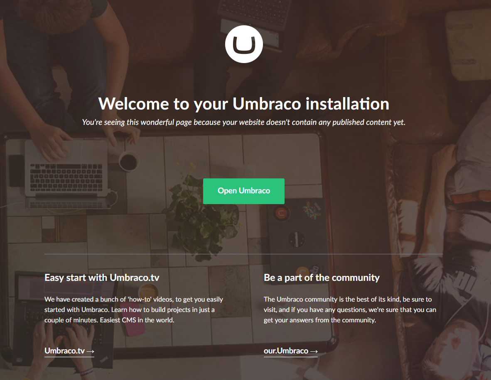
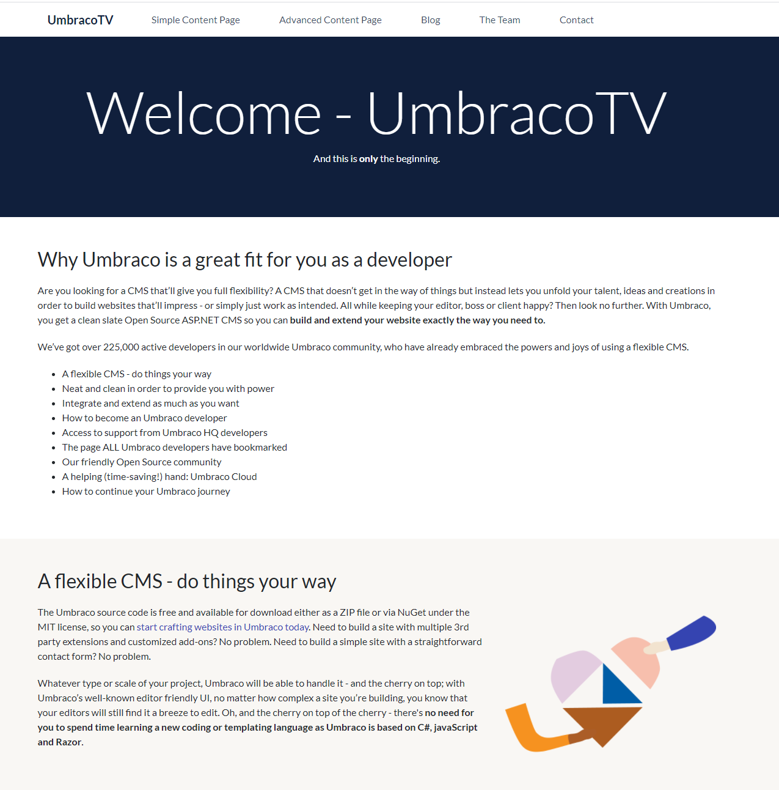
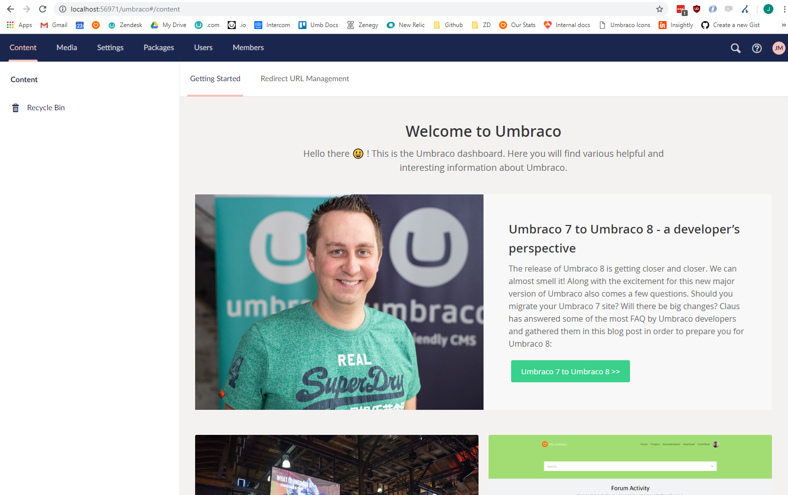

# Introduction

The following sections of the "Creating a Basic Site" tutorial provide step by step instructions through an Umbraco website build starting from a set of flat HTML, CSS and JavaScript files. It will allow you to take any website "template" and recreate it and wire up the sections that need content managing in the Umbraco CMS.

# **What You’ll Need**

To take you through a demo of installing a basic site in the Umbraco CMS you need the following:

*    A clean, empty installation of the Umbraco CMS without the starter site installed. See the notes below for what to do when running through the installation wizard.  
*    This tutorial uses a copy of Retrospect – a HTML5, responsive website template from Templated.co - [https://templated.co/retrospect](https://templated.co/retrospect) or, if you prefer, you can use your own flat HTML files.

# **Getting Started**

## Installing an Empty Umbraco

[Follow the steps in the Installation article](../../../Getting-Started/Setup/Install) using the latest Umbraco 8.x download. When the installation wizard starts click [Customize] and choose to **not** install the starter kit.

## Checking you have an Empty Umbraco Install

When you hit your local host address (http://localhost or whatever you’ve set up) you should see the 'Welcome to your Umbraco installation' screen.

You need to reinstall Umbraco if you can see the starter kit. If you did a manual install you can delete all files in the directory where your local host is being served from. Then, copy the Umbraco zip contents back in and then hit localhost in your browser.

## Preparing the Retrospect Template Site

Now unzip the Retrospect contents to a folder onto your desktop (or a place of your choosing).  Now open the **_index.html_** from this directory in your preferred browser to see the template – you can see it’s full of lovely filler text with dummy links. We’re going to turn this into a fully fledged, Umbraco-powered site!

Log into your Umbraco CMS installation (e.g. go to http://localhost/umbraco in your browser).  You should be faced with an empty Umbraco Backoffice similiar to the image below.

---

## Next - [Creating Your First Document Type](../Document-Types)
How to create Document Types and what they do.
