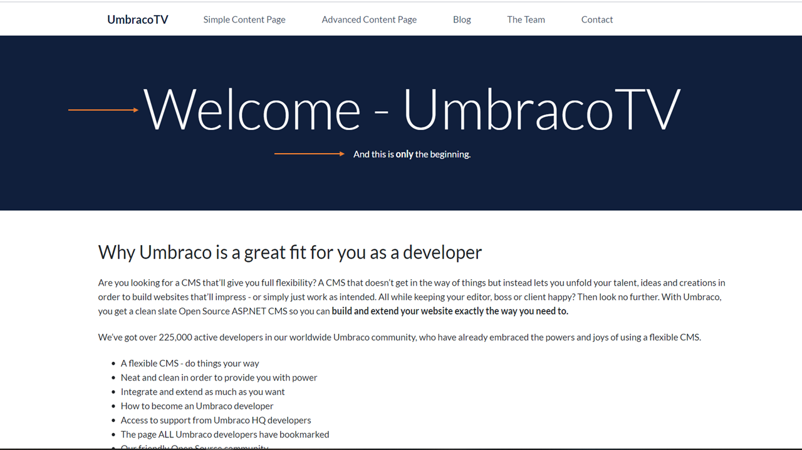
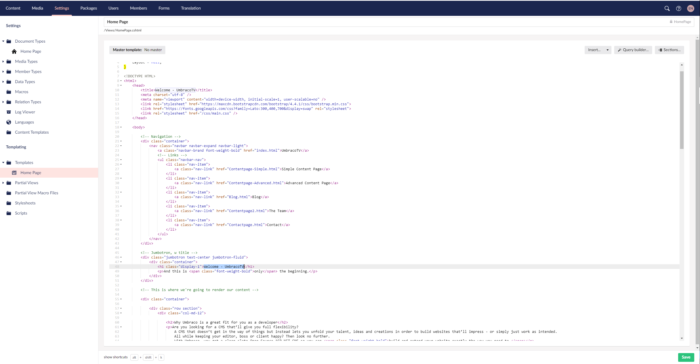
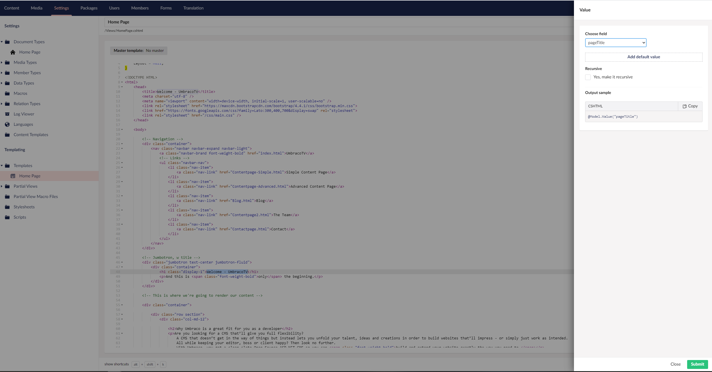
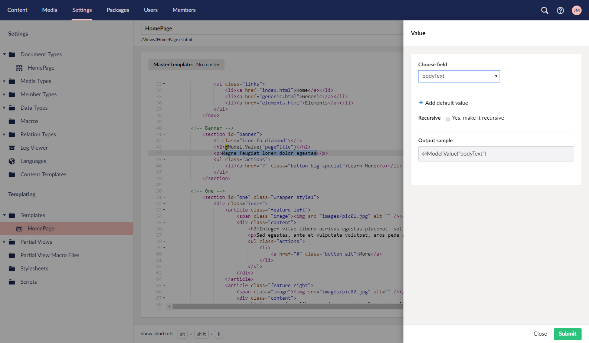
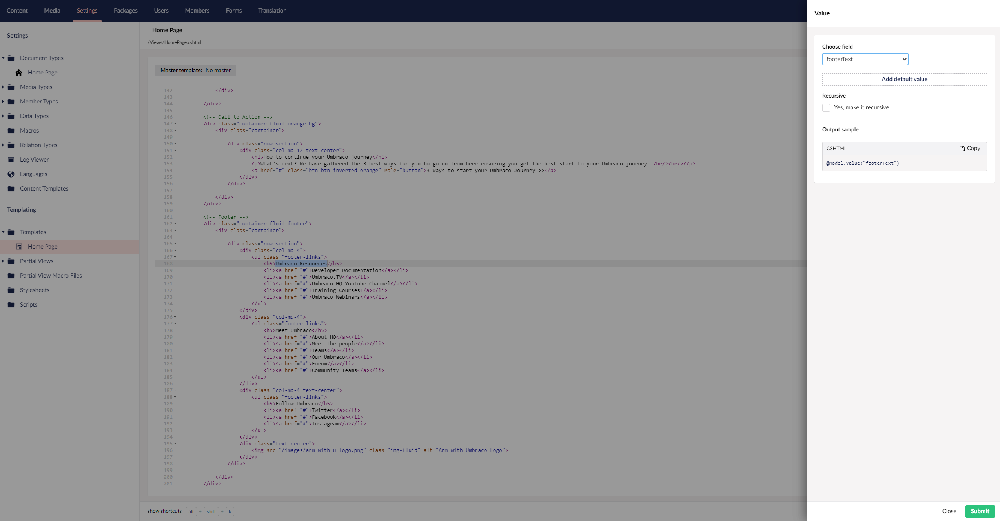

# Outputting the Document Type Properties

What you’ll notice is that the content we've added to the homepage isn’t being output. We need to wire up the data type properties (the data fields we've created in Umbraco that the editors can edit) to the template.  Let’s look at our template and identify where the content from the data properties we created before should go.

The top arrow in this image will be the "Page Title" and the bottom one will be the "Body Text", whereas the Footer is all the way at the bottom.

Go to the **_Settings > Templates > Homepage_**. Scroll down and highlight the text `“Etiam adipiscing”` around line 43.

Click the button **_Insert_** and then **_Value..._** in the Value window choose the **_pageTitle_** field.

Next do the same for the content in the `

` tags on the next line using the field **_bodyText_**.

Finally we do the footer – between the `<li></li>` tags in the footer (line 163).

Now go and reload your homepage... voilà! We have content! Now, we could go back and add additional fields in the document type, fill them out in the content node and then hook them up to the template to output the right data in the end. Feel free to do so if you want!

---
## Next - [Creating Master Template Part 1](../Creating-Master-Template-Part-1)
How to create a Master Template and use this to create more pages whilst minimising duplicate HTML code from your flat source files.
