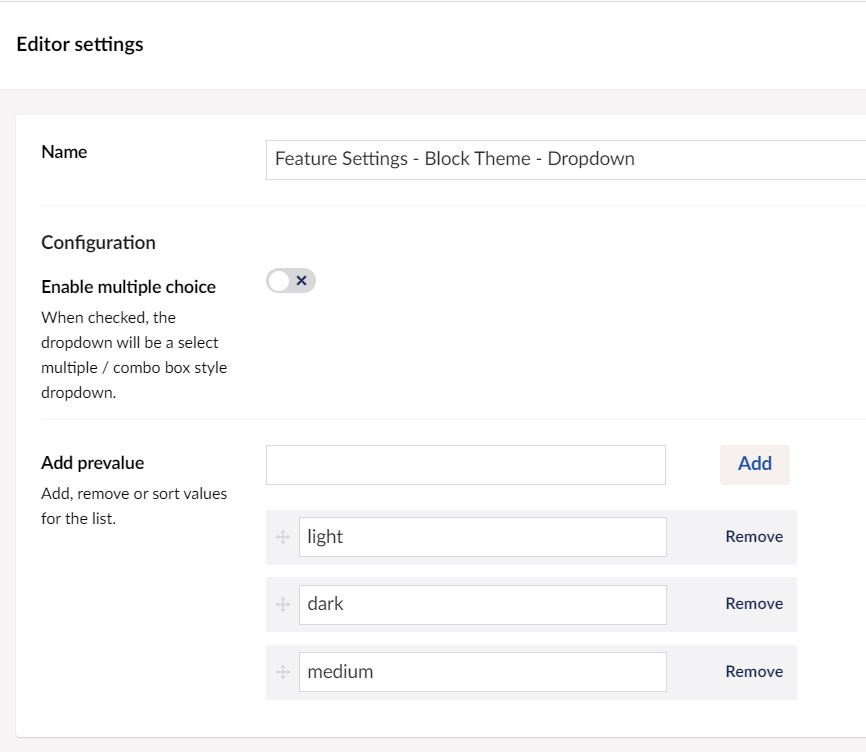
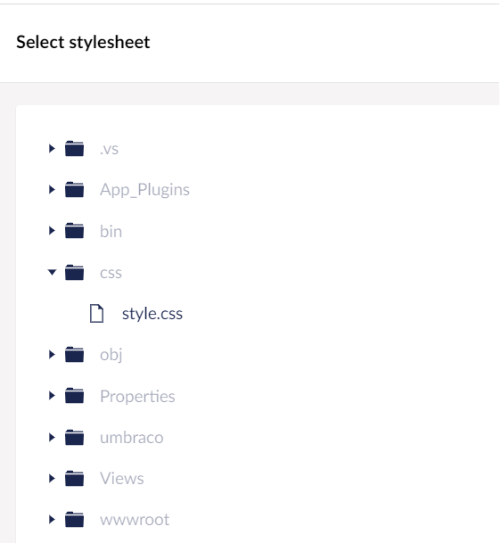
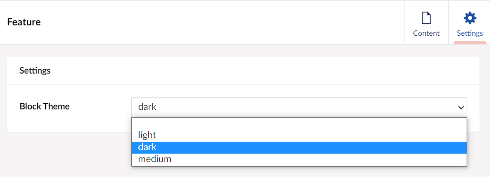

# Custom Views for Block List

Custom Views are used to overwrite the AngularJS view for the Block List in the Content editor. We can improve the editing experience by overwriting the default representation of our block entries with a custom view that will provide a better view of how the content will look on the frontend.

## Creating the Document Type

For this tutorial, we will set-up a simple document type and create a new property using Block List as the property editor.

To create a Document Type:

1. Go to **Settings**.
2. Select the **...** next to the **Document Types** in the **Settings** tree.
3. Select **Document Type with Template**.

    :::tip
    Using folders can help you organize your **Document Types**.
    :::
4. Enter a **Name** for the **Document Type**. Let's call it _Product_. You'll notice that an **Alias** is automatically created.
5. Click **Add Group** and **Enter a Name** for the group. Let's call it _Product Details_.
6. Add the following properties:
    
7. Add another group called **Features** and a property with the following specification:

    | Name        | Features                      |
    |-------------|-------------------------------|
    | Alias       | features                      |
    | Data Type   | Block List                    |
8. Click **Save**. Your document type should look like:
    

## Creating the Content Node

To create the Content Node:

1. Go to the **Permissions** tab and select **Add Child** in the **Allowed child node types**. The **Choose Child Node** window appears.
2. Select the **Product** document type and click **Save**.
3. Go to **Content**.
4. Select **...** next to **Content** and select **Product**.
5. **Enter the Name** for the article. We are going to call it _Product_.
6. Fill the required details in the **Product** page and click **Save**.

## Configuring the Block List Editor

To configure the Block List editor:

1. Go to **Settings** and open the **Product** document type.
2. Click on the **Block List** property we created earlier. You'll see the Block list editor's configuration, as shown below:

    

In the **Configuration** section, we can add **Available Blocks**, define the range of blocks that can be added, control the live and inline editing mode, or set the property editor width. The Available Blocks in the Block List editor configuration differentiates it from the other property editors. The list you create with the Block List editor is based on one or more blocks. Each block is based on an Element Type.

To add blocks to our Block List editor:

1. Click **Add** in the **Available Blocks**. The **Pick Element Type** window opens. From here, you have the option to select an existing Element Type, if any, or you can create a new Element Type from the configuration screen.
2. For this tutorial, we will **Create a new Element Type**.
3. Setup a new Element type called **Feature** and use the following configuration:

    | Property Name  | Alias   | Editor      |
    |----------------|---------|-------------|
    | Name           | name    | Textstring  |
    | Details        | details | Textarea    |
    | Image          | image   | Media Picker|

4. Click **Save and Close**. The block configuration window opens. For more information on the block configuration, see the [Setup Block Types](../../Fundamentals/Backoffice/Property-Editors/Built-in-Property-Editors/Block-List-Editor/index.md#setup-block-types) section.
5. Similarly, I'll set up another block called **Hero**.
6. Toggle **Live Editing mode** and select **Submit**.

## Creating Custom Views for blocks

We can improve the editing experience by overwriting the default representation of our block entries with a custom view that provides a better view of how the content will look on the frontend. Currently, you can only pick HTML files for a custom view. AngularJS powers these views, and therefore you can write any AngularJS logic.

Let's create a `custom.html` file with the following configuration:

```html
<section id="banner" ng-click="block.edit()">
    <div class="content">
        <header>
            <h1>{{block.data.name}}</h1>
        </header>
            <p>{{block.data.details}}</p>
    </div>

</section>
```

:::note
Once the HTML file is updated, make sure that you restart your application.
:::

### Assigning the View to the Block

Now that we have created our view, let's assign it to our block:

1. Go to **Product** in the **Settings** tree.
2. Click the `cog` wheel next to **Features**.
3. Select the **Product - Features - Block List**. The **Editor Settings** window opens.
4. Select **Feature** from the **Available Blocks** configuration. The **Configuration of 'Feature'** window opens.
5. Select **Add Custom View** in **Custom View** and browse to the **custom.html** file.
    
6. Click **Submit**.

### Adding Content to the Blocks

To add content to the blocks:

1. Go to the **Content** section and select **Product**.
2. Select **Add Content** in the **Features** group. The **Add Content** displays the blocks we created earlier.
   
3. Select **Feature**. The **Feature** window opens.
4. Enter the **Name** and **Details** in the Feature window. You will notice you can view the content as you type. This is because we have enabled the **Live editing** mode.
5. Click **Confirm**.
   

## Creating `Settings` section for Blocks

Now, we have overwritten the AngularJS view for the content editor's block presentation by using our own view. Let's create a **Settings** section to control the background color and text color of the block. To do this, we need to add a **Settings** model to our block configuration.

To add a Settings model:

1. Go to **Product** in the **Settings** tree.
2. Click the `cog` wheel next to **Features**.
3. Select the **Product - Features - Block List**. The **Editor Settings** window opens.
4. Select **Feature** from the **Available Blocks** configuration.
5. Select **Settings Model** in the Data Models section. The **Attach a settings Element Type** window opens.
6. Select **Create new Element Type**.
    a. **Enter a Name** for the element type. Let's say *Feature Settings*.
    b. Give it an icon.
    c. Click **Add Group** and **Enter a Name**. Let's call it *Settings*.
    d. Click **Add Property** and **Enter a Name**. Let's call it *Block Theme*. An alias *blockTheme* is generated.
    e. Select **Dropdown List** as the editor. The **Editor Settings** window opens.
    f. In the Add prevalue field, add **light**, **dark** and **medium** as values.
        
    g. Click **Submit**.
7. Click **Submit**.
8. Click **Save and Close**.
    
9. Click **Submit** until you reach the Product document type.
10. Click **Save**.

We need to update the `custom.html` file with the following configuration:

```html
<section id="banner" ng-click="api.editBlock(block, block.hideContentInOverlay, index, parentForm)">

    <div class="text-block" ng-class="{'bg-dark': block.settingsData.blockTheme[0] === 'dark', 'bg-light': block.settingsData.blockTheme[0] === 'light', 'bg-medium': block.settingsData.blockTheme[0] === 'medium' }">
        <div class="content">
            <header>
                <h1>{{block.data.name}}</h1>
            </header>
                <p>{{block.data.details}}</p>
        </div>
    </div>
</div>
```

Additionally, we need to update our stylesheet to use the color configuration. For this tutorial, I have created a `style.css` stylesheet with the following styles:

```css
@import url(https://fonts.googleapis.com/css?family=Montserrat|Source+Sans+Pro:400,700,300,600,600italic,400italic);

body {
 font-family: 'Source Sans Pro', sans-seif;   
}

h1{
    font-weight:900;
}
    
.text-block{
    padding:20px;
}

.bg-dark {
    background-color: #33ddaa;
    color: #8866aa;
}

.bg-light {
    background-color:#b76e79;
    color:#f50407;
}
        
.bg-medium{
    background-color:#2211aa;
    color:#b76e79;
}
```

### Assigning the Stylesheet to the Block

Now that we have updated our view and stylesheet let's assign it to our block.

1. Go to **Product** in the **Settings** tree.
2. Click the `cog` wheel next to **Features**.
3. Select the **Product - Features - Block List**. The **Editor Settings** window opens.
4. Select **Feature** from the **Availabe Blocks** configuration. The **Configuration of 'Feature'** window opens.
5. Select **Add Stylesheet** and browse to **style.css**.
    
6. Select **Add Settings** in the **Settings model** and select **Feature Settings**.
7. Click **Submit** until you reach the Product document type.
8. Click **Save**.
9. Restart your application. Now, when you head over to the **Product** page in the **Content** section and hover over the block you will notice the settings option.
    
10. Click on **Edit Settings** and you can see the **Block Theme** options we created.
    
11. **Select a Theme** of your choice and click on **Submit** to see the changes reflect on your block.
    

## Rendering the Block List Content

To render the stored value of your Block List editor on the frontend, see the [Rendering Block List Content](../../Fundamentals/Backoffice/Property-Editors/Built-in-Property-Editors/Block-List-Editor/index.md#rendering-block-list-content) section.
