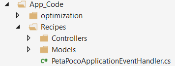

# Tutorial - Creating Exernal Databases in Umbraco with Peta Pocos

## Overview

This guide will take you steps to create external databases in Umbraco using Peta Pocos

## What is Peta Poco?

PetaPoco is a tiny & fast micro-ORM for . NET. It is tiny with abosoutely no dependencies

## Requirements Needed to Use PetaPoco

- Umbraco 7+ with a SQL Database
- Umbraco 8+ does not support Peta Poco
- Nuget Peta Poco Package - Optional (https://www.nuget.org/packages/PetaPoco/)

## Steps to Create Your First Table
- [Setting up the folders](#setting-up-the-folders)
- [Creatung our first table](#creating-our-first-table)
- [Implementing new table](#implementing-new-table)
- [Accessing the new table](#accessing-the-new-table)

## Related Links
[CollaboratingPlatypus/PetaPoco](https://github.com/CollaboratingPlatypus/PetaPoco)

## Setting up the folders 
First, we need set up structure for our data and tables. Under the `App_Code` folder, create a `Recipes`.  Next under `Recipes` create a folder called `Models` and under that folder create a folder called `pocos` or `PetaPocos`. In the `pocos` or `PetaPocos` folder the table will be created.


## Creating our first table
Next, we need to create a table, we are going to call it `Recipe`. Next, we need to create a table, we are going to call it `Recipe`. In the sample code, line 4 and 5 are needed in order to set up the table in the database. `Umbraco.Core.Persistence` and  `Umbraco.Core.Persistence.DatabaseAnnotations` contain the methods Umbraco uses for databases and table. The line after that is the path to the poco file. Here is some sample code, and we will explain it as well: 

```csharp
using System;
using System.Collections.Generic;
using System.Text;
using Umbraco.Core.Persistence;
using Umbraco.Core.Persistence.DatabaseAnnotations;

namespace Recipes.Models.pocos
{

    [TableName("CMSRecipes")]
    [PrimaryKey("RecipeId", autoIncrement = true)]
    [ExplicitColumns]

    public class recipe
    {
    
        [Column("RecipeId")]
        [PrimaryKeyColumn(AutoIncrement = true)]
        public int RecipeId { get; set; }
     
        [Column("RecipeName")]
        [Length(250)]
        public string RecipeName { get; set; }

        [Column("Description")]
        [SpecialDbType(SpecialDbTypes.NTEXT)]
        public string Description { get; set; }

        [Column("Directions")]
        [SpecialDbType(SpecialDbTypes.NTEXT)]
        public string Directions { get; set; }

        [Column("ServingSize")]
        [NullSetting(NullSetting = NullSettings.Null)]
        [Length(100)]
        public string ServingSize { get; set; }

        [Column("DateSubmitted")]
        public DateTime DateSubmitted { get; set; }

        [Column("DateApproved")]
        [NullSetting(NullSetting = NullSettings.Null)]
        public DateTime DateApproved { get; set; }

        [Column("UserId")]
        [NullSetting(NullSetting = NullSettings.Null)]
        public int UserId { get; set; }
       
        [Column("CategoryID")]
        public int CategoryID { get; set; }
        
    }

}
```

## Implementing new table
Next we want to implement the table to Umbraco website and database. First we will create a `PetaPocoApplicationEventHandler.cs` file under the `Recipes` folder. 



This file will help us create the new table `Recipe` for our site. Thing to note in the sample code, `ApplicationEevntHandler` and `Umbraco.Core.Persistence` are required to create the table. The fisrt line is neccessary to access the table code:

```csharp
using Recipes.Models.pocos;
using Umbraco.Core;
using Umbraco.Core.Persistence;

namespace Recipes
{
    public class PetaPocoApplicationEventHandler : ApplicationEventHandler
    {
        protected override void ApplicationStarted(UmbracoApplicationBase umbracoApplication, ApplicationContext applicationContext)
        {
            var ctx = applicationContext.DatabaseContext;
            var db = new DatabaseSchemaHelper(ctx.Database, applicationContext.ProfilingLogger.Logger, ctx.SqlSyntax);

            if (!db.TableExist("CMSRecipes"))
            {
                db.CreateTable<recipe>(false);
            }    

        }
    }
}

```
Once you restart the site, the table will be created. You will be thrown errors for any code issues before the table is created.
If you have access to the database, you can use `Microsoft SQL Server Manaagement Studio` to check for the table.

## Accessing the new table
Now we are ready to access the new table. We can insert, select, delete, and update data. We create a new call `Recipes` outside of the `PetaPoco` or `Pocos` folder. Lines 4 and 5 are key accessing data, one is for acccessing Umbraco Database Methods and the next one is used to access the table code. Here is a sample of the code.

```csharp
using System.Collections.Generic;
using System;
using System.Linq;
using Umbraco.Core.Persistence;
using Recipes.Models.pocos;

namespace Recipes.Models
{

    public class Recipes
    {

        // Saves Inserted data
        public recipe Save(recipe items)
        {
            UmbracoDatabase db = Umbraco.Core.ApplicationContext.Current.DatabaseContext.Database;
            db.Save(items);
            return items;

        }
        // Gets Recipe By Id
        public static recipe GetRecipe(int RecipeId)
        {
            UmbracoDatabase db = Umbraco.Core.ApplicationContext.Current.DatabaseContext.Database;
            List<recipe> Recid = db.Fetch<recipe>("SELECT * FROM CMSRecipes WHERE Recipeid = @0", RecipeId);
            db.CompleteTransaction();
            db.CloseSharedConnection();
            if (Recid.Count > 0)
                return Recid[0];
            else
                return null;
        }
        // Get Recipe By Name
        public static recipe GetRecipeID(string RecipeName)
        {
            UmbracoDatabase db = Umbraco.Core.ApplicationContext.Current.DatabaseContext.Database;
            List<recipe> Recid = db.Fetch<recipe>("SELECT RecipeID FROM CMSRecipes WHERE RecipeName = @0", RecipeName);
            db.CompleteTransaction();
            db.CloseSharedConnection();
            if (Recid.Count > 0)
                return Recid[0];
            else
                return null;
        }

    }
}    
```

## In conclusion:
This is a simple way to implement external tables into Umbraco Website