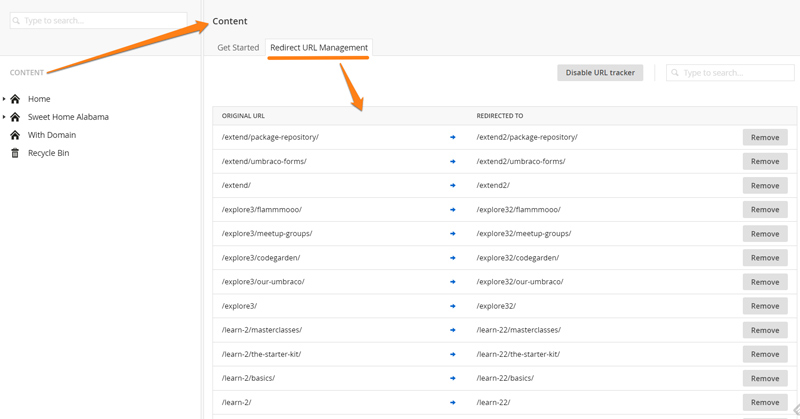
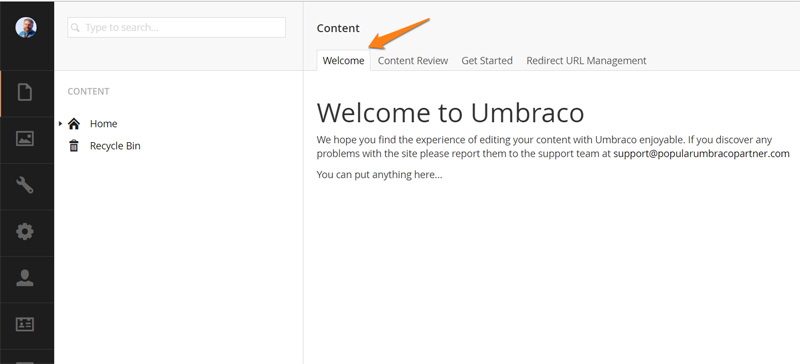
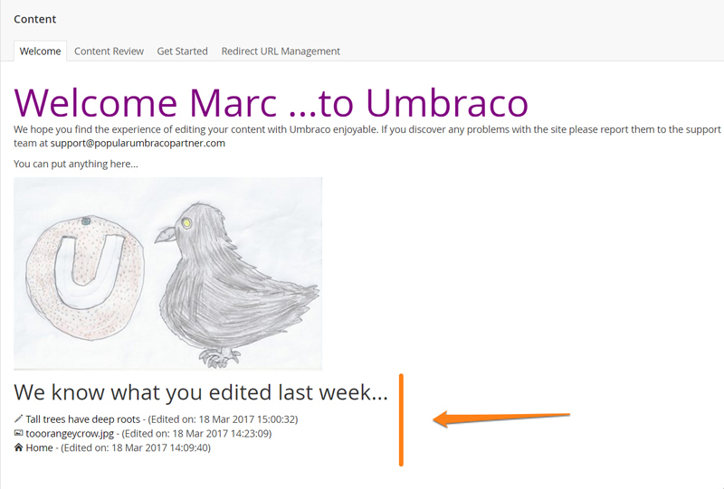
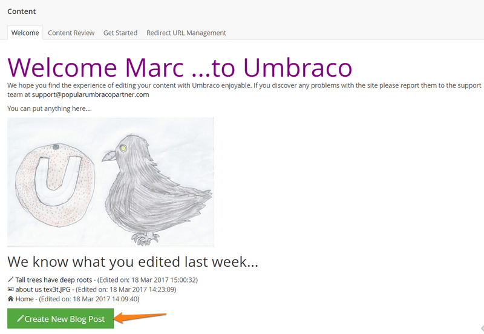

# Tutorial - Creating a Custom Dashboard

## Overview

This guide takes you through the steps to setup a simple Custom Dashboard in Umbraco. 

### What is a dashboard?

A tab on the right hand side of a section eg. Redirect Url Management dashboard in the Content section

### Why?

It is generally considered good practice when you build an Umbraco site to provide a custom dashboard to welcome your editors and provide information about the site and/or provide a helpful gateway to common functionality within the site.
This guide will show the basics of creating a custom 'Welcome Message' dashboard and then show how you can go a little further to provide interaction using angularJS...

So all the steps we will go through:

- Setting up the dashboard plugin
- Writing a basic Welcome Message View
- Configure the Custom Welcome Dashboard to be displayed.
- Adding styles
- Adding an AngularJS controller
- Display the Current User's name in our Welcome message
- Display User's Recent Updates
- Create a shortcut button to add a new blog post
- You can do anything...

## Prerequisites
This tutorial uses AngularJS with Umbraco, so it does not cover AngularJS itself, as there are tons of resources on that already here:

- [egghead.io](http://www.egghead.io/)
- [angularjs.org/tutorial](http://docs.angularjs.org/tutorial)
- [Tekpub](http://tekpub.com/products/angular)

There are a lot of parallels here with Creating a Property Editor, the tutorial '[Creating a Property Editor Tutorial](../../Tutorials/creating-a-property-editor/index.md)' is very much worth a read through too.

## The end result

At the end of this guide we should have a welcome dashboard displaying a list of the editor's recent site updates.

## Setting up a plugin

The first thing we must do is create a new folder inside `/App_Plugins` folder. We will call it
`CustomWelcomeDashboard`

## Creating the dashboard view

Next we will create a html file inside this folder called 'WelcomeDashboard.html' the html file will contain a fragment of a html document and so does not need <html><head><body> entities.

Add the following html to the WelcomeDashboard.html

    

        <h1>Welcome to Umbraco</h1>
        
We hope you find the experience of editing your content with Umbraco enjoyable and delightful. If you discover any problems with the site please report them to the support team at <a href="mailto:">support@popularumbracopartner.com</a>

        
You can put anything here...

    

## Configuring the dashboard to appear

Open up your dashboard.config file from the /config folder of your site. ([explaination of the Dashboard Config settings are here...](../../Extending/Dashboards/index.md))

Add the following section:

    <section alias="Custom Welcome Dashboard">
        <access>
            <deny>translator</deny>
        </access>
        <areas>
            <area>content</area>
        </areas>
        <tab caption="Welcome">
            <control>
                /app_plugins/CustomWelcomeDashboard/WelcomeDashboard.html
            </control>
        </tab>
    </section>

So the terminology here gets a bit muddled but we're creating a 'Section' (but this is not the same 'Section' as the 'Content Section' - which here is called an 'Area'), this is specifically a 'Dashboard Section' that you can use to group your dashboard tabs and controls together.

The above configuration is saying:

> "Add a tab called 'Welcome' to the 'Content' area/section of the Umbraco site, use the WelcomeDashboard.html as the content (view) of the dashboard, and don't allow 'translators' to see it!"

**Note:** The order in which the tab will appear in the Umbraco Backoffice depends on its position in the dashboard.config file, so to make our Custom Welcome message the first Tab the editors sees in the content section, make sure the above configuration is the 'first' section configuration in the dashboard.config file.

**Note:** You can specify multiple controls to appear on a particular tab, and multiple tab's in a particular section.

**Note:** You can remove existing dashboards, and control who gets to see them by updating the other configuration sectons in the Dashboard.config file

### The Result

## Adding styles

Congratulations! job done - no this is just the starting point the dashboard can be styled as you want it to be, but there are a couple of further steps to undertake be able to apply a custom stylesheet to the dashboard:

We need to add a package.manifest file to our CustomWelcomeDashboard folder

(this file allows Umbraco to load other resource to use with your html view - it's just a file - it's called by convention 'package.manifest' and will contain the configuration of the resources to load in JSON format)

When Umbraco loads the dashboard it will look for this file in the same folder as your html view (remember the dashboard config points to the html view) and use this manifest to load the other resources to use with the Dashboard.

This manifest file is simpler to the one you would create for a [custom property editor] (../../Extending/Property-Editors/package-manifest.md)

Inside this package manifest we add a bit of JSON to describe the dashboard's required javascript and stylesheet resources:

    {
        javascript:[
	    /*javascript files listed here*/
        ],
	    css: [
		    /*list of stylesheets appear here:*/
	    "~/app_plugins/CustomWelcomeDashboard/customwelcomedashboard.css"
	    ]
    }

Now create a stylesheet in our CustomWelcomeDashboard folder called 'customwelcomedashboard.css', and add some styles, I don't know perhaps:

    .welcome-dashboard h1 {font-size:4em ; color:purple}

This stylesheet will now be loaded and applied to your dashboard. Add images and html markup as required:

(one caveat is the package.manifest file is loaded into memory when Umbraco starts up, so if you are adding a new stylesheet or javascript file you will need to start and stop your application for it to be loaded)

## Adding functionality

We can add functionality to the dashboard by associating an AngularJS controller with the html view.

Let's add a new file to the CustomWelcomeDashboard folder called 'customwelcomedashboard.controller.js' where our controller code will live.

and register this AngularJS controller to the Umbraco angular module: 

    angular.module("umbraco").controller("CustomWelcomeDashboardController", function ($scope) {
        var vm = this;
        alert('hello world');
    });

In our html view update the outer div to hook up to this controller:

    

and finally we need to update the package.manifest file to load the additional controller js file when the dashboard loads:

    {
        javascript:[
	    /*any comma delimited list of javascript files appear here*/
	    "~/app_plugins/CustomWelcomeDashboard/customwelcomedashboard.controller.js"
        ],
	    css: [
		    /*a comma delimited list of stylesheets appear here:*/
	    "~/app_plugins/CustomWelcomeDashboard/customwelcomedashboard.css"
	    ]
    }

If all is setup fine we should now receive the 'Hello world' alert everytime the dashboard is reloaded in the content section.

### Going further - Umbraco Angular Services and Directives

Umbraco has a fine selection of angular directives, resources and services that you can use in your custom property editors and dashboards, the details are here: https://our.umbraco.org/apidocs/ui/#/api

For this example it would be nice to welcome the editor by name (Umbraco is a place where everybody knows your name...), to achieve this we can use the **userService** here to customise our dashboard welcome message and increase friendliness:

We inject the userService into our AngularJS controller like so:

    angular.module("umbraco").controller("CustomWelcomeDashboardController", function ($scope,userService) {

and then we can use the userService's promise based 'getCurrentUser()' method to get the details of the current logged in user:

    var user = userService.getCurrentUser().then(function (user) {
        console.log(user);
        vm.UserName = user.name;
    });

(Tip: notice you can use console.log to view in your console window what is being returned by the promise, it helps to debug, but also understand what properties are available to use)

and finally we can now update our view to incorporate the current user's name in our Welcome Message:

    <h1>Welcome {{vm.UserName}} ...to Umbraco</h1>

and for reference the full contents of /customwelcomedashboard.controller.js at this stage of the tutorial should look like this:

    angular.module("umbraco").controller("CustomWelcomeDashboardController", function ($scope,userService) {
        var vm = this;
        vm.UserName = 'guest';

        var user = userService.getCurrentUser().then(function (user) {
            console.log(user);
            vm.UserName = user.name;
        });
    });

## I know what you did last Tuesday...

A returning editor may find it useful to see a list of the last few articles they have been editing, with a handy link to load and continue editing (instead of having to remember, and find the item again in the Umbraco Content Tree).

We can make use of Umbraco's Angular resource for retrieving audit log information, the **logResource** and make use of the **getUserLog** method to return a list of items the user has saved recently.

So we inject the logResource into our controller:

    angular.module("umbraco").controller("CustomWelcomeDashboardController", function ($scope,userService,logResource) {

We'll add a property on our ViewModel to store the log information:

    vm.LogEntries = [];

and we'll add to our WelcomeDashboard.html view some markup which will make use of angular's *ng-repeat* to display a list of these log entries:

    <h2>We know what you edited last week...</h2>
        <ul>
            <li ng-repeat="logEntry in vm.LogEntries">{{logEntry.nodeId}} - {{logEntry.comment}} - {{logEntry.timestamp  | date:'medium'}}</li>
        </ul>

and back in our controller we'll populate the array of entries using the logResource, returning any log entries of 'Save' type:

     logResource.getUserLog("save",new Date())
       .then(function (response) {
            console.log(response)
            vm.LogEntries = response;
       }

However looking at the console output will reveal the data retrieved by the logResource is a little sparse eg:

    Object
        $$hashKey:"265"
        Content:
            Object
                comment:"Save Content performed by user"
                logType:1
                nodeId:1063
                timestamp:"2017-03-18T14:09:40.91"
                userId:0

So there is a bit of work to be done to provide something meaningful to the editor from the audit log!

We need to make use of the **entityResource**, an Umbraco Angular resource that enables us to pull back more information about an entity given its id.

Inject this into our angular controller:

    angular.module("umbraco").controller("CustomWelcomeDashboardController", function ($scope,userService,logResource,entityResource) {

and now we can loop through the response from the logResource, filter out 'saves' we're not interested in eg, Macro Saves, or DocType Saves, generally we need the entry in the log to have a nodeId and mention either Media or Content in the comment text. 

The **entityResource** then has a getById method that accepts the Id of the item and the entity 'type' to retrieve useful information about the entity eg its name.

Here's what we have:

       logResource.getUserLog("save", new Date()).then(function (response) {
            console.log(response);
            var logEntries = [];
            // loop through the response, and filter out save log entries we are not interested in
            angular.forEach(response, function (item) {
                // if no entity exists -1 is returned for the nodeId (eg saving a macro would create a log entry without a nodeid)
                if (item.nodeId > 0) {
                    //this is the only way to tell them apart!!
                    if (item.comment.indexOf("Media") > -1 || item.comment.indexOf("Content") > -1) {
                        if (item.comment.indexOf("Media") > -1) {
                            //log entry is a media item
                            item.entityType = "Media";
                            item.editUrl = "media/media/edit/" + item.nodeId;
                        }
                        if (item.comment.indexOf("Content") > -1) {
                            //log entry is a media item
                            item.entityType = "Document";
                            item.editUrl = "content/content/edit/" + item.nodeId;
                        }
                        //use entityResource to retrieve details of the content/media item
                        entityResource.getById(item.nodeId, item.entityType).then(function (ent) {
                            console.log(ent);
                            item.Content = ent;
                        });
                        logEntries.push(item);
                    }
                }
                console.log(logEntries);
                vm.LogEntries = logEntries;
            });
 
and we can update our view to be:

        <h2>We know what you edited last week...</h2>
        <ul class="unstyled">
            <li ng-repeat="logEntry in vm.LogEntries"><i class="{{logEntry.Content.icon}}"></i> <a href="/Umbraco/#/{{logEntry.editUrl}}">{{logEntry.Content.name}}</a> - (Edited on: {{logEntry.timestamp  | date:'medium'}})</li>
        </ul>

and it should look a bit like this:

(Note: the url /Umbraco/#/content/content/edit/1234 is the path to open up a particular entity (with id 1234) ready for editing.)

## I know what you want to do today

Well that's great, but one of the key user journeys an editor will make in the back office is to create a new thing, and if it is a person's job to create new blog entries in the same section two or three times a day, why not create them some shortcuts to achieve these common tasks:

We can use the knowledge that by convention a link to edit a page (as used above) when passed the additional querystring parameters doctype=alias and create=true, will present the user with a brand new content item to create within the section, and so all we need to add to our view is:

    

        <a class="btn btn-primary btn-large" href="/umbraco/#/content/content/edit/1075?doctype=BlogPost&create=true"><i class="icon-edit"></i>Create New Blog Post</a>
    

Where 1075, is the id of our blog section. (we could write some code in our controller to determine the best id for the current user to create entries)

## Custom External Data - creating your own angular resource

You can create your own custom angular services / resources, to interact with your own serverside data (using UmbracoAuthorizedJsonController), The property editor tutorial has a step explaining how to do this [part 4 - Adding server-side data to a property editor](../../Tutorials/creating-a-property-editor/part-4.md).

## What else? - what are you waiting for?

Perhaps the Dashboard is a gateway to a third party system or a tool to search specific content, or tools to help clean up existing content. extend extend extend

Asteroids... ?

