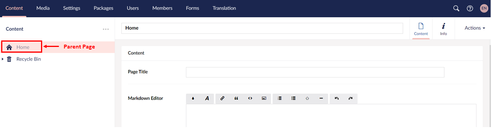
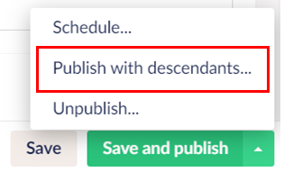

# Creating, Saving, and Publishing Content

In this section, you will get an overview of how to create a new page, save your content, and the options available for publishing and unpublishing the content.

## Creating a New Page

Select the parent page to create your new page. The parent page can be the home page or any of the sub-pages of the site. 

If the parent page allows sub-pages underneath it, follow these steps:

1. Hover over the name of the parent page in the **Content** section and click **•••** to view the types of pages you can create.
2. Select the page type you wish to create. The new page is loaded in the editor on the right-hand side.
3. Enter a **Name** for the page and click **Save**.

    

## Saving and Publishing Pages

There are three different options for saving and publishing pages. The options vary depending on whether you’re still in the process of editing the page or have completed your edits and wish to publish your changes.

### Option 1: Save and Preview

The **Save and preview** button allows you to save your changes and preview it before publishing the changes to the live site. The **Preview** feature shows you how the page will look once it is published. This **Save and preview** feature only saves your page and does not publish your contents to the live site.

### Option 2: Save

The **Save** button is used for saving the page without publishing the changes to the live site. The **Save** feature is especially useful if you are working on changes over a period of time as you can save your changes frequently to prevent losing any data.

### Option 3: Save and Publish

The **Save and publish** button is used to publish a previously saved page to the live website or to publish a page without previewing it. The **Save and publish** feature will save and publish the page to your live website.

The **Save and publish** button has three options:

#### 1: Schedule

The **Schedule** button allows you to set a time and a date for when your page should be published. With this option, you can continue working on your edits and the site will automatically be published at the time and date it was scheduled to.

To set up scheduled publishing, follow these steps:

1. Navigate to the page you want to publish.
2. Select the arrow next to the **Save and Publish** button.
3. Select **Schedule**.
4. In the **Scheduled Publishing** window, set the date and time in the **Publish at** field.

    
5. Select **Schedule**.

#### 2: Publish with descendants

The **Publish with descendants** button allows you to publish the current page and all the content linked to this page to the live site. Using this option, you can publish the current parent page and it's child nodes, previously published, and unpublished content items.

To publish the node with descendants, follow these steps:

1. Navigate to the page you want to publish.
2. Select the arrow next to the **Save and Publish** button.
3. Select **Publish with descendants**.

    
4. Toggle the option to **Include unpublished content items** if you wish to. This option includes all unpublished content items for the selected page and the available linked pages.

    

#### 3: Unpublish

The **Unpublish** button allows you to unpublish a page if you do not want a page to be publicly visible and do not want to delete it.

To unpublish a page, follow these steps:

1. Navigate to the page you want to unpublish.
2. Select the arrow next to the **Save and Publish** button.
3. Select **Unpublish**.

You can also unpublish your page by setting the date and time using the **Schedule** feature.

To set up scheduled unpublishing, follow these steps:

1. Navigate to the page you want to unpublish.
2. Select the arrow next to the **Save and Publish** button.
3. Select **Schedule**.
4. In the **Scheduled Publishing** window, set the date and time in the **Unpublish at** field.

    
5. Select **Schedule**.

---

Prev: [Umbraco Interface](../Umbraco-Interface/index.md) &emsp; &emsp; &emsp; &emsp; &emsp; &emsp; &emsp; &emsp; &emsp; &emsp; &emsp; &emsp; &emsp; &emsp; &emsp; &emsp; &emsp; Next: [Using Tabs](../Adding-Tabs/index.md)
