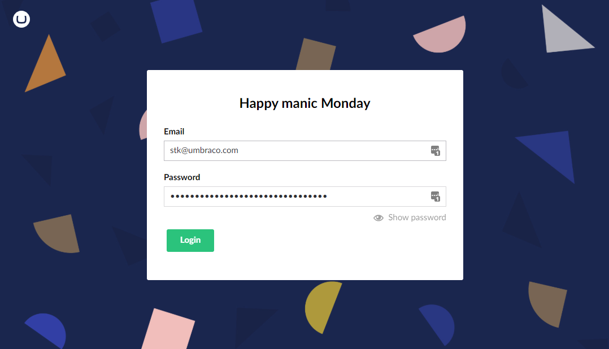
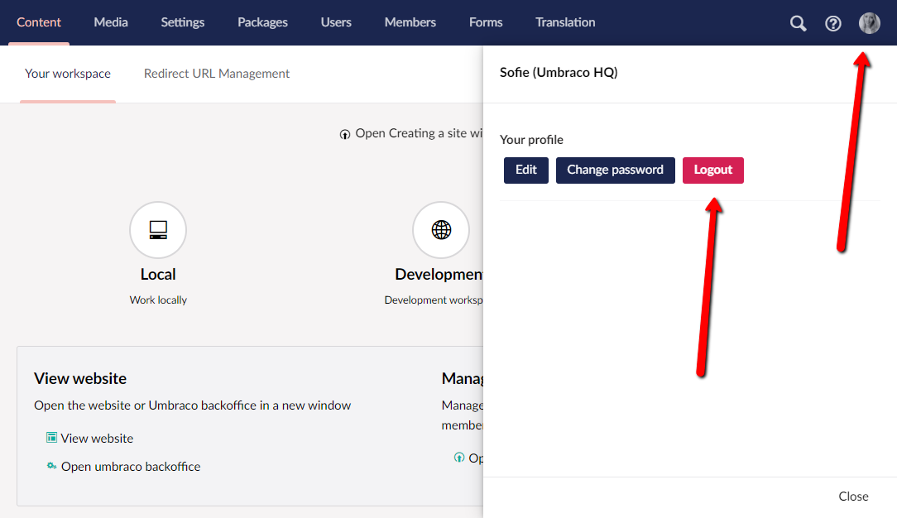

# Logging In and Out

## Logging in

To access the Umbraco Backoffice you can open your web browser and enter your website domain name followed immediately by `/umbraco` (for example: http://www.company.com/umbraco/). You will be presented with the login form into which you need to enter your username or email address and the password provided by your system administrator.

Please note the address at which you access Umbraco may vary so check with your system administrator.

## Logging Out

To logout of the Umbraco Backoffice select the profile picture in the top-right of the screen which will reveal a slide out menu. Then click the logout button, to be logged out of Umbraco.

