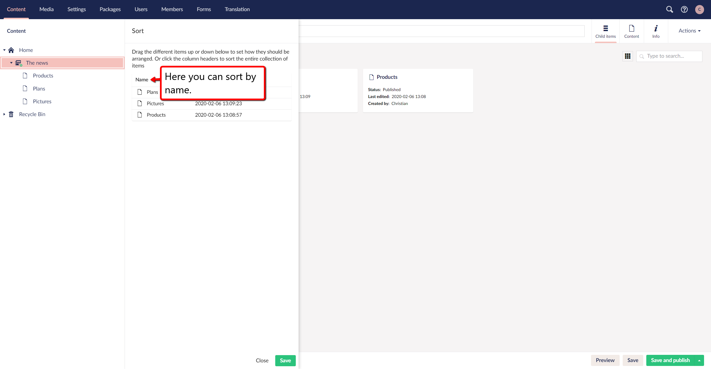
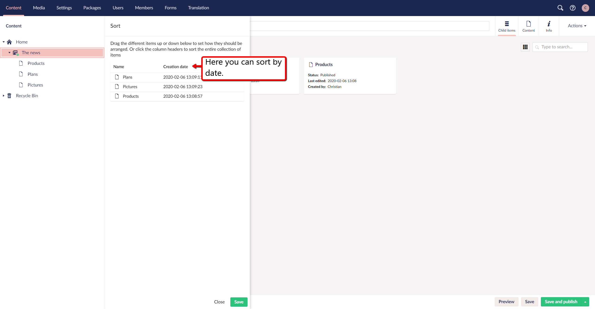

#Ordering Pages
This is intended as an instructional guide for how you can sort your items in the tree section.

The pages in Umbraco are sorted in the tree structure according to a predefined sort order. It is most common for the page that has been created most recently to be placed at the bottom of the tree structure, however, you can change the sort order of the pages in a section of the website by using the sort function.

In the following guide, you will be presented with two different ways to sort your content in the nodes.

# Ordering through the section tree:
1. Navigate to the ***parent node*** whose content you want to sort.

2. Right, click it.

3. Press the option that says ***sort***.

4. After pressing ***sort*** a window will appear on the side of the bar where you found ***sort***.

5. In this window you can arrange the ***Child nodes*** of the parent in the order you want by dragging them up or down Alternatively, click on the Name or Creation Date column header to sort the items automatically by Name or Creation Date. Clicking on a column header again reverses the sort order.
The first image below shows the field in which you can drag and drop to arrange the nodes as you would like.

**In this screenshot it is shown where you can click the name to sort by name.**

**In this screenshot it is shown where you can click the date to sort by date.**

6. Click ***Save***.

# Ordering using the Action button:
1. Navigate to the parent that contains the content you want to sort.

2. Navigate to the ***top right corner*** After clicking the parent in the section tree, here you will find the Actions button, click this.

3. After clicking this you will be presented with a dropdown menu and in this menu, about halfway down you will find ***sort***.

4. After pressing ***sort***, a window will appear on the side of the section tree.

5. In this window you can arrange the Child nodes of the parent in the order you want by dragging them up or down, Alternatively, click on the Name or Creation Date column header to sort the items automatically by Name or Creation Date. Clicking on a column header again reverses the sort order.
The first image below shows the field in which you can drag and drop to arrange the nodes as you would like.

**In this screenshot it is shown where you can click the name to sort by name.**

**In this screenshot it is shown where you can click the date to sort by date.**

6. Click ***Save***.

