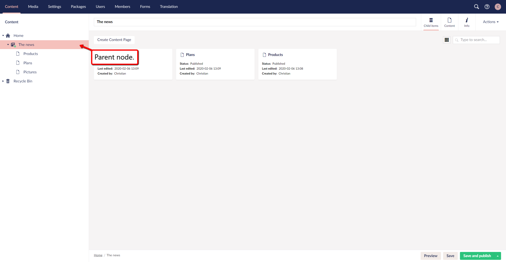

# Ordering Pages
This is intended as an instructional guide for how you can sort your items in the tree section.

The pages in Umbraco are sorted in the tree structure according to a predefined sort order. It is most common for the page that has been created most recently to be placed at the bottom of the tree structure. You can change the ***sort*** order of the pages in a section of the website by using the sort function.

In the following guide, you will be presented with two different ways to sort your content.

## Ordering your content
1. Navigate to the ***parent node*** whose content you want to sort.

2. There are two ways to do this step.
* The first way is to right-click the parent node. 
* The second way is to Navigate to the ***top right corner*** After clicking the parent in the section tree. Here you will find the Actions button, click this.
Both of these options will present you with a drop-down menu.

3. Press the option that says ***Sort***.

4. After pressing ***Sort*** a window will appear on the side of the section tree.

5. In this window you can arrange the ***Child nodes*** of the parent in the order you want by dragging them up and down. Alternatively you can click on the Name or Creation Date column header to ***sort*** the items automatically by Name or Creation Date. Clicking on a column header again reverses the ***sort*** order.

6. Click ***Save***.
