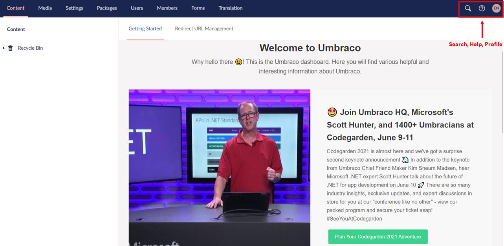
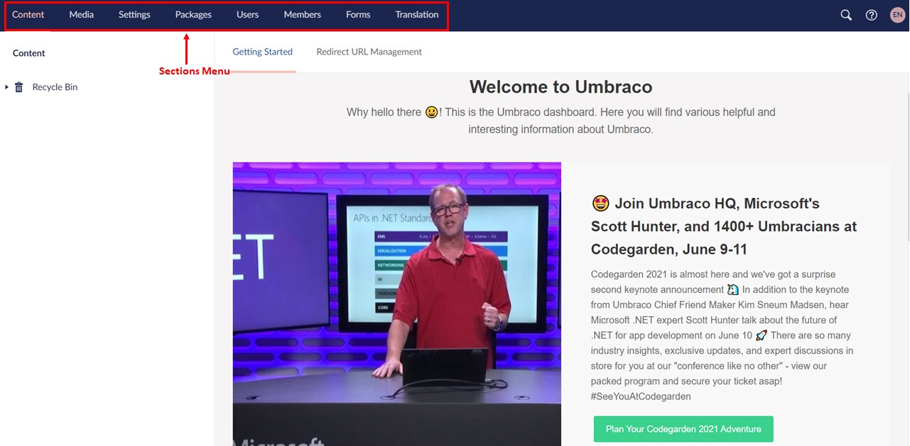
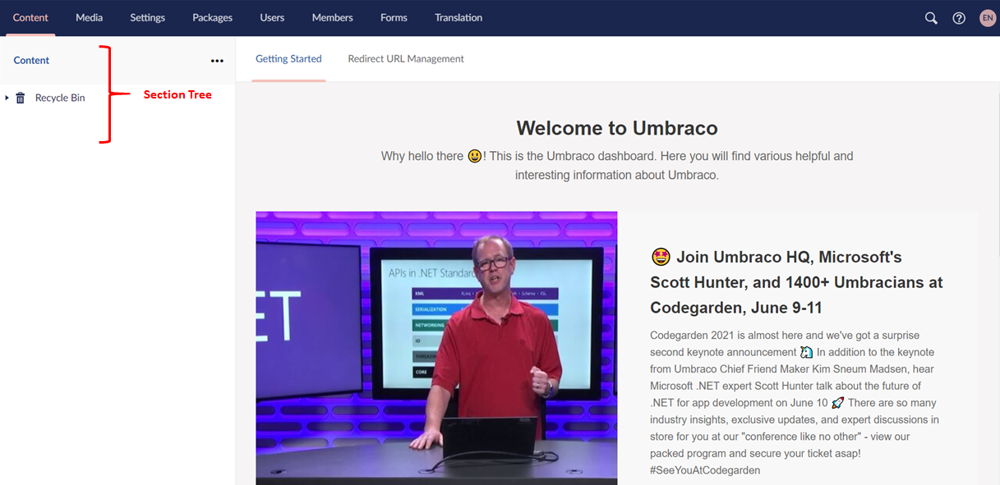

# Umbraco Interface

## Initial View

After logging in to an Umbraco 9 project you will be presented with a dashboard containing a wide array of buttons and features. In this guide you will gain a quick overview of what each button does.

### 1. The Dashboard

The first tab in the dashboard is **Getting Started** which provides helpful information about Umbraco. The second tab is **Redirect URL Management** which redirects published pages which are renamed or moved to the new page in your project.

### 2. Search, Help, and Profile Settings

In the top right corner of the screen, is the **Search** field where you can search for the content, that you are looking for. The next icon is the **Help** icon which provides different Help options such as Tours, Umbraco TV, and Umbraco Documentation.
The last icon is your **profile** which allows you to edit your profile and password.

### 3. The Sections menu

The following sections are available in the backoffice:

- **Content** - allows to manage your content.
- **Media** - allows to manage images and other media files.
- **Settings** - allows to handle your meta data such as document types.
- **Packages** - allows to manage and install packages.
- **Users** - allows to manage the users on the project. To learn more about users, see the [Users](../../../../Getting-Started/Data/Users/) article.
- **Members** - allows to handle the members of the project. If you want to learn more about Members, see the [Member](../../../../Getting-Started/Data/Members/) article.
- **Forms** - allows to create and manage your forms.
- **Translation** - allows to manage languages.  

The menu list will differ depending on your rights for the project. For example: if you are an editor, then you will only have access to **Content**, **Media** and **Forms** as per default settings.

### 4. The Section tree

The section tree is different depending on the section you are in. The section provides an overview of the nodes contained in the tree.

In this example, you are looking at the content section.

The **Content** tab allows you to create content nodes and manage your content tree. When you hover over the sections, it is highlighted with a darker color indicating that you are hovering over it. A button with three dots will show up, left-click or right-click to view additional options.

The **Recycle Bin** contains the deleted content and is available only in the **Content** and the **Media** section.

---

Prev: [Logging In and Out](../Logging-In-and-Out/index-v9.md) &emsp; &emsp; &emsp; &emsp; &emsp; &emsp; &emsp; &emsp; &emsp; &emsp; &emsp; &emsp; &emsp; &emsp; &emsp; &emsp; &emsp; Next: [Creating, Saving and Publishing Content](../Creating-Saving-and-Publishing-Content/index-v9.md)
