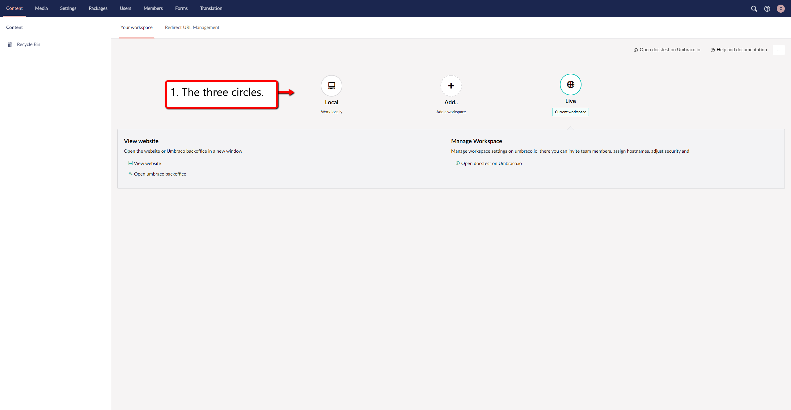
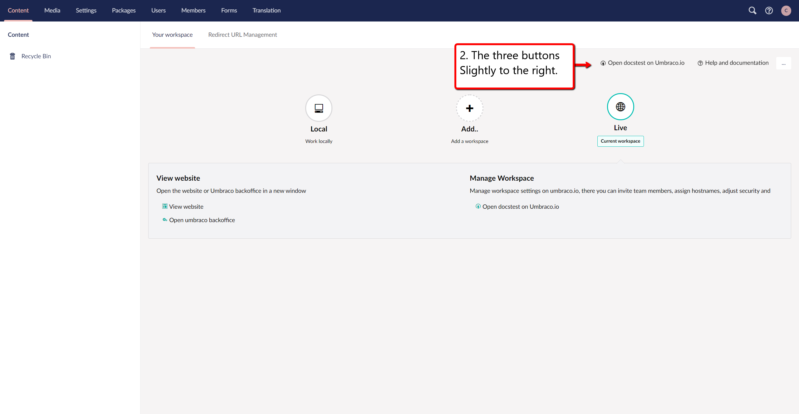
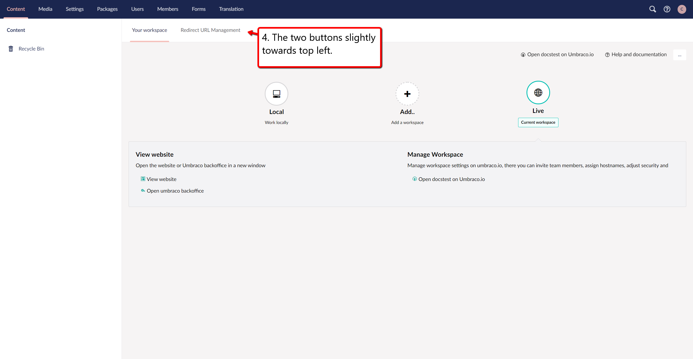
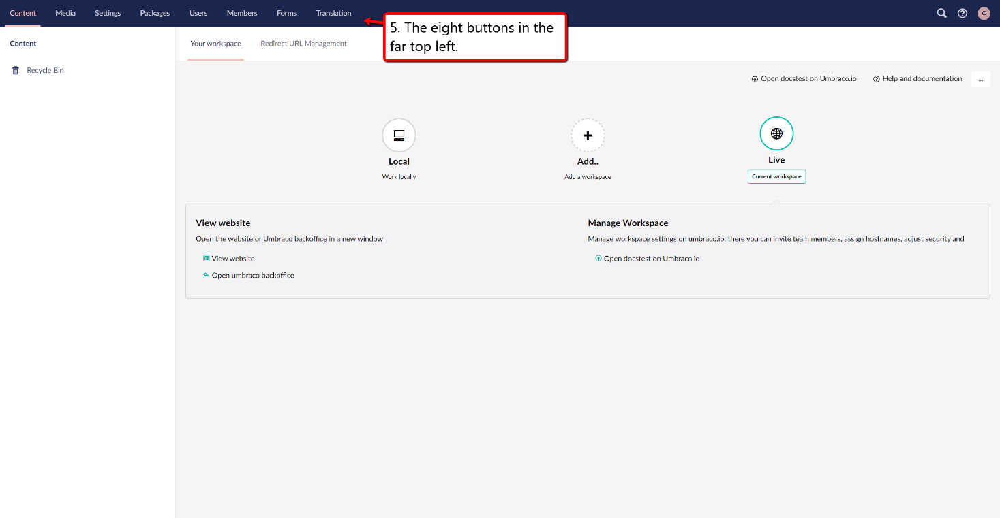
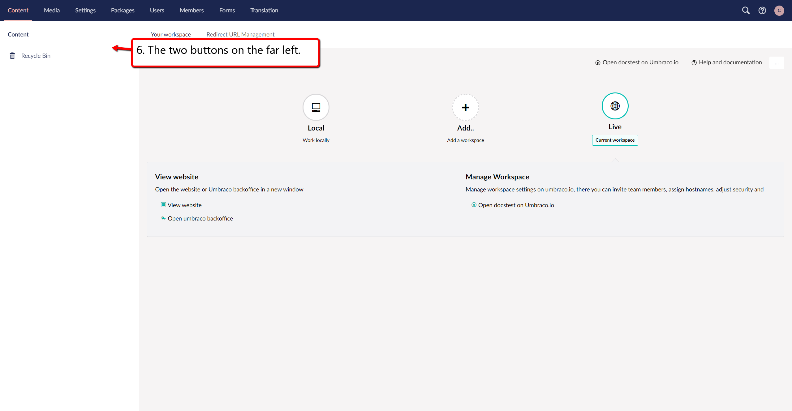

# Umbraco Interface

## Initial View

After logging in to an Umbraco V8 project you will be presented with a screen with a lot of different buttons in this guide you will gain a quick overview of what each button does.

### 1. The three circles
These circles represent the environments, the first one in the row is **local** environment, the next one on the right from local is to **add new** environments and the last one in the line is your **live** environment.
clicking these circles will present you with a box below that gives you different options.

### 2. The three buttons slightly to the right
The first button in this row opens the overview of the environments on the project, the second button takes you to the [Umbraco Cloud documentation](https://our.umbraco.com/Documentation/Umbraco-Cloud/).
The last button has three dots, this gives you the following options: 
- Getting Started
- Set up a Project
- Deployment
- Troubleshooting

### 3. The three buttons in the top right
 The first button is a search field here you can search for the content that you are looking for.
The second button is the help button if you click this you will get options for **help**.
The third button is your **profile**, this will give you the option to edit your profile and password.

### 4. The two buttons slightly towards top left
The first button is **Your Workspace** that takes you to the tab with the circles on it.
The second button is **Redirect URL Management** this is for redirects on you project.

### 5. The eight buttons in the far top left
These buttons are the tabs that you will be working under during you work with you project. 
The first button is **Content** this is where you manage your content.
The next button is **Media**, under this tab you can manage images and other media files.
The third button is **Settings**, in this tab you handle your meta data such as document types.
Button number four is **Packages**, this tab lets you manage and install packages.
The fifth button is **Users**, this tab lets you manage the users on the project.
Button six is the **Members** tab, and here you can handle the members of the project.
The seventh button in the row is **Forms** tab, here you can create and manage your forms.
The final and eight button is **Translation**, this tab is for managing languages.  

### 6. The two buttons on the far left
The first one is **Content** this allows you to create content nodes, and manage your content tree, if you hover over it then it will highlight with a darker color indicating that you are hovering over it, and a button with three dots will show up, clicking this will present you with additional options, there will be other option if you right click the field.
The second button is the **Recycle bin**, this is where your deleted content ends up.
