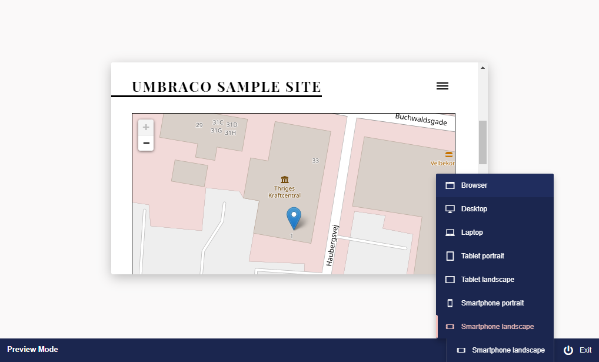

# Preview Pane Responsive View

When viewing page content in preview mode you have the option to scale the preview window to various device sizes.

1. Once you have finished editing the page content click the ***Preview*** button.
2. Click the button to the left of the exit button. This will reveal the device slide out menu.
3. Select which device you would like to scale the preview pane to.

:::note
The notification settings apply to the chosen content item as well as any child items that appear below the item in the content tree
:::

