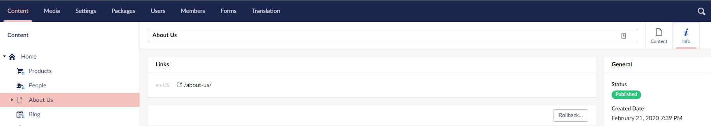
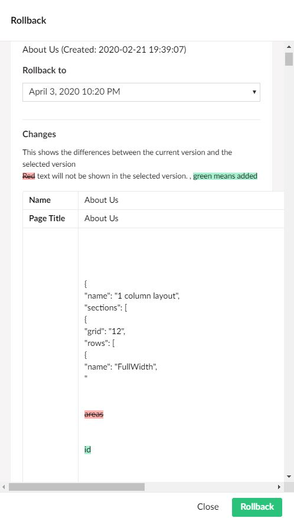

# Versions

Umbraco allows you to work with multiple versions of the same page. All previously saved pages are stored in a version history list. This means that you never lose changes to a page because all old versions of the page are saved to the history. You then have the opportunity to access and re-publish older versions if necessary.

## Comparing Versions

To compare a page on the site with its previous versions:

1. Navigate to the Info content app. 
2. Click on the ***Rollback*** button.
3. In the Rollback dialogue box, select a version from the Rollback To drop-down list.
4. When you select a version from the drop-down list, you are presented with a comparison of the current page with the version you selected. Red, struck-out text is text that will not appear in the selected version and green means text that will be added, should you choose to rollback to that version of the page.

 

