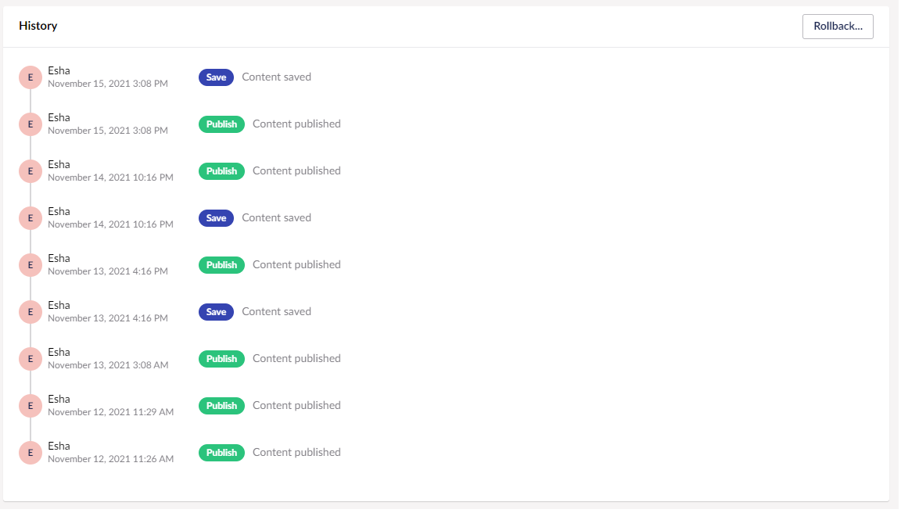
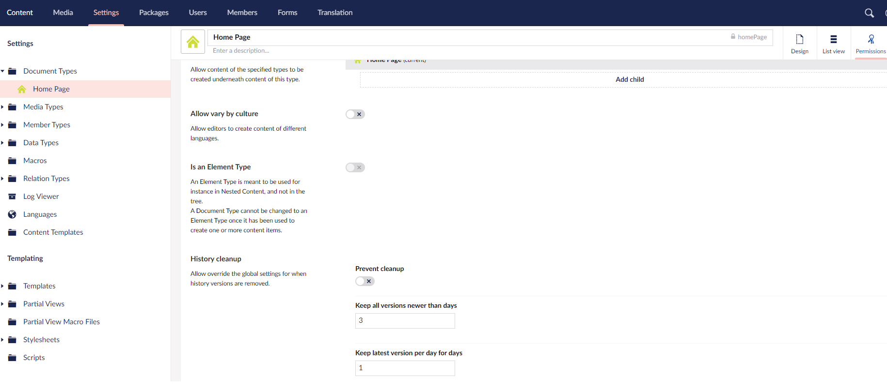

# History Cleanup

Everytime a content item is saved in Umbraco a new version or revision is saved in the database. Version management allows you to roll back to the previous version and also provides a history of changes.

If you are actively working on a content item, it can consist of multiple database entries. Of these entries only one may be in use i.e. the published version and a few other versions might be relevant such as saved but not yet published version.

History Cleanup cleans the history of the content items ensuring there is limited and relevant data. History cleanup helps your Umbraco installations to keep the database footprint of Umbraco at a reasonable level and allow efficient querying of the database.



## History Cleanup Schedule

The cleanup is scheduled to run daily. It will go through content items and clean up any unnecessary versions based on the [Cleanup Policy](#cleanup-policy).

## Cleanup Policy

By default, the cleanup policy removes all the versions that are more than 4 days old except for the latest versions which will be kept for 90 days.

You can configure the cleanup policy and either add new defaults for all the Document Types or disable the cleanup policies for a specific Document Type. To do so:

1. Go to the **Settings** section.
2. Select the document type to configure the cleanup policy for.
3. Go to the **Permissions** tab.
4. In the **History Cleanup** section:
    - *[Optional]* Toggle **Prevent cleanup** to disable the cleanup policy.
    - Enter the number of days to keep all the newer versions for before its is cleaned up.
    - Enter the number of days to keep the latest version per day before its is cleaned up.

      
5. Click **Save**.

### Upgrading an Existing Installation

If you are upgrading an existing Umbraco installation to version 9.1, by default, the History Cleanup is disabled. You can configure the History Cleanup in the `appsettings.json` file:

```json
{
  "Umbraco": {
    "CMS": {
      "Content": {
        "ContentVersionCleanupPolicy": {
          "EnableCleanup": true,
          "KeepLatestVersionPerDayForDays": 90,
          "KeepAllVersionsNewerThanDays": 7
        }
      }
    }
  }
}
```

---

Prev: [Rollback to a Previous Version](../Rollback-to-a-Previous-Versions/index.md)
