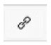
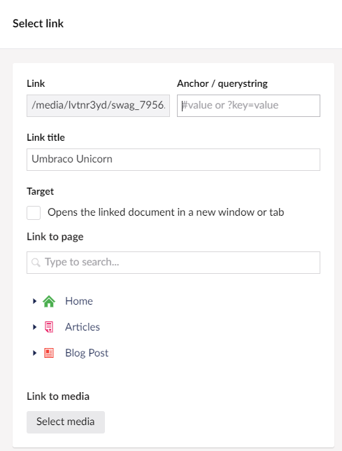

# Working with Rich Text Editor

The Umbraco Rich Text Editor is an editable field where you, as the editor, can be creative. You select how much you want to do yourself. You can work on text content, format the text, or leave it the way it is.

If you want to use advanced functionality, you can insert images, create tables, or create links to other pages or documents. The functionality varies depending on how the editor is set up.

- [Editor Buttons](#editor-buttons)

- [Paragraph Break/Line Break](#paragraph-breakline-break)

- [Shortcut Keys](#shortcut-keys)

- [Text Formatting](#text-formatting)

- [View Source Code](#view-source-code)

- [Links](#links)

- [Working with Images](#working-with-images)

- [Macros](#macros)

- [Tables](#tables)

Contact your system administrator for details regarding your editor.

## Editor Buttons

By default, the following editor styles are available. Your system administrator can determine the styles displayed in different templates. You might have access to more or fewer styles than those shown here.

## Rich Text Editor Functionality

The Rich Text Editor provides the following functionalities:

### Paragraph Break/Line Break

The Rich Text Editor is like any other word processing program. You write the text and the text wraps around when the line reaches the end. Use the following keyboard shortcuts in the editor to add:

- Space between paragraphs - press `ENTER`.
- Line breaks - press `SHIFT + ENTER`.

### Shortcut Keys

For ease, there are shortcut keys for certain editor functions. Use the following shortcut keys to carry out certain commands:

Shortcut | Action
---|---
Ctrl + A | Select all
Ctrl + B | Bold
Ctrl + C | Copy
Ctrl + I | Italic
Ctrl + U | Underline
Ctrl + V | Paste
Ctrl + X | Cut
Ctrl + Y | Redo
Ctrl + Z | Undo

### Text Formatting

You do not normally need to spend much time formatting text because Umbraco takes care of the formatting. However, the editor provides a number of options for controlling the text formatting.

#### Formatting Buttons

The most familiar way to control formatting is using the formatting buttons. With these buttons, you can apply basic formatting such as Bold, Italic, aligning text, creating bulleted and numbered lists, and applying indents.

To apply a format using the formatting buttons:

1. Select the text you want to apply the formatting to.
2. Click the format button to apply the formatting you wish to add.

    

#### Custom Formats

An alternate way to apply formatting is using Custom Formats. The **Formats** drop-down list provides a set of predefined styles that can be applied to text while maintaining a consistent look and feel throughout the site.

These styles often incorporate more advanced formatting functionality which can be applied to provide a different look for certain elements such as links, headings and sub-heading. For example, you can use a format style to change a link into a call to action button. While the styles available on your site may differ, follow the below process to apply styles:

1. Select the text you want to apply the style to.
2. Choose the style to apply from the **Format** drop-down list.

#### Copying Content from Other Programs

:::note
When you write content in another editor to be copied into a rich text editor, you may encounter style issues on your website.
:::

While pasting content, the original text styles is preserved which can lead to different font faces, sizes, and colours displaying on the website when viewed.

:::tip
To prevent formatting issues, we recommended pasting the content first into a markdown editor such as notepad, then copy and paste it into your rich text editor.
:::

#### Remove Formatting

If you have already formatted a paragraph or selection using the formatting buttons, you can remove the formatting rule. To remove formatting:

1. Select the text you want to remove the style from.
2. Click the relevant formatting button to remove the formatting rule.

You can also add a **Remove format** button in your toolbar. To add the **Remove format** button:

1. Navigate to your rich text editor.
2. Go to the **Editor Settings** window.
3. Select **Remove format**.

    

### View Source Code

If you are proficient in HTML, you can switch to HTML mode to create your page. You can also check the code and make minor adjustments to get the page exactly as you want it.

Certain elements such as scripts is not recognized by the HTML view of the rich text editor. You can enter the scripts directly in the text view of the editor.

### Links

The **Insert/edit Link** button is used to add or update links to internal pages, external pages, media files, email links, and anchors. To insert different types of hyperlinks, follow these steps:

#### Link to a Page on Another Website

1. Select the text for the hyperlink.
2. Click the **Insert Link** button. The **Select Link** tree opens on the right-side of the editor.
3. In the **Link** field, enter the URL of the web page you wish to link to.
4. In the **Link title** field, enter the text that will be shown as a pointer to the link. This is an important information for everyone reading the website with different accessibility aids.
5. In the **Target** field, select the checkbox if you want the link to open in a new window or tab.
6. Click **Submit**.

#### Link to a Page in Umbraco

1. Select the text for the hyperlink.
2. Click the **Insert Link** button. The **Select Link** tree opens on the right-side of the editor.
3. Select a page from the **Link to page** tree. The selection will populate the **Link** and **Link Title** fields.
4. In the **Link Title** field, enter the text that will be shown as a pointer to the link. By default, the name of the selected page will be populated.
5. In the **Target** field, select the checkbox if you want the link to open in a new window or tab.
6. Click **Submit**.

#### Link to a Media File in Umbraco

1. Select the text for the hyperlink.
2. Click the **Insert Link** button. The **Select Link** tree opens on the right-side of the editor.
3. Select the **Select media** button. The **Select media** tree opens where you can select the media item.
4. Click **Select**.  The selection will populate the **Link** and **Link Title** fields.
5. In the **Target** field, select the checkbox if you want the link to open in a new window or tab.
6. Click **Submit**.

#### Link to an email address in Umbraco

1. Select the text for the hyperlink.
2. Click the **Insert Link** button. The **Select Link** tree opens on the right-side of the editor.
3. In the **Link** field, enter the text `mailto:` followed by the email address you wish to link (e.g. mailto:name@company.com).
4. In the **Link Title** field, enter the text that will be shown as a pointer to the link.
5. In the **Target** field, select the checkbox if you want the link to open in a new window or tab.
6. Click **Submit**.

#### Link to an Anchor on the Same Page

An anchor allows you to create internal page links that enable users to navigate within a page. There are two parts to setting up an anchor - the anchor itself and the link to the anchor.

#### Creating an anchor

1. Select the text or place the cursor where you wish to create the anchor.
2. Click the **Anchor** button. The **Create Anchor** dialog opens.

    

3. Enter the anchor name in the **ID** field. Aoid special characters and do not use spaces.

    
4. Click **OK**. You will see a small anchor icon where you previously had the cursor in the editor.

To delete the anchor:

1. Select the anchor icon in the editor.
2. Press the **Delete** key.

#### Linking to an anchor

1. Select the text where you wish to add the anchor.
2. Click the **Insert link** button. The **Select Link** tree opens on the right-side of the editor.
3. Add a `#`symbol followed by the name of your anchor in the **anchor/querystring** field.
4. Click **Submit**.

#### Create a Link from an Image

You can make images into clickable links in Umbraco:

1. Insert an image into the editor (see [Working with Images](#working-with-images), for more details).
2. Select the image to form the hyperlink.
3. Click the **Insert Link** button. The **Select Link** tree opens on the right-side of the editor.
4. In the **Link** field, enter the URL of the web page you wish to link to.
5. In the **Link title** field, enter the text that will be shown as a pointer to the link.
6. In the **Target** field, select the checkbox if you want the link to open in a new window or tab.
7. Click **Submit**.

#### Removing a link

To remove a link:

1. Select the link in the editor. For text links, place the cursor anywhere within the link text. For an image, select the image itself.
2. Click the **Remove Link** button which removes the hyperlink.

    

If the remove link button is not in your richtext editor toolbar, you can add the **Remove Link** button:

1. Navigate to your rich text editor.
2. Go to the **Editor Settings** window.
3. Select **Remove Link**.

    

Alternatively, click the **Insert/Edit Link** button and manually remove the link from the **Link** field.

### Working with Images

To display images on a page the images must be uploaded to your Umbraco media library.

Many organisations set up a media library containing images that editors can use on their pages. The procedure for uploading an image varies slightly depending on which method your organisation has adopted, so check with your system administrator what is applicable in your organisation.

#### Inserting an Image from the Media Library

1. Place the cursor in the editor where you want to insert your image.
2. Click the **Media Picker** button on the toolbar. The **Select Media** tree opens on the right-side of the editor.
3. Select the folder in which your image is stored.
4. Click the thumbnail of the image. The **Edit selected media** tree opens.
5. Enter an **Alternative Text** and **Caption** for your image. Both these fields are optional.
6. Click **Select** to add the image.

#### Inserting an Image from your Computer

You can upload images directly from your local directory in the rich text editor. These images will be stored in the Umbraco media library. Ensure that the image is placed in the correct location within the library.

You can also create folders in the media library by clicking the `+` icon next to `Media/`.

To insert an image from your computer:

1. Place the cursor in the editor where you want to insert your image.
2. Click the **Media Picker** button. The **Select Media** tree opens on the right-side of the editor.
3. Click the **Upload** button in the top-right corner of the tree.
4. Browse to the directory, select the image, and click **Open**.
5. Enter an **Alternative Text** and **Caption** for your image. Both these fields are optional.
6. Click **Select** to add the image.

#### Deleting an Image from the Page

To delete an image from the page:

1. Select the image in your editor.
2. Press **Delete** on your keyboard. The image is removed from the page, but is not deleted from the Umbraco media library.

### Macros

In Umbraco, macros are small building blocks of functionality that can be used in an editor. Each macro encompasses a piece of functionality and provides an interface to be able to modify the macro as per your requirements. A macro can be anything from a contact form to an embeddable media player. The advantage of macros is that it gives editors the ability to add complex elements to the page in a less complex manner.

The macros available to you differ from system to system. Contact your system administrator to find out which macros are available to you and what they do.

#### Adding a Macro to the Page

1. Place the cursor in the editor where you want to insert your macro.
2. Click the **Insert Macro** button. The **Select Macro** tree opens on the right-side of the editor.
3. Select a macro to insert or enter the macro name in the **Search** bar.

   
4. Configure the macro as required.
5. Click **Submit** to insert the macro. The macro is displayed in the editor with a dotted border.

   

:::note
If there are no macros, you can [Create Macros](../../../Reference/Templating/Macros/managing-macros.md#creating-macros). The above image is an example of macros available when a Starter Kit package is installed.
:::

#### Editing macros

You can edit the macro values after it has been added to the rich text editor:

1. Highlight the macro in the rich text editor.
2. Click the **Insert Macro** button. The **Select Macro** tree opens on the right-side of the editor.
3. Here, you can edit the configuration as per your requirement.

#### Removing macros

To remove a macro:

1. Highlight the macro in the rich text editor.
2. Press the **Delete** or **Backspace** button on your keyboard.

### Tables

Tables are used to format information in a grid based structure. When you insert a table, you select how many rows and columns the table should comprise of, as well as fill in a number of additional optional formatting properties. These values can be altered later, so it is not important to know exactly what your table will look like when you create it.

#### Editing an Existing Table

To edit an existing table:

1. Click on a cell in the table.
2. A small square box is displayed with some quick actions.
3. Select the action of your choice. Alternatively, click on the **Table** button in the rich text editor. There are various other options available for modifying cells, rows and columns such as height, alignment, merge, insert and delete.

    

**Table Properties** provides several options for modifying the table’s appearance. However the developer of the website may have already created table styles for you so you may not need to adjust these settings.

---

Prev: [Deleting and Restoring Pages](../Getting-Started-With-Umbraco/Deleting-and-Restoring-Pages/index.md) &emsp; &emsp; &emsp; &emsp; &emsp; &emsp; &emsp; &emsp; &emsp; &emsp; &emsp; &emsp; &emsp; &emsp; &emsp; &emsp; &emsp; Next: [Version Management](../Version-Management/index.md)
