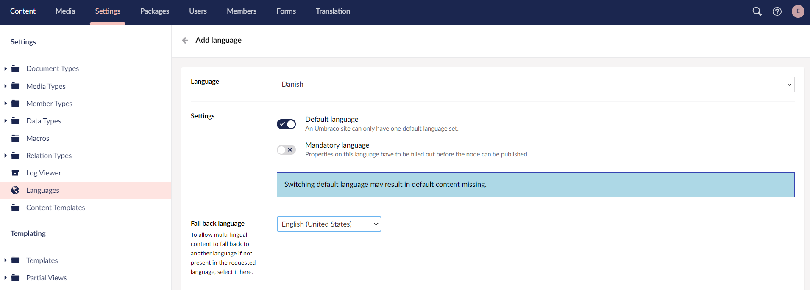
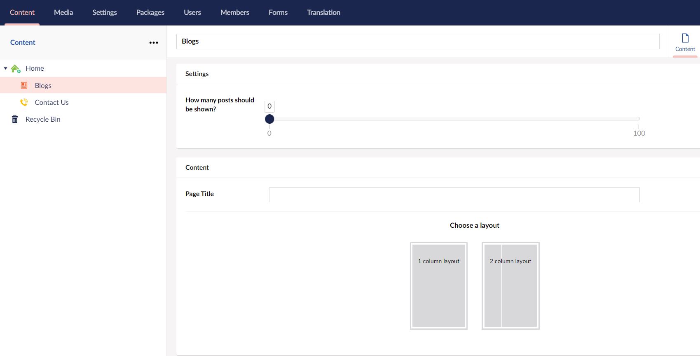
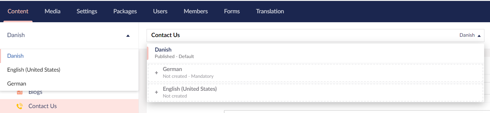
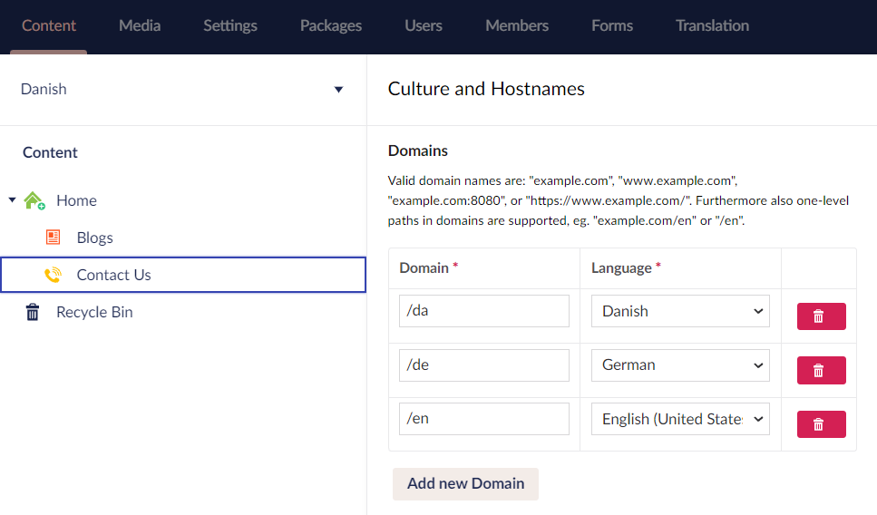
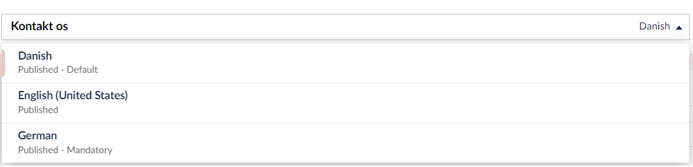
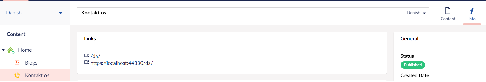

# Creating a Multilingual Site

In Umbraco 8 and above, you can use **language variants** to setup a multilingual site. **Language Variants** allows you to vary content by culture so you can allow a content node to exist in several languages. This tutorial explains how to make the site multilingual by making variations of our content.

## Adding a new language

To add a new language, follow these steps:

1. Go to the **Settings** section.
2. Go to **Languages** in the **Settings** tree. The **Languages** window opens in the editor.
3. Click **Add Language**. The **Add Language** window opens in the editor.
4. Select a **Language** from the dropdown list. In this tutorial, we will pick *Danish*.

   
5. In **Settings**, select the following options to set the new language as the:
    - Default language for your site, toggle **Default Language**.
    - Mandatory language for your site, toggle **Mandatory Language**.
6. Select a **Fallback Language** from the drop-down list.

    
7. Click **Save**.

Similarly, we can add more languages depending on the website requirements. For this tutorial, we'll use Danish (default language), English, and German as our variants.
    

## Document Types

For this tutorial, we will create the following document types:

- Home Page

    
- Blogs

    
- Contact Us

    

## Enabling Language Variants on Document Types and Properties

To enable language variants on Document Types, follow these steps:

1. Go to the **Settings** tab.
2. Select **Contact Us** from the **Document Types** folder.
3. Go to the **Permissions** tab and toggle **Allow vary by culture**

    
4. Click **Save**.
5. Go to the **Design** tab.
6. Click on the gear icon ⚙ of the **Page Title** and toggle **Allow vary by culture**.

    
7. Click **Submit**.
8. For this tutorial, we will not make any changes to the **Address**. Click **Save**.

## Viewing the Language Variants in the Content section

When you return to your content node you will notice two things:

1. At the top of the content tree, there is a dropdown to view the content tree in the language of your choice.

   
2. To the right of the content name there is now a dropdown where you can select a language. You can also open a split view so you can see two languages at once.

   

## Adding Culture and Hostnames to the Root Node of the Website

To add culture and hostnames, follow these steps:

1. Go to the **Content** tab.
2. Right-click on the **...** dots next to the **Contact Us** content node and select **Culture and Hostnames...**.
3. In the **Culture and Hostnames** tree, let's add a domain for each hostname, like it's done here:

    
4. Click **Save**.

## Adding Language Variants to the Content

To add language variants to the content, follow these steps:

1. Go to the **Contact Us** node. You will find a language dropdown next to the title at the top:

    
2. Click the dropdown and hover over the new language. You will see an **Open in Splitview** option will appear.

    
3. Click **Open in Splitview**. In this splitview, we can see the content node with each language side by side.

    You may notice that the **Address** and other fields are greyed out - this is because we haven't checked the **Allow vary by culture** checkbox.

    
4. Enter the **Name** for your content node and the **Page Title** in the new language.
5. Click **Save and Publish**. The **Ready to Publish** window opens providing the option to publish in one or more languages.

    
6. You can select either one or multiple languages and click **Publish**.

## Rendering Variant Content in Templates

To render the values of the Contact Us page, use the following in the template:

```csharp
@Model.Value("pageTitle")
```

The `.Value()` method has a number of optional parameters that support scenarios where we want to "fall-back" to some other content, when the property value does not exist on the current content item. To use the fallback type, add the `@using Umbraco.Cms.Core.Models.PublishedContent;` directive.

To display a value for a different language, if the language we are requesting does not have content populated:

```csharp
@Model.Value("pageTitle", "en-Us", fallback: Fallback.ToLanguage)
```

For more information, see the [Using fall-back methods](../../Fundamentals/Design/Rendering-Content/#using-fall-back-methods) article.

## Viewing the Language Variant on the Browser

To view the language variant on the browser, follow these steps:

1. Go to the **Content** tab.
2. Select your new language from the language dropdown above your content tree.
3. Select the **Contact Us** node and go to the **Info** tab.
4. You will notice the links with the new language domain added to it. If it's not there, you might need to refresh the page.

     
5. Click on the link to view the new language varied node in the browser.
6. Alternatively, you can add the domain name to your localhost in the browser. For example: <http://localhost:xxxx/da/>
