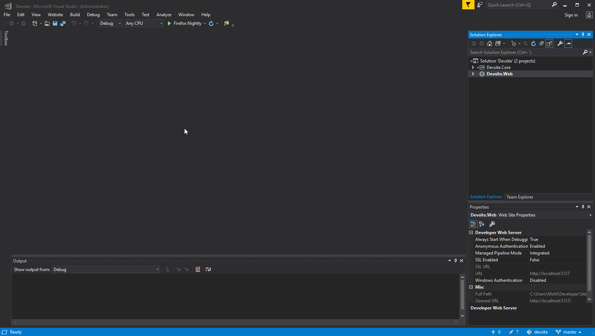

# Working with a Cloud database locally

This article will cover how you can connect to the database of your project that you have locally on your machine and it will also cover how you can work with custom table with Umbraco Cloud.

## Connecting to your local Umbraco installation

When cloning down your project to work locally you might want to have a look in your database every now and then. You can connect to your local Umbraco database through, for example, Visual Studio.

In Visual Studio this is done through the Server Explorer. Add a new connection to a SQL server database file. Umbraco's database file can be found in `App_Data`:

If this is your first time connecting to a local database this way, you might have to choose a data source when clicking `Add Connection`. Select `Microsoft SQL Server Database File` and hit OK.

Umbraco will create an mdf file (LocalDB) if you have SQL Server installed on your local machine, provided LocalDB is enabled and can be discovered by Deploy. If Deploy can't create an mdf file it will create a SQL CE (sdf) file instead.

## Using Custom Tables with Umbraco Cloud

Umbraco Cloud will ensure that your Umbraco related data is always up to date, but it won't know anything about data in custom tables unless told. Nothing new here, it's like any other host when it comes to non-Umbraco data.

The good news is that you have full access to the SQL Azure databases running on Umbraco Cloud and you can create custom tables like you'd expect on any other hosting provider. The easiest way to do this is to connect using SQL Management Studio.

A recommended way of making sure your custom tables are present, is to use Migrations to ensure that the tables will be created or altered when starting your site. Migrations will ensure that if you are adding environments to your Umbraco Cloud site, then the tables in the newly created databases will automatically be created for you. Check [Creating a custom Database table](https://our.umbraco.com/Documentation/Extending/Database/) for an example of how to create and use Migrations.

:::note
If you're using Umbraco 7 check instead [this blog post](https://cultiv.nl/blog/using-umbraco-migrations-to-deploy-changes/) for a full walkthrough of how to create and use Migrations.
:::
