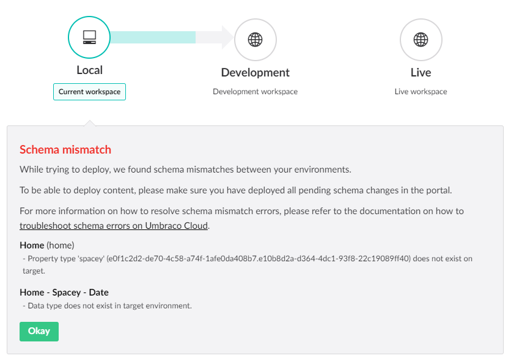

# Transferring Content and Media
After deploying changes to meta data, it's time to transfer your content and media. This is done from the Umbraco backoffice.

Content and media transfers are very flexible which means you have complete control over which content nodes and/or media items you want to transfer - all in one go, a few at a time or just a single node.

Transferring content will overwrite any existing nodes on the target environment - content transfers will transfer the items that you select in the "source" environment to the "target" environment exactly the same as it was in the "source". This means that if you have some content on the target environment already, this will be replaced by the new content from the source environment.

**Important**: Content and Media transfers will only work if you've deployed all changes to your meta data before hand. Please refer to our documentation on how to deploy meta data from either [Local to Cloud](../Local-to-Cloud) or [Cloud to Cloud](../Cloud-to-Cloud).

## Step-by-step
Let’s go through a content transfer step by step. Imagine you’ve finished working on new content for your project locally and you are ready to transfer the changes to the Cloud. 

You want to transfer the whole site so you start from the `Home` node and choose to transfer everything under it:

1. Click on the ellipsis next to the `Home` node in the Content tree
2. Choose "Do something else"
3. There you get the choice of **Queue for transfer**
  * If you’re currently editing the Home page you could also use the Actions dropdown to find  **Queue for transfer**
4. Choose if you want to include all pages under the chosen page or simply just transfer the chosen node
  * If you wish to transfer all your content at once, *right-click* the top of the Content tree where you will also find **Queue for transfer** - this will queue all your content for transfer.
5. When you've selected all the content you wish to transfer go to the Deployment dashboard - the easiest way to get there is to click on the Content section header
6. You will be able to see which items are currently ready to be transferred - this will include both content and media that you've *queued for transfer*
7. Confirm by clicking '*Send changes to the Development workspace*' and monitor the progress of the transfer
8. If everything went well, you will see the confirmation screen saying that the transfer has succeeded

### Media items

Media items are transferred the same way as content:

1. In the Media section *Right-click* the items you want to transfer and choose **Queue for transfer** 
  * or simply *right-click* the top of the Media section to transfer all you media at once.
2. Go to the Deployment dashboard in the Content section to see the items you've queued for transfer and to transfer your items.

## Schema Mismatches

Sometimes a content transfer might not be possible. For example if you add a new property to the HomePage Document type and you don’t have that property in both environments, you’ll get an error with a hint on how to fix this.

If you are seeing this type of issue when trying to transfer content, head over to our chapter about [Schema Mismatch errors](../../Troubleshooting/Content-Deploy-Schema), where you can read about how to resolve the issues.
