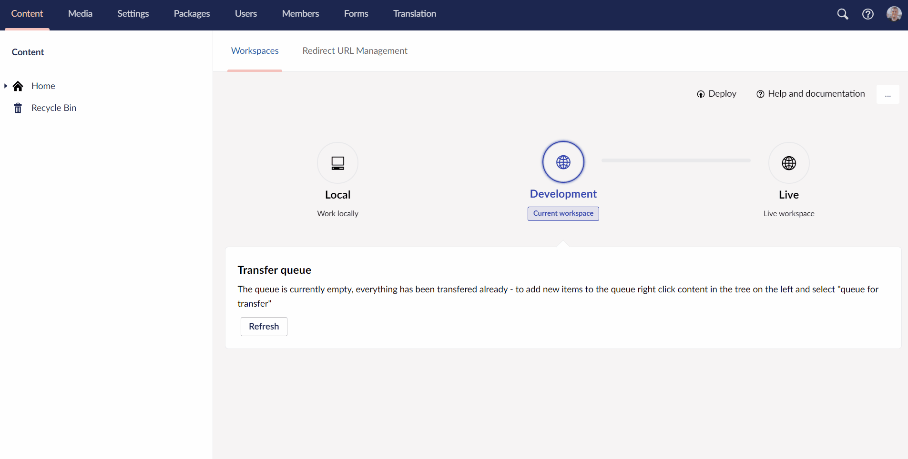

# Clearing cached signatures

Umbraco Deploy improves the efficiency of transfers by caching signatures of each artifacts in the database for each environment. The signature is a string based, hashed representation of the serialized artifact.

Sometimes you might see that Deploy is performing poorly, throwing unexpected issues or the like. In this case a good approach of solving these issues is to clear the cached signatures.

## Clearing cached signatures manually

Follow these steps to clear the cached signatures

1. Go to backoffice
2. Navigate to the **Settings** section
3. Select the **Deploy** dashboard
4. In the dropdown under **Deploy Operations** select `Clear cached signatures`
5. The Deploy engine will clear all cached signatures. The status will change to `Clear signatures pending`
6. When it's done you'll see the status has changed to `Last deployment operation completed`
7. Final step is to check that you can deploy the schema - see [**Deploy schema**](../Deploy-schema) article

