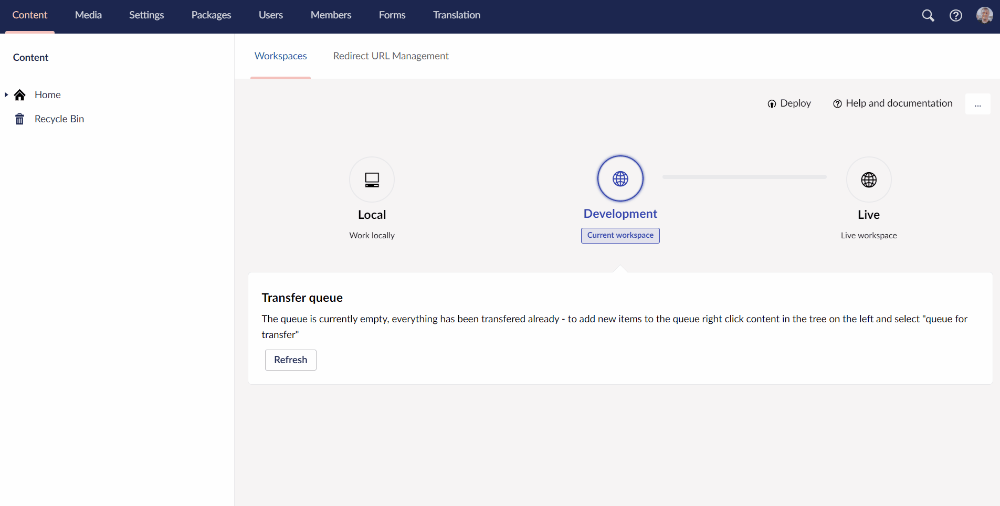

# Deploying schema from data files on your Cloud environments

When you deploy from one environment to another on your Umbraco Cloud project, the files from the Git repository are merged into the files used on the site. The Deploy engine then deploys your schema from your data files. What this means is that the files on the disk will be deserialized into the database on the Cloud environment.

You can run a deployment of schema manually by following these steps:

1. Go to backoffice
2. Navigate to the **Settings** section
3. Select the **Deploy** dashboard
4. In the dropdown under **Deploy Operations** select `Schema deployment from data files`
5. The Deploy engine will start the process and the status will change to `Read pending`
6. When it's done you'll see the status has changed to one of two possible outcomes:
    1. `Last deployment operation completed`: The deployment succeeded and your environment is in good shape!
    2. `Last deployment operation failed`: The deployment failed - go to the Cloud portal, to see the error message

