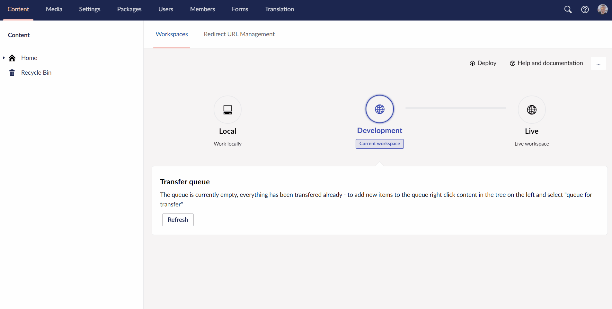

# Extract schema to data files

Sometimes our guides requires you to generate UDA files for your projects metadata. You do that by extracting schema to your data files. Every time you create something in the backoffice on your Umbraco Cloud project a UDA files will be generated.

Generating UDA files manually by extracting your schema ensures that you have everything you need in order to deploy successfully from one environment to another.

## What are UDA files?

:::info
UDA is an abbreviation for Umbraco Deploy Artifact.
:::

When you create something in the backoffice of your Umbraco Cloud project and hit save, a UDA file will be generated.

The UDA file contains metadata and detailed information about the type that was created.

Here's an example of what a UDA file looks like for Umbraco Deploy 4:

```json
{
  "DefaultTemplate": "umb://template/a3f18ec99a3d4eccbcdc8ec84818fc34",
  "AllowedTemplates": [
    "umb://template/a3f18ec99a3d4eccbcdc8ec84818fc34"
  ],
  "Icon": "icon-user-females-alt color-black",
  "Thumbnail": "folder.png",
  "Description": null,
  "IsContainer": true,
  "Permissions": {
    "AllowVaryingByCulture": false,
    "AllowVaryingBySegment": false,
    "AllowedAtRoot": false,
    "IsElementType": false,
    "AllowedChildContentTypes": [
      "umb://document-type/35c861853d094b40a5714e5dfc1e6a89"
    ]
  },
  "Parent": null,
  "CompositionContentTypes": [
    "umb://document-type/4917d94e68914de5b7e6c4608e62a61a",
    "umb://document-type/99f977c38d024cf09cb20c294401bf40"
  ],
  "PropertyGroups": [
    {
      "Key": "fff0ec88-4e4d-4520-ab28-6f086a9e5466",
      "Name": "Content",
      "SortOrder": 0,
      "PropertyTypes": [
        {
          "Key": "fff20b45-f444-4a58-8cac-b9f97ca5c161",
          "Alias": "featuredPeople",
          "DataType": "umb://data-type/4885450ea60f42bb984a43988baf5283",
          "Description": null,
          "Mandatory": false,
          "Name": "Featured People",
          "SortOrder": 2,
          "Validation": null,
          "VariesByCulture": false,
          "VariesBySegment": false,
          "LabelOnTop": false,
          "MemberCanEdit": false,
          "ViewOnProfile": false,
          "IsSensitive": false
        }
      ]
    }
  ],
  "PropertyTypes": [],
  "Udi": "umb://document-type/bdba3428eef04bbbb0b7f9b98a55c74f",
  "Dependencies": [
    {
      "Udi": "umb://data-type/4885450ea60f42bb984a43988baf5283",
      "Ordering": true,
      "Mode": 0
    }
  ],
  "Name": "People",
  "Alias": "people",
  "__type": "Umbraco.Deploy,Umbraco.Deploy.Artifacts.ContentType.DocumentTypeArtifact",
  "__version": "4.1.2"
}
```

This UDA file represents a Document Type with name **People**. All dependencies for the document type is listed in the file and also metadata like `AllowedAtRoot` and `Icon`.

UDA files are generated for the following types:

* Data types
* Data type containers
* Dictionary items
* Document types
* Document type container
* Languages
* Macros
* Media types
* Member types
* Relation types
* Templates

## Manually extracting schema to your UDA/Data files

Follow these steps to extract schema to your data files



1. Go to backoffice
2. Navigate to the **Settings** section
3. Select the **Deploy** dashboard
4. In the dropdown under **Deploy Operations** select `Extract schema to data files`
5. The Deploy engine will generate UDA files for all the types in your project. The status will change to `Write pending`
6. When it's done you'll see the status has changed to `Last deployment operation completed`
7. Final step is to deploy the schema - see [**Deploy schema**](../Deploy-schema) article

This process might sometimes end up giving you collision errors on your environments due to duplicates. This can be resolved by following our [Structure Error](../../../Troubleshooting/Structure-Error) documentation.
