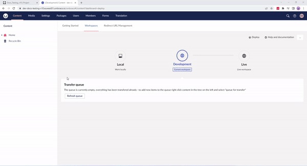

# Extract Schema to Data Files

Sometimes our guides require you to generate Umbraco Deploy Artifact (UDA) files for your project's metadata. You do so by extracting schema to your data files. Every time you create something in the backoffice on your Umbraco Cloud project, UDA files are generated.

Generating UDA files manually by extracting your schema ensures you have everything you need to deploy successfully from one environment to another. For more information on UDA Files, see the [What are UDA files](../../../Set-Up/Power-Tools/Generating-UDA-files/index.md#what-are-uda-files) article.

## Manually extracting schema to your UDA/Data files

Follow these steps to extract schema to your data files:

1. Go to the Backoffice.
2. Navigate to the **Settings** section.
3. Go to the **Deploy** dashboard.
4. Select **Extract Schema to Data Files** from the **Deploy Operations** dropdown.
5. Click **Trigger Operation**. The Deploy engine will generate UDA files for all the types in your project.

The **Deploy Status** will change to `Write pending`. Once the operation is done, you'll see the status has changed to `Last deployment operation completed`. To deploy the schema, see the [**Deploying Schema from Data Files on your Cloud Environments**](../Deploy-schema) article.

This process might sometimes end up giving you collision errors on your environments due to duplicates. See [How to resolve collision errors](../../../Troubleshooting/Structure-Error) article.

