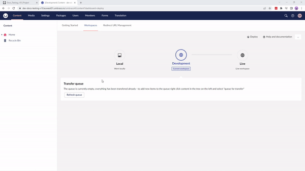

# Deploy Operations

:::note
This article only applies to you if you are running Deploy version 4 and above.
:::

Umbraco Deploy is the deployment engine of Umbraco Cloud. With Umbraco Deploy you have the possibility of performing certain operations with your schema directly from within the Backoffice, using the Umbraco **Deploy** dashboard. You can access the Umbraco **Deploy** dashboard from the **Settings** section.

<iframe width="800" height="450" title="Umbraco Deploy - Management dashboard" src="https://www.youtube.com/embed/l5qdTsIddKM?rel=0" frameborder="0" allow="autoplay; encrypted-media" allowfullscreen></iframe>

## What operations can you run using Deploy?

With Umbraco Deploy, you can run different operations:

* [Deploying Schema from Data Files on your Cloud Environments](Deploy-schema)
* [Extract Schema to Data Files](Extract-schema-to-data-files)
* [Clearing Cached Signatures](Clearing-cached-signatures)
