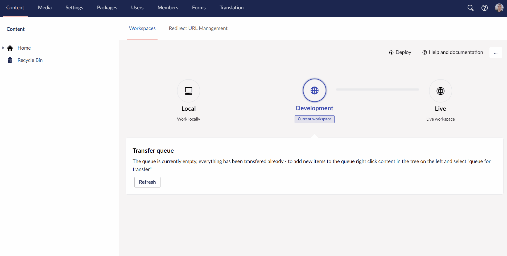

# Deploy operations

:::note
The following article in the documentation only applies to you if you are running Deploy 4+. 
:::

Umbraco Deploy is the deployment engine of Umbraco Cloud. With Umbraco Deploy you have the possibility of performing certain operations with your schema directly from within the backoffice, using the Umbraco Deploy dashboard.
You access the Umbraco Deploy dashboard from the settings section.

<iframe width="800" height="450" src="https://www.youtube.com/embed/l5qdTsIddKM?rel=0" frameborder="0" allow="autoplay; encrypted-media" allowfullscreen></iframe>

## What operations can you run using Deploy?

With Umbraco Deploy you can run different operations:

* [Deploy schema from data files](Deploy-schema)
* [Extract schema to data files](Extract-schema-to-data-files)
* [Clear the cached signatures](Clearing-cached-signatures)