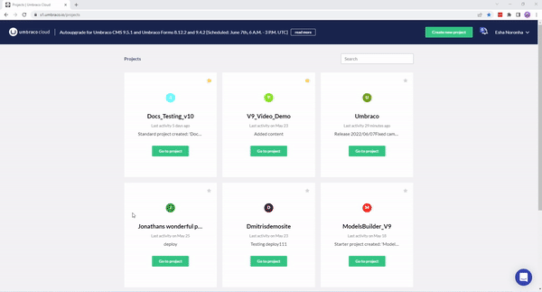

# Deployment Webhook

You can now configure a deployment webhook to be triggered upon successful deployments to any of your Umbraco Cloud environments, e.g. when deploying from your local environment to your Cloud Development environment. Upon successful deployment, general information about the deployment will be posted in a JSON format to the specific URL you have configured.

## Use cases

There are many 'audit' cases when you would like to let others know about what is happening with your site. Here are some examples of cases where this feature could be useful:

1. Any deployments to the Live site could be relevant for many parties in a company. Posting information about them in internal communication channels like *Slack* is made possible using this feature.
2. Monitoring of the whole deployment cycle. A successful deployment might result in a potentially breaking change. Integrating the webhook with other monitoring services, you could find out which deployment has caused the issue.
3. Letting content editors know about particular deployments when a new document type was added as they can now use the new document type.

## Configuration steps



1. From the Umbraco Cloud Portal go to **Settings** -> **Webhooks**
2. Select the environment to register a webhook.
3. Fill in the **Webhook URL** to which the data about a deployment should be posted to. An absolute URL with HTTP/HTTPS schema is an acceptable input to the field - ex. `https://exampleURL.com`
4. Click **Add Webhook**.

## Sample data

General information about the deployment (to the configured environment) will be posted in JSON format to the URL (configured in the previous section).

### Headers

The headers contain information about the payload in JSON format as well as a version of the payload.

```json
X-Umb-Webhook-Version: 1
Content-Type: application/json; charset=utf-8
```

### Contents

Contents of the payload contain general information about the current deployment with links to the project in the Portal and the frontend of the environment. The last part of the contents is a collection/enumeration of commits that were deployed to the environment, mentioning the author, the commit message, and changed files.

```json
{
    "Id":"40810bf1bbbfc16dd273162509de297ad386fb4e",
    "Status":"success",
    "StatusText":"",
    "AuthorEmail":"laughing@unicorn.dk",
    "Author":"Laughing Unicorn",
    "Message":"Adding document type 'LaughingUnicornLaughs'",
    "Progress":"",
    "ReceivedTime":"2017-10-02T11:19:00.4984213Z",
    "StartTime":"2017-10-02T11:19:04.1328336Z",
    "EndTime":"2017-10-02T11:19:24.3470224Z",
    "LastSuccessEndTime":"2017-10-02T11:19:24.3470224Z",
    "Complete":true,
    "ProjectName":"laughingUnicorn",
    "ProjectUrl":"s1.umbraco.io/project/laughingunicorn",
    "SiteUrl":"laughingunicorn.s1.umbraco.io",
    "EnvironmentName":"Live",
    "Commits":[
        {
            "AuthorName":"Laughing Unicorn",
            "AuthorEmail":"laughing@unicorn.dk",
            "Message":"Adding document-type 'LaughingUnicornLaughs'\n",
            "Timestamp":"2017-10-02T07:16:39",
            "ChangedFiles":[
                "data\\revision\\document-type__9ac71ecba6d84344af4bcbf43ab6cd80.uda"
            ]
        },
        {
            "AuthorName":"Laughing Unicorn",
            "AuthorEmail":"laughing@unicorn.dk",
            "Message":"Adding template 'LaughingUnicornLaughs'\n",
            "Timestamp":"2017-10-02T07:16:38",
            "ChangedFiles":[
                "Views\\laughingunicornlaughs.cshtml",
                "data\\revision\\template__80d64e8172df46479ccf330bb9f63f2c.uda"
            ]
        }
    ]
}
```
