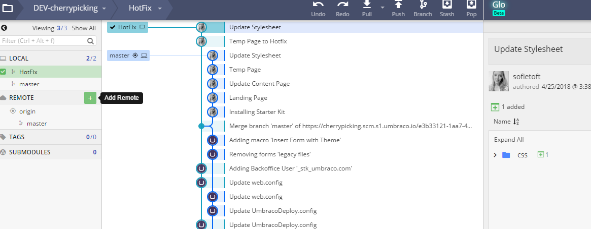
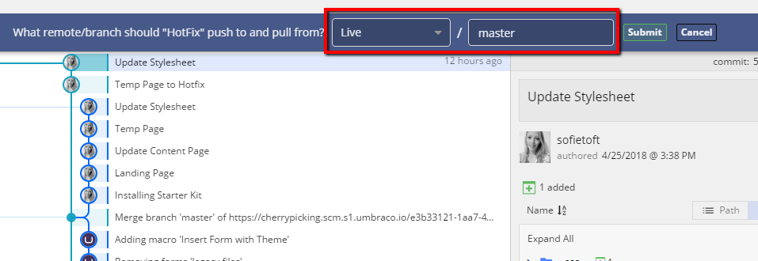

# Apply hotfix by using Git

In this article you'll find a step-by-step guide on how to apply a hotfix to a Live environment by using only Git.

Tools used:

* GitKraken

## The scenario

You have an Umbraco Cloud project with two environments, Development and Live. 

You have been working on building the site on a local clone of the Development environment, and now you want to send some but not all changes to the Live environment.

A set of commits have been pushed from your local clone to the Development environment. Out of these commits, you only need the changes from two of the commits on the Live environment.

## Apply selected changes to the Live environment

Here are the steps to follow in order to apply selected changes to the Live environment without deploying from Development to Live.

### Branching and Cherry picking

1. Open the Development repository in GitKraken (or your preferred Git client)
2. Choose the commit where you want to create a new branch
    * This branch should be created in an early commit, before the changes you've made locally have been committed
    
        

3. With the new branch, _Hotfix_, selected it's now time to _cherry pick_ the commits you want to apply to the Live environment
4. _Right-click_ the commit you want, and choose **"Cherrypick commit"**
    * You will be asked if you want to commit this directly to the new branch - Choose **Yes**
    * Choose **No** if you want to create a new message for the commit
5. You can cherrypick as many commits as you like
6. Your Git history will now look something like this

    

### Push to Live

Before you push the newly created branch to Umbraco Cloud we need to change the _remote destination_. If you simply hit _Push_ now, the branch would be pushed to the Development environment. You need to add the Live environment as a _new remote_.

7. Find the clone URL for the Live environment in the Umbraco Cloud Portal

    

8. In GitKraken add a **new remote**, by clicking the **+** next to _Remote_

    

9. Give the new remote a name - like **Live**, and add the clone URL for the Live environment to both _Push URL_ and _Pull URL_ - click **Add Remote**

    

10. You will be prompted to login - use your Umbraco Cloud credentials
11. Now you will see that the history from the Live repository is visible in the Git history
12. Next step; Check out the new branch and hit **Push**
13. Choose to push to the newly added remote, and write **master** to make sure you are pushing to the master branch on the Live environment

    

14. Hit **Submit** and the push will start
15. **Note** that when changes are pushing directly to a Live environment and you have more than one environment, the changes are not automatically extracted into the site
16. Find a guide on how to extract the files, in the [Manual Extraction](../../../Set-Up/Power-Tools/Manual-extractions) article

You have now applied a hotfix to the Live environment.

Make sure that you merge and remove the branch you've created on the Development repository, before pushing to the Development environment on Cloud - you can always create a new branch, if you need to apply another hotfix to the Live environment.

When you are ready building on your Development environment, simply follow the [normal workflow of Cloud](../Deployment) to deploy the changes to the Live environment.

## Important notes

* Make sure that the changes you push directly to your Live environment is also pushed to the Development environment. This will ensure that your environments are kept in sync.
* This guide can also be used for applying a hotfix to a _Staging_ environment.