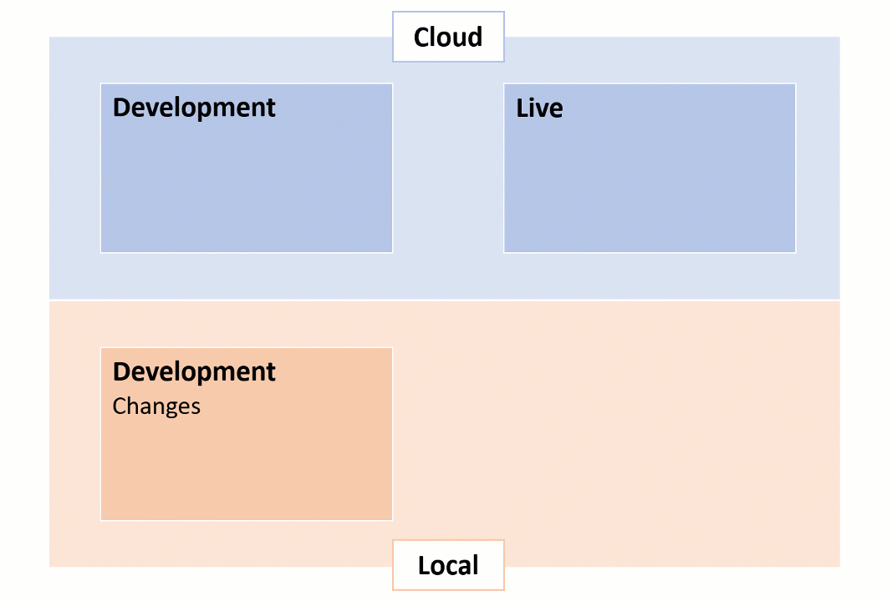

# How to handle hotfixes on Umbraco Cloud projects

When you have an Umbraco Cloud project with multiple environments, you might run into a situation where you need to push a hotfix to your Live environment, but have other pending changes on your Development environment that is not yet ready for the Live site.

Let's say you have 2 environments, a Live environment and a Development environment. You are currently working on building some changes on your Development environment, but these changes wont be ready for the Live environment for another few weeks. Now you need to apply a minor change to your Live environment - a *hotfix*. 

Normally you would do this, by making the hotfix on the Development environment and deploy it to the Live environment. In this scenario that's not possible, as you do not want to deploy the other changes you are still working on.

Following the workflow of Umbraco Cloud, you should never make changes directly on your Live environment. You should only make changes on the Live environment if that's the only environment you have. Read the [Environments](../../Getting-Started/Project-overview/) article to learn more about environments on Umbraco Cloud.

With that said, it **is** possible to apply selected changes to your Live environment without breaking the workflow of Umbraco Cloud. 

There are two roads you can take:

## [1. Move files manually](Move-files-manually/)

One way to apply a hotfix to a Live environment would be to clone down both your Development and your Live environment to your local machine. Take the changed and/or updated files from the cloned Development environment and copy them into the cloned Live environment, and push them to the Live environment on Cloud. Using this guide will also allow you to test the changes on a cloned version of your Live environment before pushing to the Cloud.

Read the guide here: [Move files manuallty](Move-files-manually/)

## [2. Use Git "magic"](Using-Git/)

Another way to apply a hotfix to a Live environment on Cloud is to clone down the Development environment and then use Git to push selected changes to the Live environment. This guide requires some knowledge about Git, and you should only go with this guide if you feel comfortable working with Git.

Read the guide here: [Deploy hotfix with Git](Using-Git/)

