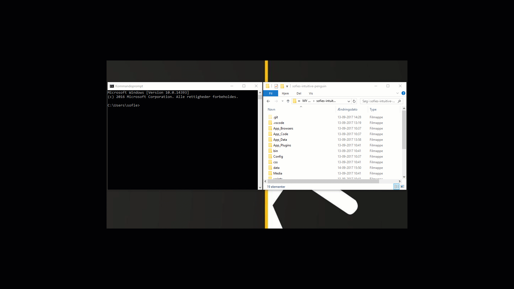

# Generating metadata

You have now moved and merged the files from your own project with the Umbraco Cloud project files. So far, so good! In this part, you are going to generate the so-called UDA for all your project components.

## Verify your Cloud project runs locally
* Open a command prompt
* Navigate to the `/data` folder in your local Umbraco Cloud project files
* Add a deploy-marker by typing `echo > deploy`
* Run the Umbraco Cloud project locally
    * The deploy engine will start when the deploy-marker is detected. This also adds the Umbraco Cloud users to the database you merged into the Umbraco Cloud project.
    * When it's done you should see a deploy-complete marker in the `/data` folder
* Go to the backoffice and verify the project has all metadata, content and media as expected.

## Generate UDA files
In order for your project to run on the Umbraco Cloud environments you need to generate UDA files for all your metadata.
* Make sure the folder `/data/revision` on your Umbraco Cloud project is empty
* Open a command prompt
* Navigate to the `/data` folder in your local Umbraco Cloud project files
* Add an *export* marker by typing `echo > deploy-export`
    * Generating the UDA files make take a while, depending on the extend of your project
* You should now see that your `/data/revision` folder has been populated with UDA files corresponding to your projects metadata

At this point you are ready to deploy your site to Umbraco Cloud - Yay!