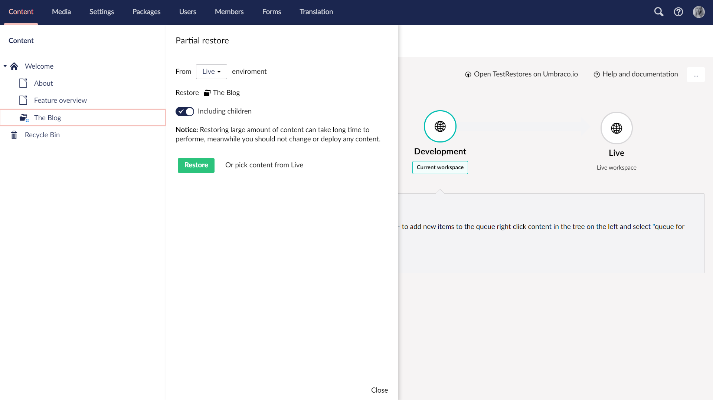

# Partial Restores

In some cases you might not want to restore the entire content tree, but only the parts that you need. **Partial restores** is a feature that allows for restoring specific parts of your content instead of restoring everything.

You can use Partial Restore on

- [Environments with existing content or media](#environment-with-existing-content-or-media), and on
- [Empty environments](#empty-environment) - Requires Umbraco Deploy 3.3+.

## Empty environment

**This is a feature only available with Umbraco Deploy 3.3+**

In this scenario you've cloned down your Cloud environment to your local machine or setup a new Cloud environment. In both cases the new environment will have an empty Content section as well as an empty Media section. 

:::note
Be aware that this feature will also restore all dependencies on the selected content.

E.g. when you restore a content node which references media items as well as other content nodes, these will all be restored as well, including any parent nodes that these nodes depend on.
:::

Follow these steps to perform a partial restore to get only the parts you need:

1. Go to the Content section of the Umbraco backoffice on your new environment (local or Cloud)
2. *Right-click* the Content Tree, or click the three dots an select *Do something else*
3. Choose *Partial Restore*
4. Select the environment that you would like to restore content from
5. Click "*Select content to restore*" - this will open a dialog with a *preview of the content tree* from the environment you selected
6. Select the content node you would like to restore
7. Decide whether you also want to restore any child nodes *below* the selected node
8. Start the restore by clicking *Restore*
9. To see the restored content, *reload* the content tree - *right-click* the Content tree to find this option

Keep in mind if you select a content node deeper down the tree, all the parents above it, required for the node to exist, will be restored as well.

Partial Restores on empty environments are especially helpful when you have a large amount of content and media and do not necessarily need it all for the task you need to do. Instead of having to restore everything which could potentially take a long time, doing a partial restore can be used to shorten the waiting time by only restoring the parts you need. This will ensure that you can quickly get on your way with the task at hand.

## Environment with existing content or media

It is also possible to use the Partial Restore feature on environments where you already have content in the Content tree.

Imagine that you are working with your Umbraco Cloud project locally. One of your content editors updates a section in the content tree on the Live environment. You would like to see how this updated content looks with the new code you are working on. Follow these steps to do a Partial Restore of the updated content node:

1. Go to the Content section of your local Umbraco backoffice
2. *Right-click* the content node which you know contains updates
3. Choose *Partial Restore*
4. Select the environment that you would like to restore content from
5. Decide whether you also want restore any child nodes under the selected node
6. Start the restore by clicking *Restore*
7. When the restore is done, reload the content tree to see the changes

