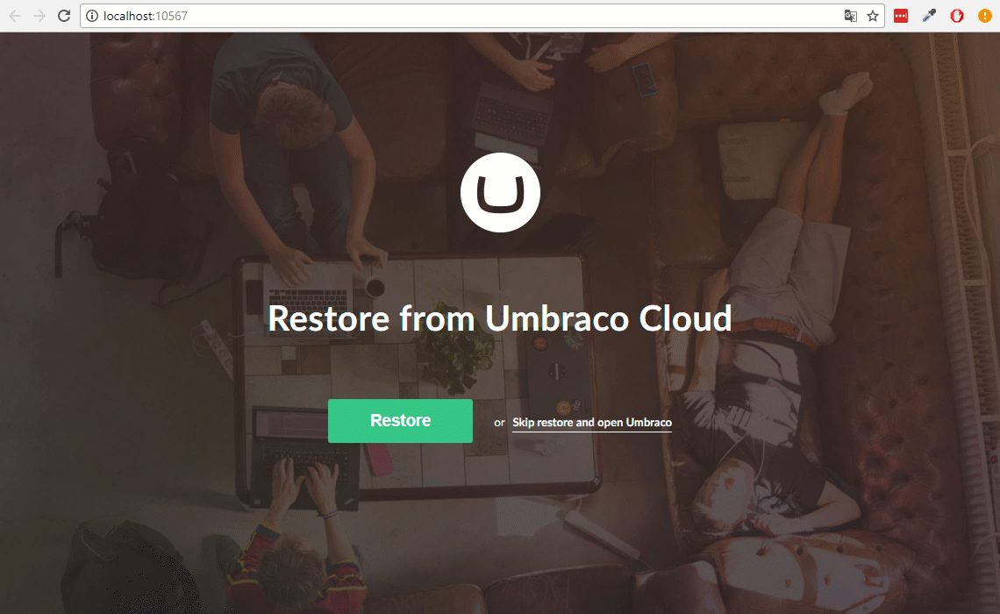
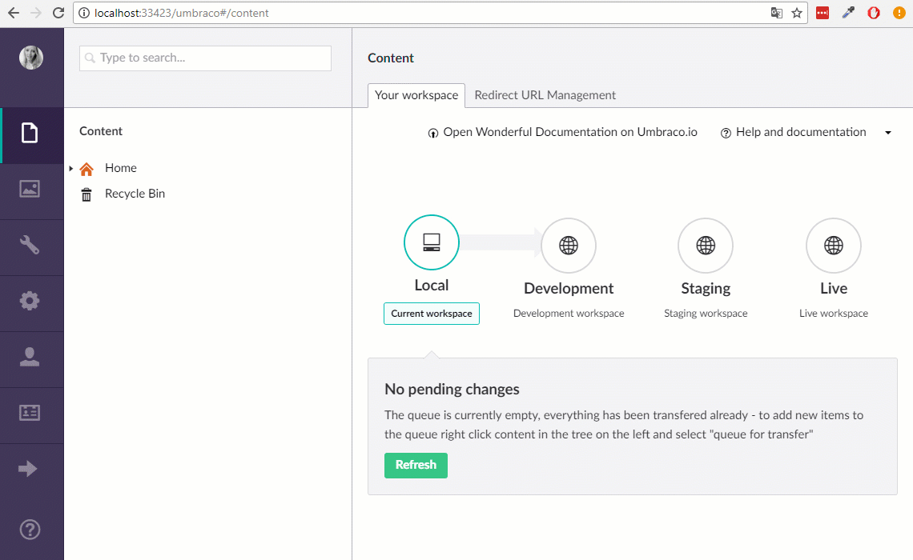

# Restoring content

When you have already created some content on your Cloud environment and you clone down your Umbraco Cloud project to your local machine, you will need to do an extra step, in order to see your content locally as well.

You will also need to use the restore option when setting up new Umbraco Cloud environments. The restore option also comes in really handy if you have content editors creating content on the Live or Staging environments and you want to work with this content when building templates on the Development environment or on your Local clone.

## Video Tutorial

<iframe width="800" height="450" src="https://www.youtube.com/embed/ha4KDpE81dg?rel=0" frameborder="0" allow="autoplay; encrypted-media" allowfullscreen></iframe>

## Step-by-step 

### Restore when starting up the project locally

The first time you run your project locally you will have the option to restore your content and media before going to the Umbraco backoffice.

1. When your site is done spinning up, click the green **Restore** button - this will restore all content and media!
2. Wait till the process completes - this might take a while, depending on the amount of content and media you have on your project
3. When it's complete click **Open Umbraco**
4. You will now find all your content and media in the Umbraco backoffice

### Restore from the Umbraco backoffice

The second option for restoring your content and media is found in the Umbraco backoffice - use this option when setting up new Cloud environments!

1. Go to the Umbraco backoffice on the environment you want to restore content and media to
2. *Right-click* the top of the Content section
3. Choose **Restore**
4. You will now have the option to restore content from any of your Cloud environments
  * To ensure the restore will succeed, make sure that your environments have the same meta data.
5. Click **Restore from ..** and wait till the process completes - this might take a while, depending on the amount of content and media you have on your project
6. When it's done, *right-click* the Content tree again and choose **Reload** to see your content in the tree
7. Your media will also have been restored
8. To see your media, go to the Media section and *reload* the tree

### Partial restores

If your project has a lot of content nodes and/or media items you might not want to restore everything every time a minor change has been made to the content.

Imagine that you are working with your Umbraco Cloud project locally. One of your content editors updates a section in the content tree on the Live environment. You would like to see how this updated content looks with the new code you are working on. Follow these steps to do a partial restore of the updated content node:

1. Go to the Content section of your local Umbraco backoffice
2. *Right-click* the content node which you know has been updated on the Live environment
3. Choose **Partial restore**
4. From the *dropdown* you will be able to choose which environment you want to restore the content node
5. After choosing environment, click **Restore from ..**
6. When the restore is done, reload the content tree to see the changes

**Note:** Partial restores are only available when you actually have content on your environment. This means that you cannot do partial restores on a fresh Local clone or a newly created Cloud environment where to content tree is empty.
