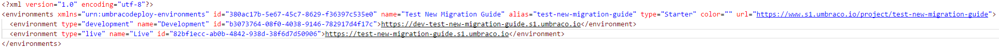
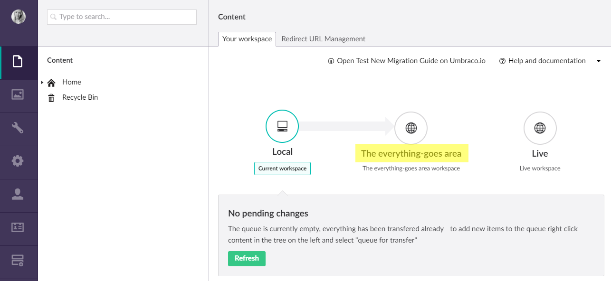

# Deployment
Umbraco Cloud uses a deployment model that relies on Git, Kudu, and Umbraco Deploy core technology to move your changes from one environment to another. Umbraco Cloud uses a classic "left to right" deployment model, meaning that changes are first made in the Development or local environment and then deployed to the Live environment.  

__Note:__ If your project contains a Staging environment, deployments will be made from Development to Staging and then from Staging to Live.

## Deployment Approach
Umbraco Cloud uses a two-part deployment approach where we keep meta data (Document types, templates, etc) and content (Content nodes and Media) as separate parts of a deployment. In order to be able to distinguish between the two types of deployments we use the term *transfer* for content and media deployments and the term *deploy* for meta data deployments.
In summary:

1. Meta data such as Document Types, Templates, Forms, Views and config files are stored in a git repository and are **deployed** between environments using either a git client or the Umbraco Cloud Portal.

2. Content and Media items are **not** stored in the git repository. These needs to be **transferred** directly from the Umbraco backoffice using the *"Queue for Transfer"* option. Once a content editor has all the items needed for a transfer (which could be just a single item) they will use the Deployment Dashboard in the Content section to transfer the items in the queue.

With this arrangement you don't need to grant Umbraco Cloud portal access to your content editors but can, instead, allow them access only to the required backoffice sections of your sites. This also allows developers to focus on deploying meta data which is stored in the site's git repository and content editors to focus on transferring content which is stored as Umbraco data.

### Video tutorial

Learn more about the deployment approach in this video, which will also show you how to deploy meta data as well as how to transfer content and media. Below you'll find links to articles containing step-by-step guides for each approach.

<iframe width="800" height="450" src="https://www.youtube.com/embed/sjId_hN1ba0?rel=0" frameborder="0" allow="autoplay; encrypted-media" allowfullscreen></iframe>

### Deploying meta data
In order to be able to transfer content and media, the source environment and the target environment needs to have the same setup - meaning they need to be completely in sync and have the same file structure. To achieve this you need to deploy your meta data changes to the target environment. 

  - [Deploy changes from Local to Cloud](Local-to-Cloud)
  - [Deploy changes from one Cloud environment to another](Cloud-to-Cloud)
  - [How Forms are handled on Cloud](Umbraco-Forms-on-Cloud)

### Transfer Content and Media
Moving your content and media between your environments is done through the Umbraco backoffice. You can transfer content from one environment to another, e.g. from Local to your Development environment. You also have the option to restore content and media to your Local or Development environment from your Live or Staging environment.

  - [Transfer Content and Media](Content-Transfer)
  - [Restore Content and / or Media](Restoring-content)

**Note:** Transferring and restoring content and media is the same whether you are working between Local and Cloud or you are working between two Cloud environments. 

## Environment restarts
Some deployments can cause an Umbraco Cloud environment to restart. See the table below to learn which actions initiates an application restart.

|Action:                            |Application Restart? |
|-----------------------------------|---------------------|
|Config file change                 |Yes                  |
|Meta data deployment               |No                   |
|File change - fx _css-file_        |No                   |
|Content and/or Media transfer      |No                   |

### Manual restart
From the Umbraco Cloud Portal you can manually restart your environments. 

## UmbracoDeploy.config

You might notice a new file in your config folder called UmbracoDeploy.config. This files tells the deployment engine where to deploy to, it knows which environment you’re currently on (for example local or staging) and chooses the next environment in the list to deploy to.

**Note**: you’re free to update the “name” attribute to make it clearer in the interface where you’re deploying to. So if you want to name “Development” something like “The everything-goes area” then you can do that and it will be shown when deploying to that environment.

