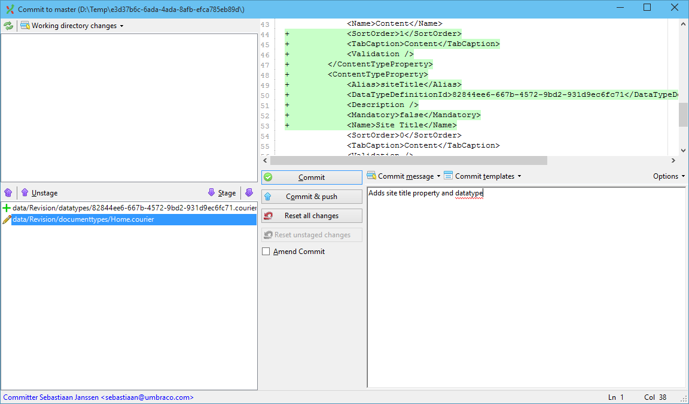
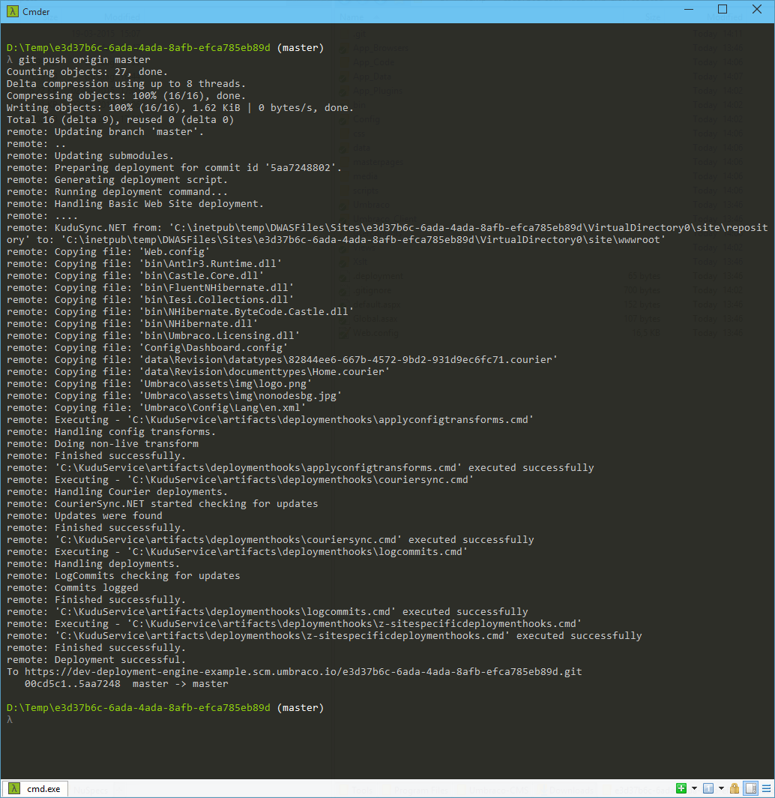
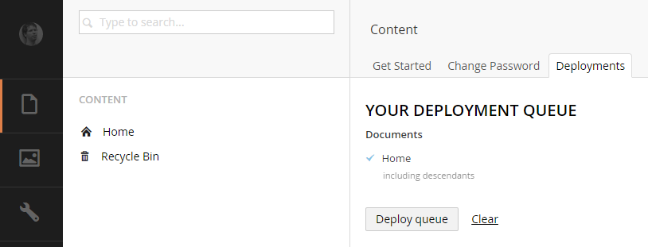
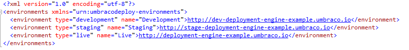

#Deployment
Umbraco Cloud uses a deployment model that relies on Git, Kudu, and Courier core technology to move your changes from one environment to another. Umbraco Cloud uses a classic "left to right" deployment model, meaning that changes are first made in the development environment and then deployed to the live environment.  

__Note:__ If your project contains a staging environment, deployments will be made from development to staging and then from staging to live.

##Deployment Approach
Umbraco Cloud uses a two-part deployment approach where we keep meta data (types, templates, etc) and content (Document and Media) as separate parts of a deployment. This allows developers to focus on deploying meta data which is stored in the site's git repository and content editors to focus on deploying content which is stored as Umbraco data. In summary:

1. Meta data such as Document Types, Templates, Macros, Views and files are still stored in a git repository and are deployed between environments using either a git client or the portal.

2. Document and Media items are not stored in the git repository, but can be deployed directly from the Umbraco back office using the "Queue for Transfer" option in the Action menu which adds them to a deployment queue. Once a content editor has all the items needed for a deployment (which could be just a single item) they will use the Deployment Dashboard from the Content section to deploy items in the queue.

With this arrangement you don't need to grant Umbraco Cloud portal access to your content editors but can, instead, allow them access only to the required back office sections of your sites.

##How do I deploy?
When working directly with an Umbraco Cloud project, you deploy using the "Deploy to ..." button from your project's portal for meta data and directly in the site's back office to deploy content.  

When working locally, or in an environment outside of Umbraco Cloud, to deploy changes to Umbraco Cloud you execute a `Git Push` from your local Git client. Umbraco keeps track of all the changes you make to a site and includes these changes when you deploy. Of course, once you’ve deployed your local changes to your development environment on Umbraco Cloud, deploying to your staging or your live site is literally as simple a pressing the "Deploy to..." button.

To deploy content you have created locally you'll use the same approach as above; adding items to the queue, then deploying the queue to your Umbraco Cloud development environment - which is automatically configured for you.

##I’m ready to get started, what do I do first?

###Working directly in Umbraco Cloud
When working with your Umbraco Cloud site directly, having logged in to the umbraco back office, any changes you make will automatically be identified and comitted to the site's Git repository. This includes umbraco specific items like document types and templates. In the Umbraco Cloud portal activity view there will be messages in the activity stream as well as an indication of how many commits have been made.

As you add or edit content and media in your site you'll notice these are not added to the site's Git repository. We leave it to you to decide which content to deploy and when.  

###Deploying meta data
In order to be able to transfer content and media, the source site and the target site need to have the same setup. Most importantly the document types need to be the same on each end.
This process has not changed, if you’re not familiar with this procedure yet, here’s an example:
- You’ve cloned a site to your local machine to work on
- You’ve added a few fields to the "Home" document type
- The `data\Revision\documenttypes\Home.courier` file is now updated with these changes
- You’ve also created a new datatype that’s used on the "Home" document type, this datatype is stored as a file in `data\Revision\datatypes`
- Using git, commit those two changed files to your local repository and push them to the development environment using `git push`
- On the development site, a deployment kicks in and the “Home” document type is updated and the new datatype you created locally is now automatically created on the development environment as well

###Deploying from Umbraco
The steps to deploy your content and media are, in short:
- Select the page that you wish to deploy
- Select the "Do something else" option (or right-click) and choose "Queue for transfer"
- Choose whether to deploy just that page or everything under that page as well and click the "Queue" button
- Go to the Deployments Dashboard in the content section of Umbraco
- Click "Deploy queue"
- Done!

**Note**: This will overwrite any existing nodes - content deploy will transfer the items that you select including the content that’s entered in the "source" environment and restore it in the “target” environment exactly the same as it was in the "source."

This will not always work immediately, as the site meta data needs to be the same between the environments that you’re deploying from and to. Sometimes you’ll see a message telling you the two environments don’t match up. The message includes instructions on how to resolve the issues.

##Step-by-step
Let’s go through a deploy step by step. Imagine you’ve finished working on new content for your great new project locally and want to deploy. You want to deploy the whole site so you start from the Home page and will choose to deploy everything under it.

Click on the ellipsis next to the "Home" page in Umbraco and choose "Do something else."" There you get the choice of "Queue for transfer."" If you’re currently editing the Home page you could also use the Actions dropdown to get the "Queue for transfer" item. In the following screenshot, both options are highlighted.

You then get to choose if you want to include all pages under the chosen page.

This will give you control over exactly what you want to deploy, you can dig into your own content tree and only deploy a few items, or you can choose to deploy all of it in one go.

You can then go to the “Deployments” dashboard. The easiest way to get there is to click on the “CONTENT” header highlighted here.

**Note**: if you are already on the content tab then nothing will happen, make sure to refresh the browser window to update.

Clicking on the “Deployments” tab should then show you what items are currently ready to be deployed.

Clicking the “Deploy queue” button will package up all of the items that need to be deployed and
it will check the target site to make sure that the site meta data is the same on both ends.

You can then confirm by clicking “Deploy everything now” and you can then monitor the progress of the deploy.

If everything went well, you should see the confirmation screen that the deploy has succeeded.

Sometimes a deploy is not possible, for example if you add a new property to the homepage document type and you don’t have that property in both environments, you’ll get an error with a hint on how to fix this.

The problem will appear in your CourierTracelog.txt as a line looking like this:

    2015-04-27 14:59:20,546 [10] INFO  Umbraco.Courier.Core.Packaging.RevisionPackaging - [Thread 45] Document types: Home hash-mismatch (local/remote) e5c6dc5f2eee6521b2d024f7777bbd9e / 2628e7c3e4bc7215fd398a2bbb13f423

In order to compare the two environments, we create a hash of all of the important data of (in this case) the Home document type and see if the hash matches on both ends. More on this later in the Debugging section.

Once fixed, you can use the “Retry” button to try again.

###UmbracoDeploy.config

You might notice a new file in your config folder called UmbracoDeploy.config. This files tells the deployment engine where to deploy to, it knows which environment you’re currently on (for example local or staging) and chooses the next environment in the list to deploy to.

**Note**: you’re free to update the “name” attribute to make it clearer in the interface where you’re deploying to. So if you want to name “Development” something like “The everything-goes area” then you can do that and it will be shown when deploying to that environment.

###Debugging

Earlier in the document we highlighted an error that you might see:

    2015-04-27 14:59:20,546 [10] INFO  Umbraco.Courier.Core.Packaging.RevisionPackaging - [Thread 45] Document types: Home hash-mismatch (local/remote) e5c6dc5f2eee6521b2d024f7777bbd9e / 2628e7c3e4bc7215fd398a2bbb13f423

This error is not very descriptive and if you’re not sure what the difference are then you can investigate it a little bit deeper. If you add a key to your appSettings section in web.config you get to actually see what data we’ve tried to compare, unhashed.
In web.config (on both ends, both source and target), you can add the following key (note: on both the source and target environment):

    <add key="DeployHashDebug" value="true" />

Now when you get the above error, you’ll get the same message with a little more information:

Using a text compare tool like WinMerge we can pretty easily figure out that the property “Test” was added to the local document type but isn’t found on the remote instance.

##Working locally (for developers)

The first time a developer starts working on the site locally, they can clone the site with git as usual. The first page that will show up is one asking for a username and password to fetch existing content from the remote (the development environment).

You can choose to skip this step and no content will be downloaded (but you still get all of the document type, datatypes, templates, etc. from the development environment).

If you do choose to restore all content you’ll see the deploy engine counting up everything it needs to download and restore.

When this is finished you’ll get a success message and you can go to the Umbraco backoffice.

For more on how to work with a local clone of your site see the [Working Local documentation.](../Set-Up/Working-Locally/)
