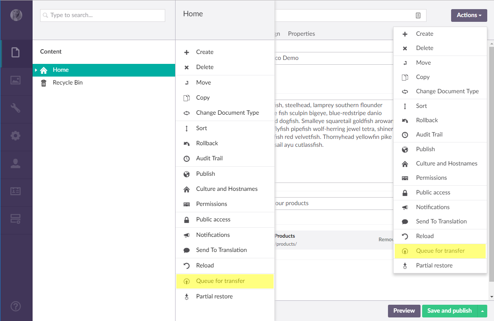
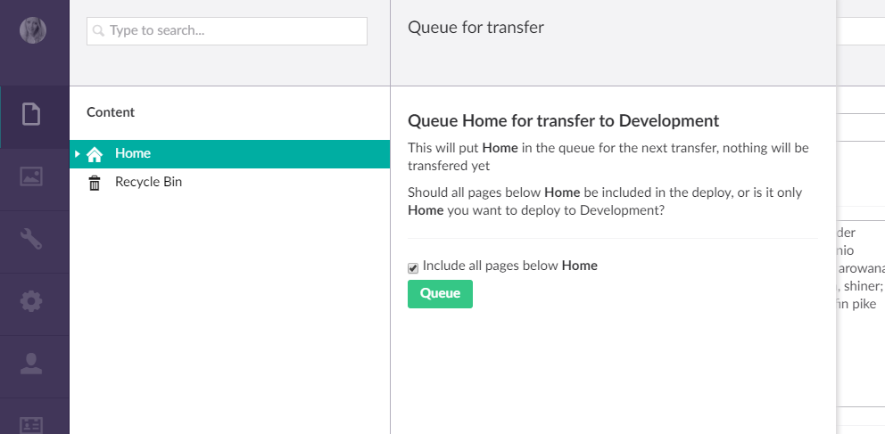
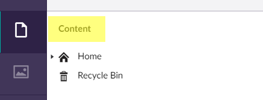
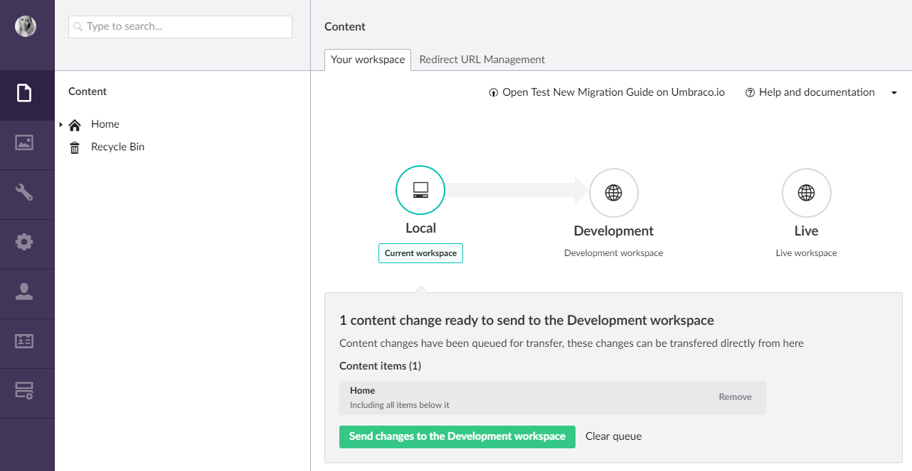
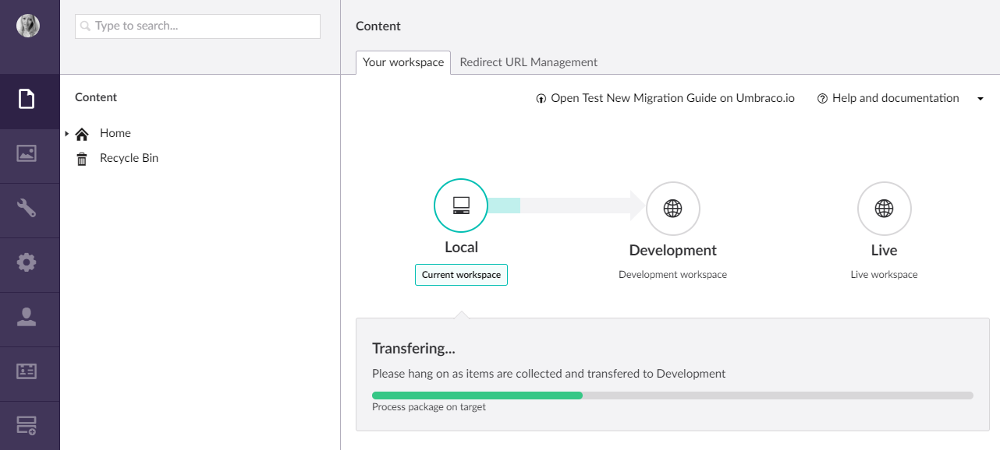
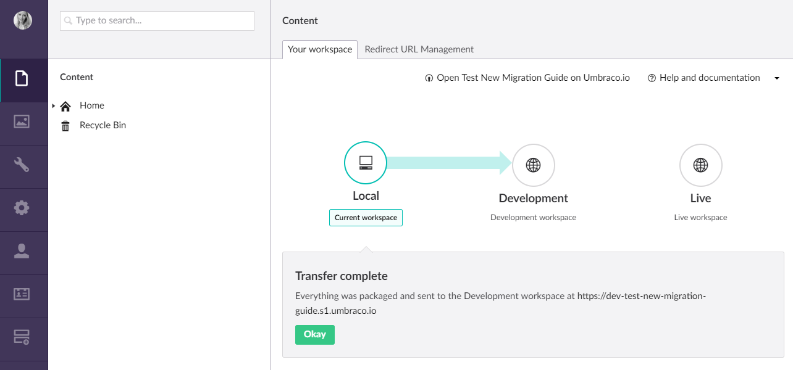

# Deployment
Umbraco Cloud uses a deployment model that relies on Git, Kudu, and Deploy core technology to move your changes from one environment to another. Umbraco Cloud uses a classic "left to right" deployment model, meaning that changes are first made in the Development or local environment and then deployed to the Live environment.  

__Note:__ If your project contains a Staging environment, deployments will be made from Development to Staging and then from Staging to Live.

## Deployment Approach
Umbraco Cloud uses a two-part deployment approach where we keep meta data (Document types, templates, etc) and content (Content nodes and Media) as separate parts of a deployment. In order to be able to distinguish between the two types of deployments we use the term *transfer* for content and media deployments and the term *deploy* for meta data deployments.
In summary:

1. Meta data such as Document Types, Templates, Macros, Views and files are stored in a git repository and are **deployed** between environments using either a git client or the Umbraco Cloud Portal.

2. Content and Media items are **not** stored in the git repository. These needs to be **transferred** directly from the Umbraco backoffice using the *"Queue for Transfer"* option in the Action menu which adds them to a deployment queue. Once a content editor has all the items needed for a transfer (which could be just a single item) they will use the Deployment Dashboard in the Content section to transfer items in the queue.

With this arrangement you don't need to grant Umbraco Cloud portal access to your content editors but can, instead, allow them access only to the required backoffice sections of your sites. This also allows developers to focus on deploying meta data which is stored in the site's git repository and content editors to focus on transferring content which is stored as Umbraco data.

### How do I deploy?
When you are working with your Umbraco Cloud project locally and you want to deploy your meta data changes to your Cloud environment you execute a `Git Push` from your local Git client. Umbraco keeps track of all the changes you make to a site and includes these changes when you deploy.

Once you’ve deployed your local changes to your Cloud environment deploying to your Staging or Live environment is literally as simple a pressing the *'Deploy changes to ..'* button in the Umbraco Cloud portal.
When you then want to deploy your meta data changes from one Cloud environment to the next - from Development to Live / Staging - you use the *'Deploy changes to ..'* button in the Umbraco Cloud portal.

To transfer content and media you have created locally you'll use the *'Queue for transfer'* option in the backoffice. The same approach goes for transferring content and media from one Cloud environment to another.

## Deploying meta data
In order to be able to transfer content and media, the source environment and the target environment needs to have the same setup - meaning they need to be completely in sync and have the same file structure. To achieve this you need to deploy your changes to the target environment. 

### Local to Cloud
When you are working with your Umbraco Cloud project locally all changes you make will automatically be identified and picked up by your local Git client. Here's a quick step-by-step on how you deploy these changes to your Cloud environment:

  - You’ve cloned a site to your local machine to work on
  - You’ve some changes to a Document type
  - The corresponding `.uda` file for this Document type is now updated with the changes - the file is located in the `/data/revision` folder
  - You’ve also created a new datatype that’s used on the document type. This datatype is stored as a new file in the `/data/revision` folder as well
  - Using Git, commit those two changed files to your local repository and push them to the Cloud environment using `git push`
  - On the Cloud environment a deployment kicks in and the document type is updated and the new datatype you created locally is now automatically created on the Cloud environment as well

In the above example, GitKraken is used to stage, commit and deploy changes made to a Document type plus a newly added Datatype from a local environment to a Cloud Development environment.

### Cloud to Cloud
When you are working directly on your Cloud Development or Staging environment any changes you make through the backoffice will automatically be identified and committed to the site's Git repository. This includes Umbraco specific items like Document types and templates. Changes made on your Cloud environments will show up in the Umbraco Cloud portal, where you will be able to see what files has been added / changed and by who the changes where made. 

In order to deploy meta data changes from one Cloud environment to another you simply click the *'Deploy changes to ..'* button on the environment where the changes has been made. The deployment will kick in, and you can follow the process on your browser. Once it's done the changes will have been applied to the Cloud environment next in line - Staging or Live.

## Transferring Content and Media
After deploying changes to meta data, it's time to transfer your content and media. This is done from the Umbraco backoffice.
The steps to deploy your content and media are, in short:

  - Select the page that you wish to deploy
  - Select the "Do something else" option (or right-click) and choose "Queue for transfer"
  - Choose whether to deploy just that page or everything under that page as well and click the "Queue" button
  - Go to the Deployments Dashboard in the content section of Umbraco
  - Click "Deploy queue"
  - Done!

**Note**: This will overwrite any existing nodes - content deploy will transfer the items that you select including the content that’s entered in the "source" environment and transfer it to the “target” environment exactly the same as it was in the "source." This means that if you have some content on the target environment already, this will be replaced by the new content from the source environment.

**Important**: Content and Media transfers will only work if you've deployed all changes to your meta data before hand. If you see a *Schema mismatch* error when attempting to transfer content and / or media please refer to our [Troubleshooting](../Troubleshooting/Content-Deploy-Schema) section for information on how to resolve the errors.

### Step-by-step
Let’s go through a content transfer step by step. Imagine you’ve finished working on new content for your great new project locally and you are ready to transfer the changes to the Cloud. You want to transfer the whole site so you start from the `Home` node and choose to transfer everything under it.

Click on the ellipsis next to the `Home` node in the Content tree and choose "Do something else". There you get the choice of **Queue for transfer**. If you’re currently editing the Home page you could also use the Actions dropdown to find  **Queue for transfer**. In the following screenshot, both options are highlighted.

You then get to choose if you want to include all pages under the chosen page.

This will give you control over exactly what you want to deploy; you can dig into your own content tree and only deploy a few items, or you can choose to deploy all of it in one go.

You can then go to the “Deployment” dashboard. The easiest way to get there is to click on the “CONTENT” header highlighted here.

You should now see what items are currently ready to be transferred - this will include both content and media items that you've *queued for transfer*.

Confirm by clicking '*Send changes to the Development workspace*' and monitor the progress of the transfer.

If everything went well, you will see the confirmation screen that the transfer has succeeded.

Sometimes a content transfer is not possible. For example if you add a new property to the HomePage Document type and you don’t have that property in both environments, you’ll get an error with a hint on how to fix this.

If you are seeing this type of issue when trying to transfer content, head over to our chapter about [Schema Mismatch errors](../Troubleshooting/Content-Deploy-Schema), where you can read about how to resolve the issues.

## UmbracoDeploy.config

You might notice a new file in your config folder called UmbracoDeploy.config. This files tells the deployment engine where to deploy to, it knows which environment you’re currently on (for example local or staging) and chooses the next environment in the list to deploy to.

**Note**: you’re free to update the “name” attribute to make it clearer in the interface where you’re deploying to. So if you want to name “Development” something like “The everything-goes area” then you can do that and it will be shown when deploying to that environment.

## Working locally (for developers)

The first time a developer starts working on the site locally, they can clone the site with git as usual. The first page that will show up is one asking for a username and password to fetch existing content from the remote (the development environment).

You can choose to skip this step and no content will be downloaded (but you still get all of the document type, datatypes, templates, etc. from the development environment).

If you do choose to restore all content you’ll see the deploy engine counting up everything it needs to download and restore.

When this is finished you’ll get a success message and you can go to the Umbraco backoffice.

For more on how to work with a local clone of your site see the [Working Local documentation.](../Set-Up/Working-Locally/)
