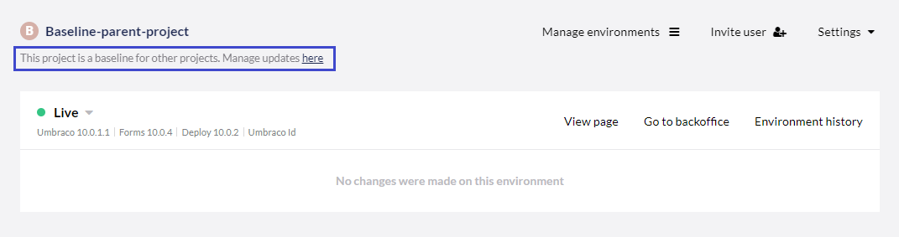

# Pushing Upgrades to a Child Project

When a project has one or more Child Projects it will appear on the Project page and the user can click to get an overview of all the Child Projects based on the current project.

From this page, you will have an overview of all the Child Projects this Baseline project has. This is also where you go when you want to push upgrades from your Baseline Project to the Child Projects.

## Upgrading Child Projects

1. Go to the Baseline project.
2. Click on Manage updates **here**.
3. Select the Child Projects you want to push your upgrades to - you can select as many or as few as you like.
4. Click **Update all child projects** or **Update selected**.
5. Click **Confirm** once the selection looks correct.

If the upgrade has been completed successfully, the Child Projects will be displayed under the **Successful updates/upgrades** section.

## Deploying Minor upgrades to Child projects

To do a minor upgrade of a Baseline project and its Child projects, the initial task is to run the minor upgrade on the Baseline project itself. This is done in the Umbraco Cloud portal by clicking the "Upgrade available!" button on the Development environment, once the environments on the project are in sync.

Following [Minor upgrades](../../../Upgrades/Minor-Upgrades/) guide and the process will leave the Baseline project upgraded to the latest version, while all the children are untouched for now.

Once the upgrade has been verified on the Baseline project, and you've made sure everything works as expected, you should go to the **Manage child projects** page on the Baseline.

On this page, you'll notice that all the children now have an available upgrade. At this point, you can select the projects to upgrade.

At first, any pending changes made on the Baseline will be deployed to the child site. Once the changes have been deployed, the child site will be upgraded to the same version as the Baseline site. All the products (CMS, Courier to Deploy, and Forms) will be upgraded.

:::note
We recommend that you set up a Development environment on your Child project before deploying the upgrade. That way you'll have an environment to test on and verify that everything has been deployed correctly.

Once you are happy with the Development environment, you can go ahead and deploy to the Live environment as well.
:::

The upgrade itself will happen once you click the upgrade button. This will start by triggering the update, where all the files are updated on the children from the baseline. Once the files are in place, we also run the upgrade process, making sure that the children are fully upgraded.

When using the feature, the Baseline Child projects must be set up following our [best practices for handling config files](../Configuration-files). This means that any changes to the Child project should be applied via a config transform file. The reason for this is that the Child projects config files will be merged by choosing the parent's config files first. That is to ensure that changes to config files, that have been made in the minor upgrade, will also be applied to the child projects.

### Errors while upgrading children from baseline

If the upgrade of a Child project fails, or the Child project is left in a bad state, it is most likely because the Child project was unable to be merged properly.

When updating Child projects from a Baseline project, a configuration from the Child project will take precedence over the Baseline project configuration. This means that when the update from the baseline to the child runs, the configuration file sometimes won’t be changed.

To fix this, it is important to follow the flow shown in [Handling configuration files](../Configuration-files/). It prevents the child will update configuration files and will ensure the best flow between the baseline and the child.

If the flow isn't used, then the repository will be in a state where the code has been updated, but the configuration files haven’t been updated. The solution is to manually fix the configuration files on the child project. Do a comparison of the configuration files on the baseline and the child, and make sure that all changes have been added to the child’s configuration files.
