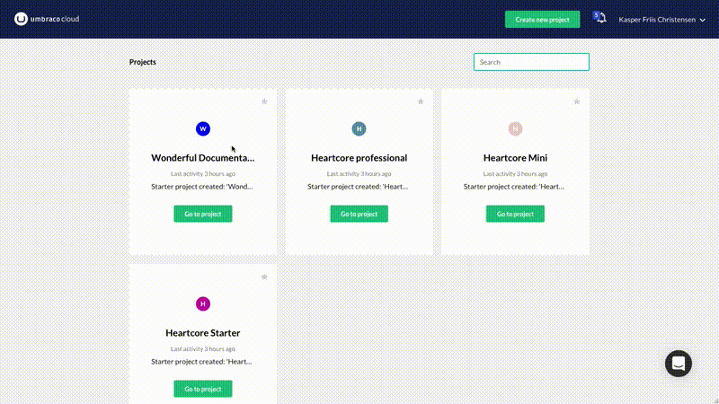

# Baselines
A Baseline Child project is very similar to a Fork (forked repository) on Github in that we create a clone of an existing project while maintaining a connection between the two projects. The connection exists between the _Live_ environment of the existing project, the **Baseline project**, and the _Development_ or Live environment - of the newly created project, the **Child project**.

Any project can act as a Baseline project.

The basic idea is that you have a project that contains all your standard Umbraco packages/components, maybe even configured with some default Document Types, which you want to use as a baseline for future projects. When you've made changes to your Baseline project you can then push these changes out to all the Child projects with a click of a button.

In this article you'll find a guide on how to create Baseline Child projects.

For some more in-depth information have a look at these articles:

* [High-level overview](High-level-overview/)
* [Upgrades Child projects](Upgrading-Child-Projects/)
* [Configuration files](Configuration-files/)
* [Baseline merge conflicts](Baseline-Merge-Conflicts/)

## Creating a Child project

Using the “Create Project” option from the Umbraco Cloud Portal, choose either the Starter or the Professional plan for your new project. 

After choosing a name for your new project, you will have the option to create the project based on an already existing project - any of your projects can be used as a Baseline project! 

When you click create you’ll be redirected to the project page for the new Child project, which shows the creation progress. It might take several minutes for the project to spin up and before your environments are ready. 

When your environments are ready your will see a *green* light next to the environment name.

**Note:** Depending on the size of the project you've chosen as a Baseline project, it might take several minutes before the Child project is ready. 

### Restore content from the Baseline project

When you've created the Child project you can choose to restore content from your Baseline project:

* 'Right-click* the top of the Content tree in the Umbraco backoffice
* Choose *Restore*
* The *Baseline project* should already be selected as the environment to restore from
* Click **Restore from Baseline**
* Once the restore is complete, *reload* the content tree to see the content!

### Technical steps

**Note:** Since the following steps were outlined we've made quite a few improvements to the Baseline workflow. For the most part the steps are still relevant and we are working on getting them updated with the latest details.

* For the Development repository we fetch and merge from the upstream branch, which was configured upon creation.

* If the merge results in a merge conflict we reset the repository, so its not in a “merging state”.

* If the merge was successful we continue to deploy the updated repository. Using Kudu’s Rest endpoints we trigger a deployment of the current state of the git repository (the HEAD).

* When that is done we create a “deploy” marker file in the wwwroot, which tells Umbraco Deploy to run when the application starts.

* Finally we make a request to the website, which just had its changes deployed.

Between the steps listed above, when handling a queued message, we post updates back to the Portal. Some of these updates will also be posted to the stream of the project that is being updated.

It is worth noting that at the time of this writing (August 2015) - when a merge conflict occurs while trying to do “git fetch + merge” the merge will be abandoned by doing a “git reset --hard”. This means that the repository will have an upstream branch that is not merged into master, and it will not be possible to merge future updates until a merge has been done manually. If its done through the Kudu DebugConsole it should be possible to choose whether to select Ours or Theirs when merging and thus resolving the conflict.

## Merge Conflicts
As with any git repository-based development it is not uncommon to have merge conflicts as the various repositories begin to differ. For more on the merge strategy we use and how to approach resolving these conflicts read the [Resolving Baseline Merge Conflicts section](Baseline-Merge-Conflicts/).

