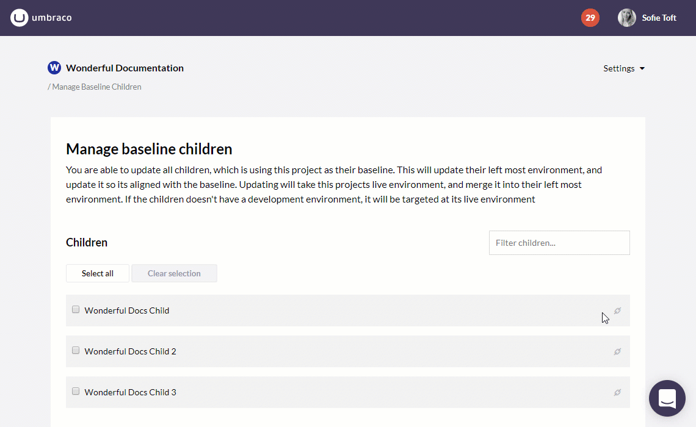

# Baselines
A Baseline Child project is very similar to a Fork (forked repository) on Github in that we create a clone of an existing project while maintaining a connection between the two projects. The connection exists between the _Live_ environment of the existing project, the **Baseline project**, and the _Development_ or Live environment - of the newly created project, the **Child project**.

Any project can act as a Baseline project.

The basic idea is that you have a project that contains all your standard Umbraco packages/components, maybe even configured with some default Document Types, which you want to use as a baseline for future projects. When you've made changes to your Baseline project you can then push these changes out to all the Child projects with a click of a button.

## Creating a Child project

Using the “Create Project” option from the Umbraco Cloud Portal, choose either the Starter or the Professional plan for your new project. 

After choosing a name for your new project, you will have the option to create the project based on an already existing project - any of your projects can be used as a Baseline project! 

When you click create you’ll be redirected to the project page for the new Child project, which shows the creation progress. It might take several minutes for the project to spin up and before your environments are ready. 

When your environments are ready your will see a *green* light next to the environment name.

**Note:** Depending on the size of the project you've chosen as a Baseline project, it might take several minutes before the Child project is ready. 

### Restore content from the Baseline project

When you've created the Child project you can also choose to restore content from your Baseline project.

* *Right-click* the top of the Content tree in the Umbraco backoffice
* Choose **Restore**
* The *Baseline project* should already be selected as the environment to restore from
* Click **Restore from Baseline**
* Once the restore is complete, *reload* the content tree to see the content!

## High-level Overview

The creation process involves a lot of different parts, which are outlined below. Keep in mind that we are creating a new and empty project, which consists of one or two environments, depending on the Plan your are on. Both environments will be a clone of the Live repository from the Baseline project.

When the Child project is created the project's identity will be added to an index of Child projects for the Baseline project. This will ensure that the Baseline project is aware of its *children* and can use that list later on, to push updates to all the children. Whoa!

### Steps

**Note:** Since the following steps were outlined we've made quite a few improvements to the Baseline workflow. For the most part the steps are still relevant and we are working on getting them updated with the latest details.

The process of creating a Child Project is rather involved. While you don't have to worry about this (that's what Umbraco Cloud is for), it can be helpful to understand the parts that make up the connection between a Baseline Project and its Child Projects:

* The Development site is created along with a new Sql Azure database

* The Staging and Live sites are created with Sql Azure credentials, but no database as we’ll make a copy of the Development database when its ready. We’ll use these pre-defined credentials later on.

* A ConnectionString is configured for each site (umbracoDbDsn)

* Once the three environments are created the project is updated (in the portal) with the name and endpoint of the repository for each of the new sites.

* The git config file is updated in the Development repository.

* The Development repository is then configured with an Upstream (remote tracking branch) for the Live repository from the Baseline project.

* Now that the Development repository is configured we fetch from the remote (being the upstream branch). The changes are merged into the master branch.

* Note: The master branch is empty so it should not be possible to encounter merge conflicts at this point

* The Development repository is deployed by making a rest call to Kudu, which deploys the HEAD of the repository to wwwroot.

* We create a “pushinfo”-file, which is used by kudu when changes are pushed to the repository

* We create a Sql Azure marker file called “install-sqlazure”, which contains the connection string for the Development Sql Azure database

* Note: This is used by Courier to install the Umbraco database schema upon app-startup

* The Development site is pinged in order to trigger Courier into running and thus creating the database schema and installing all the data, which is part of the site (in the /wwwroot/data folder).

* The initial creation is now done and the environments will appear on the Project page in the Portal. At this point the Staging and Live environments will remain dimmed.

* Now that the Development site is ready - a database copy is begun. First we make a copy of the Development database in order to create the Staging database using the credentials and database name which was already defined for this environment

* When the Staging database is ready we use that to make a new copy, which will be the database for the Live environment. Again, we use the predefined credentials and database name, so we don’t have to do anything beyond copying the database.

* Note: throttling in Sql Azure limits the amount of concurrent operations, which is why we create copies one at a time using the previously created database.

* These last two environments will be activated / un-dimmed as the databases become available on the Project page in the Portal (when the copy process is done).

Between most of these steps we send updates to the Project page in the Portal, so the progress bar, progress updates and the Activity Stream are updated.

The project should now be up and running, but both Staging and Live will be empty so the owner will have to deploy from Development to Staging and then from Staging to Live. This will push (and deploy of course) the content of the git repository to the other environments and everything will be up to date, and the Child project is ready for business.

## Pushing upgrades to a Child Project
When a project has one or more Child Projects it will appear on the Project page, and the user can click to get an overview of all the Child Projects based on the current project.

From this page you will have an overview af all the Child Projects this Baseline project has. This is also where you go, when you want to push upgrades from your Baseline Project to the Child Projects.

### Upgrading Child Projects

1. Select the Child Projects you want to push your upgrades to - you can select as many or as few as you like!
2. Click **Update selected children**
3. Make sure the selection looks correct then click **Confirm**
4. Follow the process as the upgrades are pushed to the child projects one by one
5. When the Child Projects *turn green* the upgrade was a success

### Technical steps

**Note:** Since the following steps were outlined we've made quite a few improvements to the Baseline workflow. For the most part the steps are still relevant and we are working on getting them updated with the latest details.

* For the Development repository we fetch and merge from the upstream branch, which was configured upon creation.

* If the merge results in a merge conflict we reset the repository, so its not in a “merging state”.

* If the merge was successful we continue to deploy the updated repository. Using Kudu’s Rest endpoints we trigger a deployment of the current state of the git repository (the HEAD).

* When that is done we create a “deploy” marker file in the wwwroot, which tells Umbraco Deploy to run when the application starts.

* Finally we make a request to the website, which just had its changes deployed.

Between the steps listed above, when handling a queued message, we post updates back to the Portal. Some of these updates will also be posted to the stream of the project that is being updated.

It is worth noting that at the time of this writing (August 2015) - when a merge conflict occurs while trying to do “git fetch + merge” the merge will be abandoned by doing a “git reset --hard”. This means that the repository will have an upstream branch that is not merged into master, and it will not be possible to merge future updates until a merge has been done manually. If its done through the Kudu DebugConsole it should be possible to choose whether to select Ours or Theirs when merging and thus resolving the conflict.

## Merge Conflicts
As with any git repository-based development it is not uncommon to have merge conflicts as the various repositories begin to differ. For more on the merge strategy we use and how to approach resolving these conflicts read the [Resolving Baseline Merge Conflicts section](Baseline-Merge-Conflicts/).

## Handling configuration files
When you are doing your normal development process, you'd just be updating the configuration files in your solution as usual. When you are working with baselines there’s a thing to keep in eye. 
When Umbraco Cloud is doing updates from the Baseline project to its children, all solvable merge conflicts on configuration files will be solved by using the setting on the Child project. That also means that if a file has been changed in both the Baseline and in the Child Project, the change won’t be pushed to the Child. To have custom settings on the Child project, you should take advantage of the vendor specific transform files. 

On Umbraco Cloud, it is possible to create transform files that will be applied to certain environments by naming them like `web.live.xdt.config` (see [Config-Transforms](../../Set-Up/Config-Transforms/)). This should be used when a Child Project needs different settings than the Baseline Project has. It can be achieved by using a configuration file that is specific to the Child Project, naming it like `child.web.live.xdt.config`, and only having that configuration file in the Child Projects repository. That will ensure that when doing deploys between the environments in the Child Project, those settings will be applied to the final web.config, and when the Child is updated from the Baseline, the settings won’t be overwritten.

This practice is especially important when the Baseline project gets major new functionality, like new code that is dependent on the configuration files or when it gets upgrades applied.
