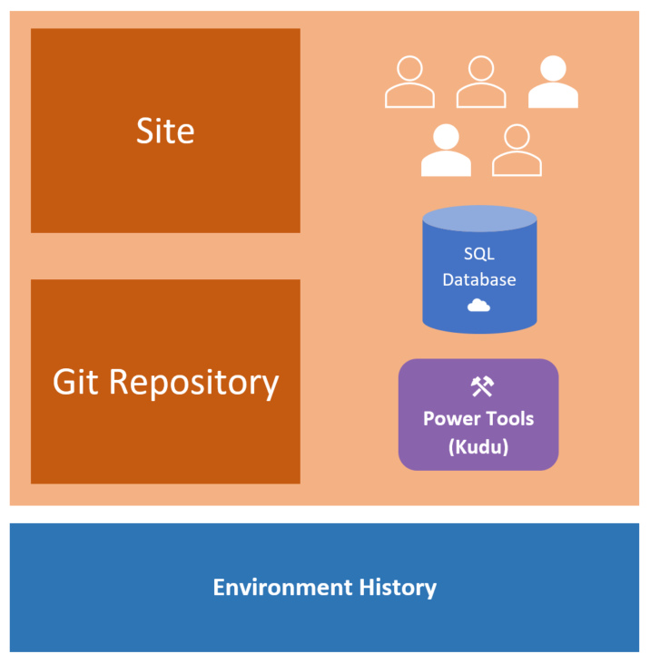

# Technical overview of an Umbraco Cloud environment

Here's a technical overview of the different parts that make up an environment on your Umbraco Cloud project:

## Site and Git repository

Your environments will have both a Git repository and a folder with your actual live site. The Git repository is what you clone down when you work with the project locally, and it's where your changes are pushed to.

The live site contains the files used to show your website to the world. When you push changes from your local machine, they are pushed to the Git repository, and when this finishes succesfully the changes are extracted into the live site.

## Team members / Users

All the team members you've added through the Umbraco Cloud Portal will have been added as backoffice users on your environments as well. As with any other Umbraco CMS installation, you can also add users directly in the backoffices of your Umbraco Cloud environments. If you do this, the users will not have the option to deploy changes between the environments.

Read more about this and team member roles in the [Team Members article](../../Set-up/Team-members).

## SQL Database

Each of your Umbraco Cloud environments will have it's own SQL Azure database. You will have full access to the databases, and you can create custom tables just like you'd expect on any other hosting provider.

Learn more about how to connect to your Umbraco Cloud databases in the [Databases article](../../Databases).

## Power Tools (Kudu)

Besides viewing the files on your Umbraco Cloud environments when cloning down the project to your local machine, you also have access to what we call **Power Tools** - Kudu.

This is a dashboard that allows you to browse, view and edit all the files on your Umbraco Cloud environment. We recommend only using the tool when you are following one of our guides in the Troubleshooting section.

In the [Power Tools article](../../Set-up/Power-tools) you can read more about how to access the dashboard, and how we recommend using it.

## Environment history

Each of your Umbraco Cloud environments has a Git repository and therefor also a Git history. We've made a simplified view of this Git history in the Umbraco Cloud Portal - the **environment history**.

In this view you'll be able to see what changes has been made to each environment - these being changes made to files.