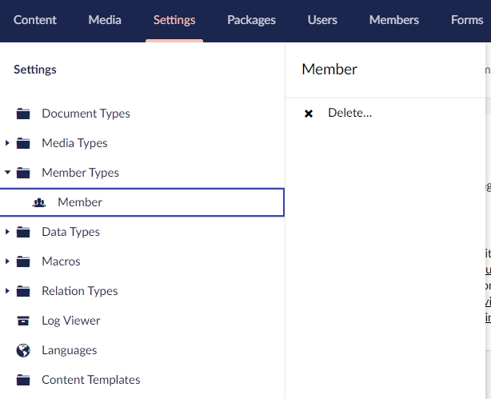
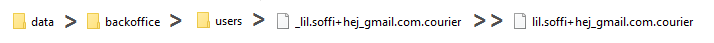
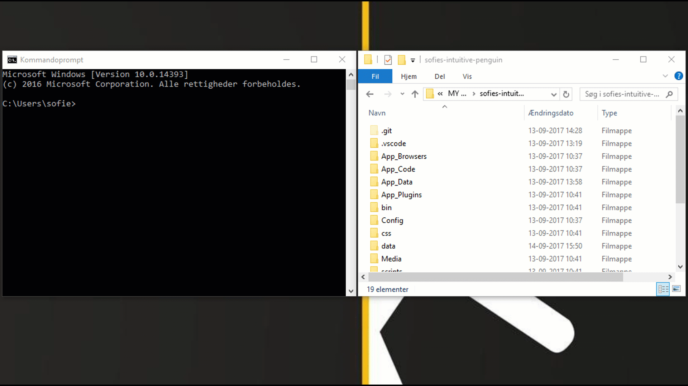

# Migrating an Existing Site to Umbraco Cloud

Sometimes you may already have an Umbraco site built that did not start with a clone of an Umbraco Cloud site. Or perhaps you have decided to move a site that's already live on Umbraco Cloud. In any case, migrating an existing site is not difficult, but it does require some specific steps, and an understanding of how Umbraco Cloud deployments work can be very helpful.

These are the steps you need to go through to complete the migration successfully:

1. [Requirements](#1-requirements)
2. [Tools](#2-tools)
3. [Prepare your site](#3-prepare-your-site)
4. [Prepare your Cloud project](#4-prepare-your-cloud-project)
5. [Clone down the Cloud project](#5-clone-down-the-cloud-project)
6. [Move and Merge files](#6-move-and-merge-files)
7. [Generate meta data](#7-generate-meta-data)
8. [Deploy to Umbraco Cloud](#8-deploy-to-umbraco-cloud)

## Video tutorial

On our Youtube channel you can find a playlist with 7 videos that will take you through the migration guide.

<iframe width="800" height="450" src="https://www.youtube.com/embed/xzua-5f2Nf4?rel=0" frameborder="0" allow="autoplay; encrypted-media" allowfullscreen></iframe>

You can find the full playlist here: [Migrate an existing site to Umbraco Cloud](https://www.youtube.com/playlist?list=PLG_nqaT-rbpwIwsrS6i8o_4kV51Jz94fV)

If you prefer following a written guide, continue to read below.

## 1. Requirements

Before you start migrating your Umbraco site to Umbraco Cloud there are a few things you need to consider. In order to migrate your site smoothly, we have made a list of requirements your project(s) needs to meet.

Your Umbraco site has to fulfill these requirements:

* Has no more content nodes than your plan covers (Starter plan: 500 - Standard plan: 2500 - Pro Plan: 7500)
  * Read more about the Umbraco Cloud Plans on [Umbraco.com](https://umbraco.com/umbraco-cloud-pricing/)
* Contains no member data
  * If you do have member data, these will need to be imported manually after the migration
* No obsolete/old packages
  * Not all packages will work on Umbraco Cloud
  * Read more about this in the section below
* Isn’t a site that has been upgraded from versions below Umbraco 7
  * Legacy code from older versions can potentially cause issues

If you have a site that does not meet the above requirements, feel free to contact us and we will help you find the best solution for your site.

### Understanding what you have

Prior to undertaking a migration you'll want to make sure you know the packages, add-ons, and custom code your site is using.

This is especially important if you are using custom property editors that will require connectors in order to work properly with the Umbraco Cloud deployment engine. Connectors are used by Umbraco Deploy to aid with the deployment of content/property-data between environments on Umbraco Cloud.

There are some common property editors that will require a connector, like [Mortar](https://github.com/leekelleher/umbraco-mortar/tree/develop/src/Our.Umbraco.Mortar.Courier) and [Archetype](https://github.com/leekelleher/Archetype.Courier), which do not currently contain a connector and will not deploy properly. There are certainly other property editors that will require a custom connector but, for the most part, property editors that store data as Umbraco data will deploy without requiring any special attention.

To help smooth this process for you, there is a community project called [Umbraco.Deploy.Contrib](https://github.com/umbraco/Umbraco.Deploy.Contrib) which contains connectors for the most common Umbraco packages:

* Archetype
* Content List
* DocType Grid Editor
* LeBlender
* Multi Url Picker
* NuPickers
* Property List
* Stacked Content
* Tuple
* UrlPicker

## 2. Tools

There are a few tools we recommend using to make the migration process as smooth as possible. We've made a checklist for you here:

* Git needs to be installed on your computer
  * Optional: Git client, like [Fork](https://git-fork.com/), [SourceTree](https://www.sourcetreeapp.com/), or [GitKraken](https://www.gitkraken.com/)
* Visual Studio OR Visual Studio Code + IIS Express
* Merging tool - like [WinMerge](http://winmerge.org/) or [DiffMerge](https://sourcegear.com/diffmerge/)

Aside from these tools you'll also need:

* A local copy of your existing site
* A new and clean Umbraco Cloud project
  * We strongly recommend having a project with **at least 2 environments**

## 3. Prepare your site

After making sure that your existing site meets all the requirements for being migrated to Umbraco Cloud, you are now ready to get started.

### Upgrade to latest Umbraco version

First order of business is to **upgrade your own Umbraco site to the latest minor version of Umbraco 7 or 8**. Why? Because Umbraco Cloud always runs the latest version and you need to make sure your project runs the same Umbraco version as Umbraco Cloud.

You can download the latest version of Umbraco from [Our](https://our.umbraco.com/download/).

If you need help upgrading your project, we have some excellent [Upgrade instructions](https://our.umbraco.com/documentation/Getting-Started/Setup/Upgrading/general) you can follow. Be thorough when upgrading, as the latest upgrade might contain breaking changes and/or updated configuration.

:::note
#### Upgrading from a version prior to Umbraco 7.6.0
With Umbraco 7.6.0 the following property editors have been updated to store UDI instead of node ID:
1. Content Picker
2. Media Picker
3. Member Picker
4. Related Links

If you're upgrading your site from a version prior to v7.6.0 or it has been upgraded earlier you might be using these pickers even though they have been marked as obsolete. 
This can cause issues when transfering content to your Cloud project a bit down the road from here. 

If you're using these obsolete pickers in the project you want on Umbraco Cloud, you will need to migrate to the newest versions of these pickers. This will include the need for a database migration. [This guide will take you through the process of migrating your database to use UDIs instead of IDs](https://skrift.io/issues/umbraco-migrations-made-easy/).
:::

If you have been using Umbraco Forms on your own project, you will also need to upgrade this to the latest version. You can find and download the latest version of Umbraco Forms under [Projects on Our](https://our.umbraco.com/projects/developer-tools/umbraco-forms/). As with Umbraco CMS we also have documentation on how to [Upgrade Umbraco Forms](https://our.umbraco.com/documentation/Add-ons/UmbracoForms/Installation/ManualUpgrade).

After upgrading your project make sure it runs without any errors. *Hint: Check the umbracoTraceLog.txt log file.*

Ideally your site will run locally using the SQL CE database as this will make content migration easier. Don't worry - if that's not possible you will still be able to complete the migration.

### Cleaning your project

Before moving on to the next step, you need to clean up the local clone of your existing site a bit.

While the site is running you need to:

* Go the backoffice of your project
* Empty the recycle bins from both the Content and Media sections

Now, shut down the project, and delete the following files and folders from `/App_Data`

* `/TEMP`
* `/Logs`
* `/cache`
* `/preview`

That was it! Now you are ready to start the actual migration process, or in other words: **now the real fun begins!**

## 4. Prepare your Cloud project

In this next part you are going to setup your Umbraco Cloud project and clone it down to your local machine.

### Setup your Umbraco Cloud project

Before the migration process can start, you will need to have an Umbraco Cloud project you can migrate your own project into.

1. The best way to get started with Umbraco Cloud is to [create a trial project](https://umbraco.com/)
2. When your project is starting choose to start with a *clean slate* - you need to have an empty Cloud project for the migration to be successful
3. We recommend that you setup your project with at least two environments.

If you on your existing site have been working with members and made changes to the default Member Type, it is important that you follow these steps on the Umbraco Cloud environments:

1. Head to the backoffice of the Development environment
2. Navigate to the *Settings* section
3. Open the *Member types* folder
4. Delete **Member**
5. Repeat these steps on all the Cloud environments

:::note

### Data types

Have you been using _older_ data types on your project, you will need to go through a few steps in order to avoid running into collision errors when deploying your migrated sites to Umbraco Cloud.

The data types in question are: Content Picker, Media Picker, Member picker, Multiple Media Picker (using Media Picker) and Related Links.

You can either

1. Rename the old data types on your existing site or
2. Follow the steps in the [Colliding Data types](../../Troubleshooting/Deployments/Colliding-Datatypes) article
:::

## 5. Clone down the Cloud project

With your Umbraco Cloud project ready for the migration, it is time to clone down the project to your local machine.

<iframe width="800" height="450" src="https://www.youtube.com/embed/p5oMCMboxQ8?rel=0" frameborder="0" allow="autoplay; encrypted-media" allowfullscreen></iframe>

Run the site locally and verify your own project and the cloned Umbraco Cloud project are using the same Umbraco version. After you've verified this, shut down the site, and it's now time to start merging the two projects.

## 6. Move and merge files

Merging your existing site into the Umbraco Cloud project is a matter of moving and merging files between the two projects. When following the steps outlined below it is important that you do not overwrite any settings and configuration related to Umbraco Deploy.

1. Copy and replace all folders from your own project to the Umbraco Cloud project
    * **Do not copy and replace** the following folders:
        * `/Config`
        * `/App_Data`
    * If your existing site uses Umbraco Forms, make sure you **do not overwrite** the `App_Plugins/UmbracoLicenses/umbracoForms.lic` file
2. Merge the config files. Pay special attention to the following files:
    * `/web.config` - in the `web.config` file for the Umbraco Cloud project you will see some new configuration related to Umbraco Deploy, Licenses and Forms. Make sure you **do not overwrite** these when you merge the files
    * `/Config/UmbracoDeploy.config` - *only relevant if you are migrating a Cloud project*
3. Copy the rest of the files in the `/Config` folder from your own project to the Cloud project
4. If you are using SQL CE
    * Make sure the SQL CE database from your own project replaces the one provided with your Umbraco Cloud project (`.mdf` or `.sdf`)
    * You can find it in `App_Data/umbraco.sdf`
5. If you are using a local SQL server make sure to update the connection string in the `web.config` for the Umbraco Cloud project.
6. Copy the rest of the files/folders in the `/App_Data` folder from your own project to the Cloud project

The final thing to do before moving on, is to make sure your Umbraco Cloud user will be added to the new database you've merged into the project. First you need to check if any Umbraco user uses the same email address as your Umbraco Cloud account. If this is the case you need to change the email address of the existing user to something else otherwise your Cloud user will be stuck in a inactive state. If you have confirmed there is no user with the same email address you can add the cloud by following these steps.

* Go to the `data/backoffice/users` folder in your Umbraco Cloud project files
* Rename your user file by removing the leading underscore

* Go back to the `data` folder
* Delete the `deploy-complete` marker
* Create a new file: `deploy` (with no extension)

That's it! Now that you've merged your existing site with the local clone of the Cloud project, you need to make sure the project runs and verify that

* You can login using your Cloud user
* All the content is there
* All Document Types, Templates, Stylesheets etc,  is in the backoffice

With that confirmed, it's time to prepare to migrate the project to Umbraco Cloud.

## 7. Generate meta data

You have now moved and merged the files from your existing site into the Umbraco Cloud project files. So far, so good!

In this next part, it is time to generate the so called UDA-files for all your projects meta data.

For more details about UDA files, read the [UDA Files](../../Set-Up/Power-Tools/Generating-UDA-files/#what-are-uda-files) article.

* Make sure the folder `/data/revision` on your Umbraco Cloud project is empty
  * If you have any files in the folder, you can safely remove those at this point
* Open a command prompt
* Navigate to the `/data` folder in your local Umbraco Cloud project files
* Add an *export* marker by typing `echo > deploy-export`
  * Generating the UDA files may take a while, depending on the extent of your project
  * You will see a `deploy-complete` marker once the export is done
  * Run `echo > deploy` again in order to double-check that the UDA files have been generated correctly
  * When you see a `deploy-complete` marker, it means everything is working as expected
* You should now see that your `/data/revision` folder has been populated with UDA files corresponding to your projects metadata

Now the migrated project is ready to be deployed to the Umbraco Cloud environment.

## 8. Deploy to Umbraco Cloud

All project files have been merged and we've generated UDA files for all the meta data. In this section, we are going to deploy the migrated project to the Umbraco Cloud Development environment.

### Deploying the metadata

1. In your Git client you should see a lot of changes ready to be committed
2. Stage and commit the changes
3. Do a *pull* to ensure everything is in sync
4. **Push** your migrated project to the Umbraco Cloud environment - check that the *'Deploy Complete'* message is displayed
    * If you have a very large commit to push, you may need to configure your Git client for this
    * Use: git config http.postBuffer 524288000

When the push is complete go check out the Umbraco Cloud Portal to verify the indicator on the Development environment is still *green*.

Go to the backoffice of your Development environment and make sure all your metadata is there. You won't see any content or media on the environment yet - this you will move in the next few steps.

### Transfer your content and media

1. With all your metadata in place, it's time to transfer your content and media as well
2. Go to the backoffice of your local clone of the Umbraco Cloud project
3. Right-click the top of the Content tree and choose *'Queue for transfer'*
    * **NOTE**: If you have a large amount of content and media you may have the best result in deploying content and media independently
    * **Media**: If you have more than "a few" media items see our recommendations for working with [media in Umbraco Cloud](../../Set-up/Media/)

**Voila!** You've now migrated your site to Umbraco Cloud.

The very final step is deploy the migration to the next environment - Staging or Live. You do this from the Umbraco Cloud Portal, using the green button on your Development environment *'Deploy changes to Staging/Live'*. Transfer content and media from the backoffice following the steps outlined above.
