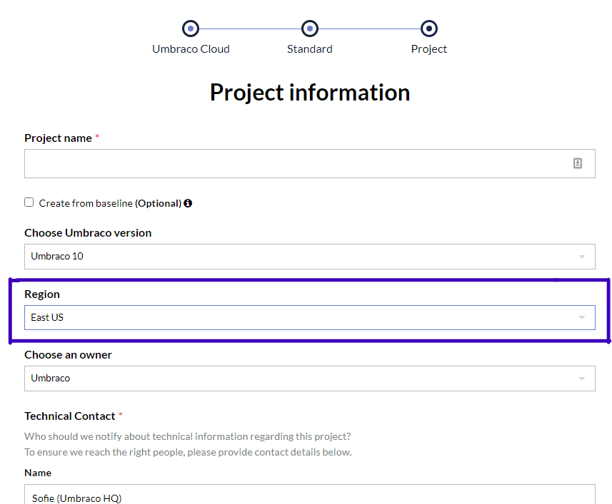

# Migrate between regions

When you create a project on Umbraco Cloud, you can choose to host the project in one of two regions: *West EU* or *East US".

In some cases, you might want to migrate your project(s) from one region to another. This article will outline the steps to do this.

The guide will use an example where a Cloud project is migrated from the West EU region to the East US region.

## Prerequisites

- Admin access and deployment rights on the project that is to be migrated.
- Git is installed locally as well as a Git client like *Git Bash*.
- A local setup that can run an Umbraco instance. Learn more about this in the [Requirements](../../../Fundamentals/Setup/Requirements/) article.

:::note
To follow this guide, it is highly recommended that you have experience with Git and running git commands through a command line tool.
:::

## Prepare your projects

The first step in this process is to create a new Umbraco Cloud project in the region you want to migrate your existing project to. In this case that will be the East US region.

This is done by selecting **East US** from the **Region** dropdown when creating the Cloud project.



The new project in the US region will run the latest version of Umbraco CMS, Umbraco Forms, and Umbraco Deploy. You will need to ensure that the project you are migrating is running the exact same version of each product before initiating the migration process.

Find more details on how to upgrade your project in the [Upgrades](../../Upgrades/) documentation.

## Migrate the project

The following steps will guide you through the migration process.

:::warning
Make sure that your projects are [prepared for the migration](#prepare-your-projects) before continuing the process.
:::

1. Clone down the project that you want to migrate - the *EU project*.
2. Restore content and media through the Umbraco backoffice.
3. Clone down the new Cloud project created in the US region - the *US project*.
4. Replace the `src/UmbracoProject/umbraco-cloud.json` file in the *EU project* with the one from the *US project*.

   :::note
   The `umbraco-cloud.json` file contains details about each environment on the Cloud project.

   By replacing the one on the *EU project* with the one from the *US project*, content and media transfers will point to the environments on the *US project* instead of the *EU project*.
   :::

5. Commit the change through git, but do not push it yet.
6. Use the following git commands to connect your local *EU project* to the live environment on the *US project*:

   ```none
   git remote rm origin

   git remote add origin https://scm.umbraco.io/useast01/name-of-us-live-site.git

   git fetch

   git branch --set-upstream-to=origin/master
   ```

7. Push the schema and files from the *EU project* to the *US project* using the following git command:

   ```none
   git push origin master -f
   ```

8. Verify that the schema and files have been merged into the live environment on the *US project*.
9. Transfer content and media from the local *EU project* to the *US project*.
10. Verify that all the content and media have been transfered to the *US project*.

Once you have verified that all schema and files as well as content and media has successfully been deployed and transferred to your new *US project* the migration process is complete.

It is highly recommended to thoroughly go through everything on the migrated site to ensure that everything works as expected.

## Post migration tasks

By following the steps above you have migrated your Umbraco project from one Cloud environment to another.

The following will need to be reconfigured on the new project after the initial migration:

- All **Team Members** added through the Cloud Portal on the *EU project* also need to be invited to the *US project*.
- **Hostnames**, **certificates** and other related settings need to be re-added and reconfigured on the *US project*.

Once everything has been configured and set up you can safely delete the *EU project* which will also cancel the running subscription on the project.

Do you need help or have any questions regarding this process, please reach out to our support using [contact@umbraco.com](mailto:contact@umbraco.com).

:::links
## Related articles
- [Manage hostnames](../../Set-Up/Manage-Hostnames/)
- [Team Members](../../Set-Up/Team-Members/)
- [Certificates](../../Set-Up/Manage-Hostnames/Security-Certificates/)
:::
