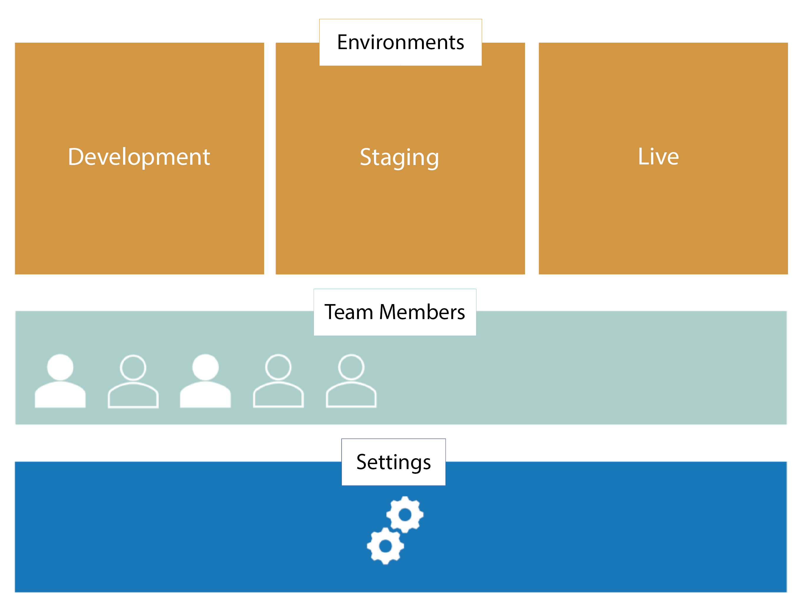

# Get to know your Umbraco Cloud project

Umbraco Cloud projects are made of three major components: environments, team members and a settings section.

## Environments

The number of environments in your project is dependent on which plan you are on:

* With the **Starter plan**, you get a single _Live_ environment and have the option to add additional environments - a _Development_ and a _Staging_ environment
* With the **Professional plan**, you will get a _Development_ AND a _Live_ environment - as with the Starter Plan you can add/remove environments as needed

For more information on how to add or remove environments, read the [Manage Environments](../../Set-Up/Manage-Environments) article

To get a more technical overview of your Cloud environments read the [Environments](../Environments) article.

## Team Members

Another major component of your Umbraco Cloud project are the team members. When you add team members to a project, they will automatically be added as backoffice users on all the environments as well. Team members can be added as *Admins*, *Writers* or *Readers*. Read the [Team Members](../../Set-up/Team-members) article to learn more about these roles.

## Settings

Last but not least is the *Settings*, where you can manage and configure your project to fit your needs. Learn more about the different settings in the [Project Settings](../../Set-up/project-settings) article.
