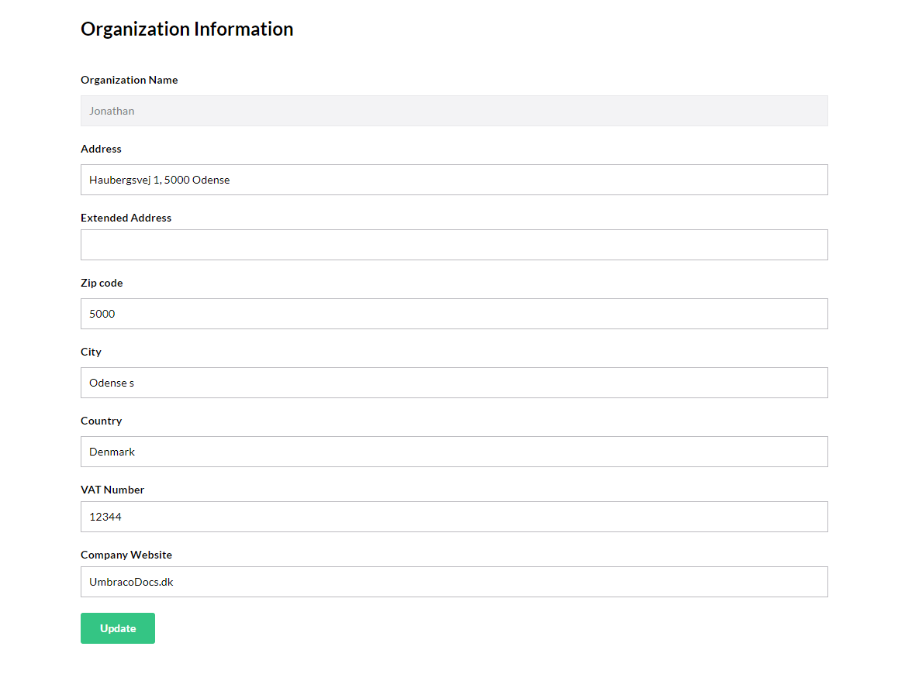
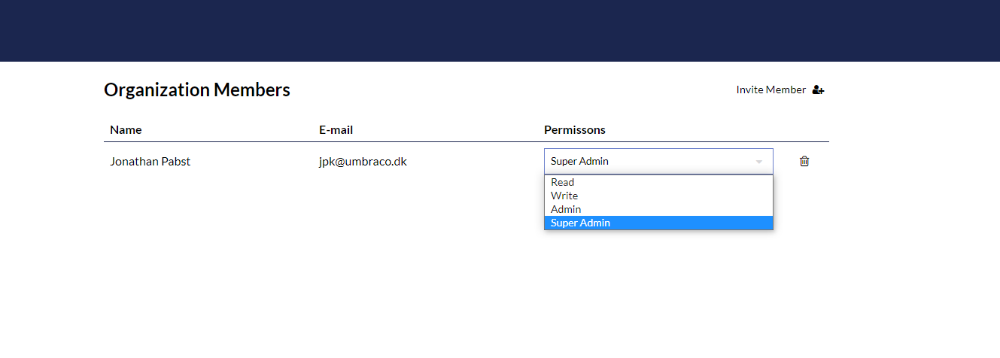
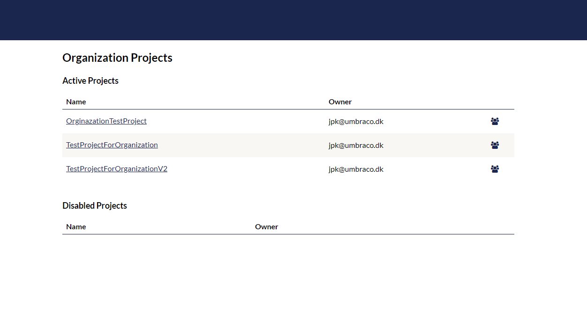
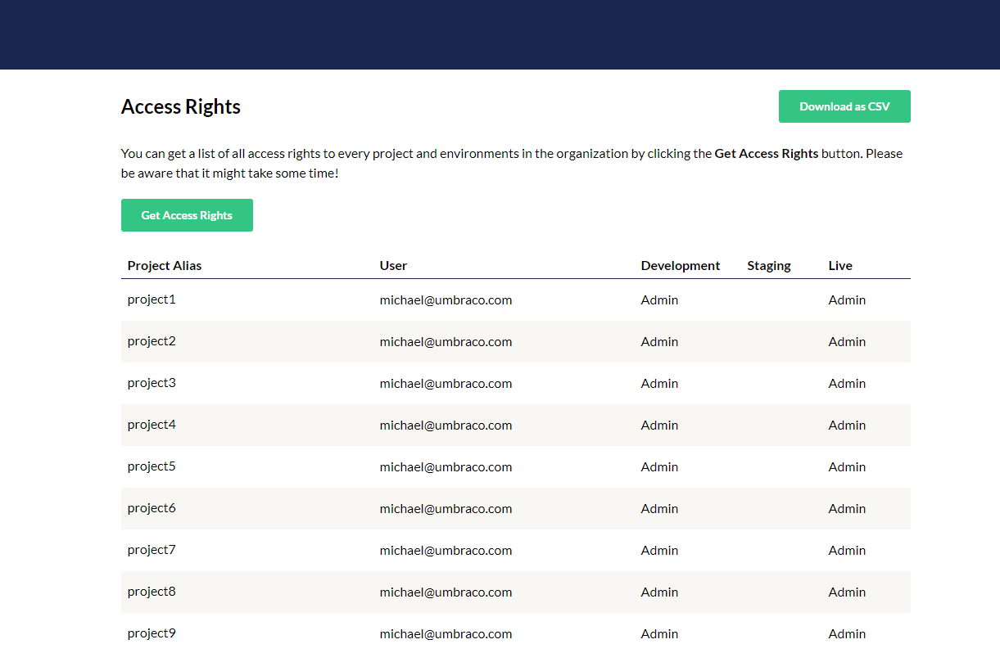

# Organizations on Umbraco Cloud

On Umbraco Cloud  you are able to get an Umbraco Cloud Organization.

With an Organization you get an overview of all the project that have been created by you and the members of the Organization to give you an better overview of all your project if you create a lot of them.

If you are interested in getting an organization, please reach out to our support team through the Chat box in your project overview.

## Managing your organization

In the following section we will go over the different options that you will get when you have an organization and give you an overview of what you can do in each section.

## Information

From the information section in your organization you can find information about your organization and if there are any changes to your information, you can change it from this section.

## Members

In the members section you can get an overview of all the members that are a part of your organization.

It is also possible from here to setup different permissions for your members, if they have write or read rights or are administrators for your organization.

## Projects

In the projects section, you can get an overview of all the projects that have been created in your organization. This makes it easier for you to see which projects your organization has.

It is also possible to see which user from your organization that has created which project and edit the team on the different project if you are a super-admin in the organization.

You are also able to see if any projects have been disabled under your organization.

## Access Rights

In the Access rights overview, you can get a list of all the access rights that your members have to each projects in your organization.

