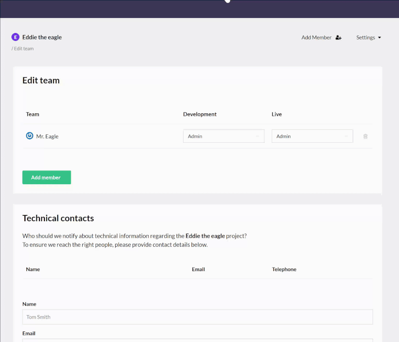

# Organizations 
On Umbraco Cloud it is possible to be part of an organization. And organization is a way for you to associate users to one organization.
The benefits are currently limited, but we are working on improving the features available for organizations.
Currently organizations are created by Umbraco HQ - so **reach out to support** to hear more about the feature, and whether they apply for your scenario.

## Invite organization to collaborate
Once you have an organization you will be able to invite other organizations to collaborate with you.
When you are in the Organization view you'll have the option to invite either Members or other Organizations. When choosing to add other Organizations, you will need to find and choose the organization from a dropdown, like illustrated below.

By inviting an organization, you are allowing a Super admin from that Organization to create projects on behalf of your Organization.

When you have invited another Organization to collaborate, you will be able to choose from Super admins in the invited organization, when adding members to a project. This effectively enables the Super admin in that organization to access your project, but also allows her to invite other members from that organization.

