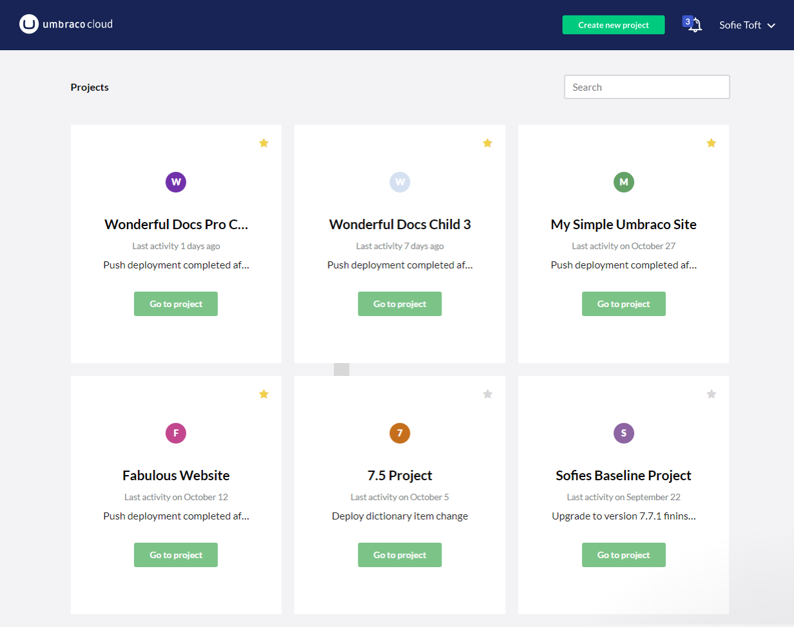
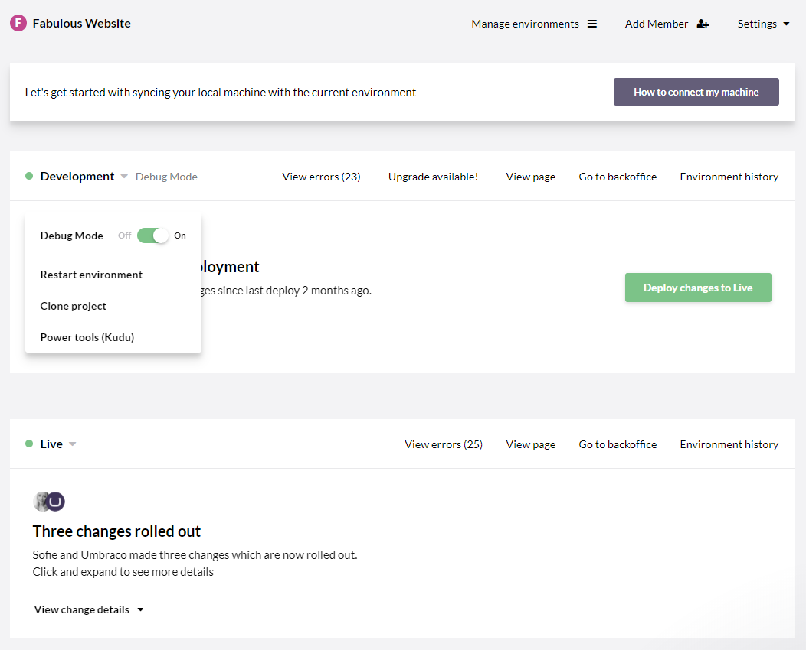
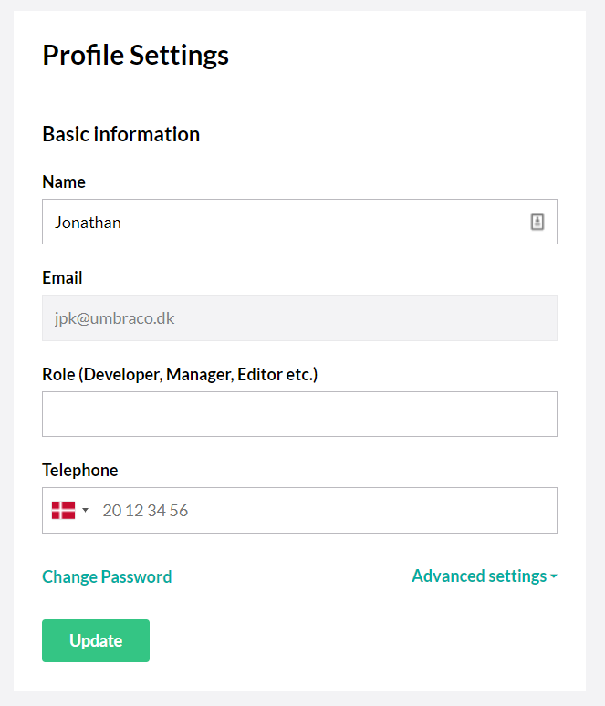
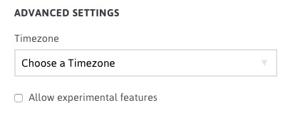

# The Umbraco Cloud Portal

To make working with your Umbraco Cloud projects as simple as possible we've built the Umbraco Cloud Portal where you can view and manage all your projects.

## Manage your projects

When you login to the Umbraco Cloud Portal you will be presented with a view of all the Umbraco Cloud projects you've created or has been added to as a team member. 

By default the projects are ordered by latest updates - projects you've worked on recently will be shown on top and the ones you haven't worked with for a while are in the bottom.

For quick access you can *favorite* the projects you are currently working, to make them appear as the first projects in the view. You can also browse through the projects by using the search field.

In the top-right corner of the projects view you'll find an option to create more projects. Simply choose the plan you want and a project will be ready for you within a few minutes. 

## Project Management

Managing your individual projects has been made even simpler with Umbraco Cloud. 

In the project view, you will have a quick overview of the environments in your project.

* Environment status
* Links to **backoffice**, **frontend** (View page) and the **environment history**
* Git URL for cloning down the environment to your local machine
* Option to restart environment
* Access to Power Tools

This is also where you go to manage the environments on your project: Click on **Manage environments** at the top of the page, and you can easily add and/or remove environments as needed. Read more about how the number of environments vary depending on the plan you are on, in the [Project overview](../Project-Overview) article.

Aside from these features, it's also from the project view that changes are deployed from one Cloud environment to another - find out more in the [Cloud-to-Cloud](../../Deployment/cloud-to-cloud) article.

From [Settings](../../Set-up/project-settings) - in the top-right corner - you'll find a lot more options to configure your project.

## The chat

In the bottom-right corner of the Umbraco Cloud Portal, you'll find a chat-bubble. This is where you will be able to reach out to the Umbraco HQ Support Warriors should you have any questions regarding your Umbraco Cloud projects.

Note that with the Starter plan you are only entitled to support regarding specific Cloud issues. If you are a Professional plan you will also be entitled to support regarding implementation and issues with the CMS.

Read about the [Umbraco Cloud plans](https://umbraco.com/pricing/) to learn more about this.

## Your Umbraco Cloud profile

You can find your Umbraco Cloud profile in the top-right corner the portal.

### Name

The name that will be displayed on Umbraco Cloud

### Email

This email address is used for logging in to Umbraco Cloud and will receive email notifications from the Umbraco Cloud Portal.

### Change password

Change the password for your Umbraco Cloud account.

### Advanced settings

#### Time zones

From your profile settings you can set your time zone. This applies to the display of status messages in the Umbraco Cloud portal and makes it easier to determine the actual time a particular status was created.

#### Experimental Features

You can enable the availability of experimental features for your projects. This includes features that may not be functionally complete and are not supported by Umbraco HQ. We recommend enabling this only if you fully understand the feature you will be using or are strictly using the project as a test.
